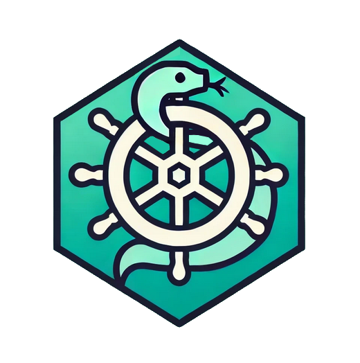
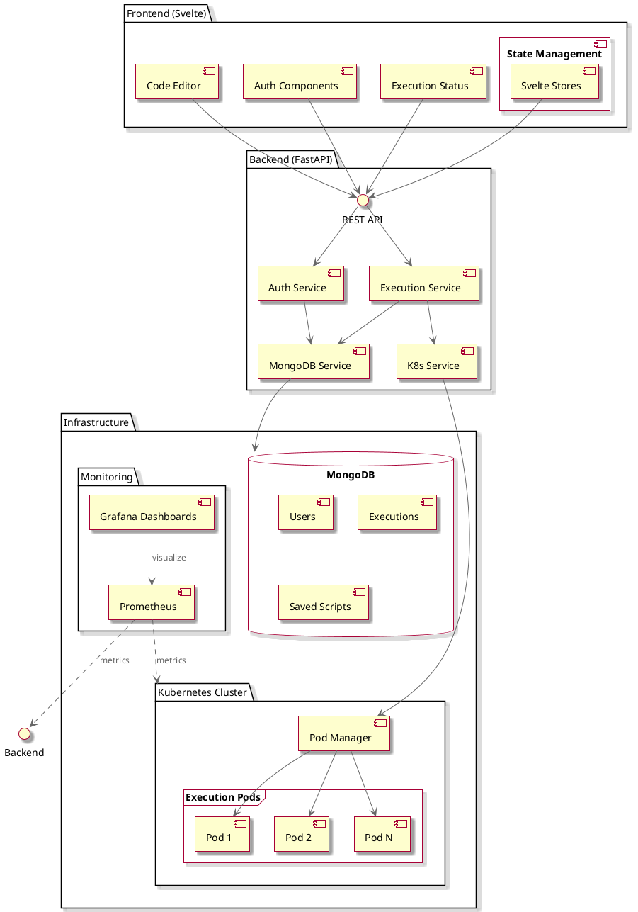
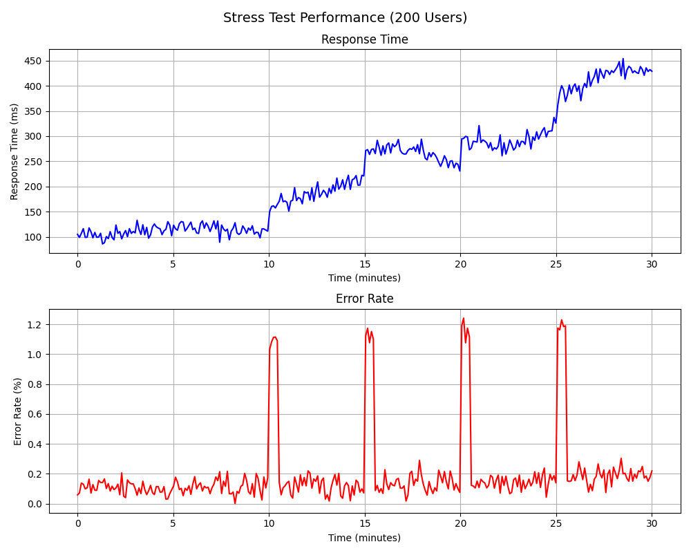

 
 <h1 align="center"><b>Integr8sCode</b></h1>

---

Welcome to **Integr8sCode**! This is a platform where you can run Python scripts online with ease. Just paste your
script, and we'll run it in an isolated environment within its own Kubernetes pod, complete with resource limits to keep
things safe and efficient. You'll get the results back in no time.

## Architecture Overview

The platform is built on three main pillars:

- **Frontend**: A sleek Svelte app that users interact with.
- **Backend**: Powered by FastAPI, Python, and MongoDB to handle all the heavy lifting.
- **Kubernetes Cluster**: Each script runs in its own pod, ensuring isolation and resource control.

Components diagram

Backend Details

### Script Execution Workflow

Here's how we handle your scripts:

1. **Receive Script**: You send us your code via the `/execute` endpoint.
2. **Spin Up Pod**: We create a Kubernetes pod just for your script.
3. **Run Script**: Your code runs inside this isolated pod.
4. **Capture Output**: We grab any output or errors.
5. **Store Results**: Everything gets saved in MongoDB.
6. **Update Status**: We keep you informed about the execution status.

### Database Design

Our MongoDB setup includes an `executions` collection:

- **Fields**:
   - `execution_id`: Unique ID for each execution.
   - `script`: The code you provided.
   - `output`: What your script printed out.
   - `errors`: Any errors that occurred.
   - `status`: Where your script is in the process (`queued`, `running`, `completed`, `failed`).
   - `created_at` and `updated_at`: Timestamps for tracking.

Frontend Details

### User Interface Components

Our Svelte app includes:

- **Code Editor**: A place to write or paste your Python code.
- **Run Button**: Kick off the execution.
- **Output Area**: See the results or errors from your script.
- **Status Display**: Know if your script is queued, running, or done.

### State Management

- **Stores**: We use Svelte's built-in stores to keep track of your script and its execution status.
- **API Calls**: Functions that talk to our backend endpoints and handle responses smoothly.

## Kubernetes Integration

### Pod Setup

- **Docker Image**: We use a lightweight Python image with just what we need.
- **Isolation**: Every script gets its own pod for security and reliability.
- **Cleanup**: Once your script is done, the pod goes away to keep things tidy.

### Resource Management

> [!TIP]
> By limiting resources, we ensure fair usage and prevent any single script from hogging the system.

- **CPU & Memory Limits**: Each pod has caps to prevent overuse (128 Mi for RAM and 100m for CPU).
- **Timeouts**: Scripts can't run forever—they'll stop after a set time (default: 5s).
- **Disk Space**: Limited to prevent excessive storage use.

### Security Considerations

> [!CAUTION]
> Running user-provided code is risky. We take security seriously to protect both our system and other users.

- **Network Restrictions**: Pods can't make external network calls.
- **No Privileged Access**: Pods run without elevated permissions.

## User Authentication

- **Accounts**: Optional—users can sign up to save scripts.
- **Security**: We use JWT tokens to secure API endpoints.

## Logging and Monitoring

- **Logs**: Centralized logging helps us track what's happening across pods.
- **Monitoring Tools**: Using Prometheus and Grafana to keep an eye on system health.
- **Alerts**: Set up notifications for when things go wrong.

To access:

- Prometheus: http://localhost:9090
- Grafana: http://localhost:3000 (login with admin/admin123)

## Testing Strategy

Unit Tests

**Repository Tests**: Testing individual database operations

- Located in `tests/unit/test_repositories/`
- Testing CRUD operations for each model
- Using real MongoDB test instance
- Ensuring data integrity and constraints
- Running with pytest-asyncio for async operations

**Service Tests**: Testing business logic and service layer

- Located in `tests/unit/test_services/`
- Testing service methods independently
- Using actual repositories with test database
- Ensuring proper error handling
- Verifying state changes and data transformations

Integration Tests

**API Endpoint Tests**: Testing complete HTTP workflows

- Located in `tests/integration/test_api_endpoints.py`
- Testing all REST endpoints
- Using FastAPI TestClient
- Verifying response codes and payloads
- Testing authentication and authorization
- Ensuring proper error responses

**Kubernetes Integration Tests**: Testing pod execution

- Located in `tests/integration/test_k8s_integration.py`
- Testing script execution in pods
- Verifying resource limits and constraints
- Testing cleanup and error scenarios
- Using test Kubernetes cluster

Load Testing

**Performance Scenarios**: Using Locust for load testing

- Located in `tests/load/`
- Different load profiles:
    - Smoke Test: 1 user, basic functionality
    - Light Load: 10 users, 5 minutes
    - Medium Load: 50 users, 10 minutes
    - Heavy Load: 100 users, 15 minutes
    - Stress Test: 200 users, 30 minutes
- Measuring:
    - Response times
    - Error rates
    - System resource usage
    - Database performance
    - Kubernetes scaling

Main results:

Test Configuration

**Environment Setup**:

- `.env.test` for test environment variables
- `pytest.ini` for pytest configuration
- `conftest.py` for shared fixtures
- Docker compose for test dependencies

**Test Database**:

- Separate MongoDB instance for testing
- Fresh database for each test run
- Automated cleanup after tests

**Test Coverage**:

- `pytest-cov` for coverage reporting 
- 92% coverage of core functionality
- Coverage reports in HTML and XML

