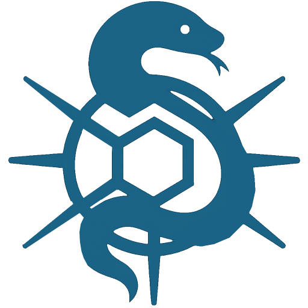
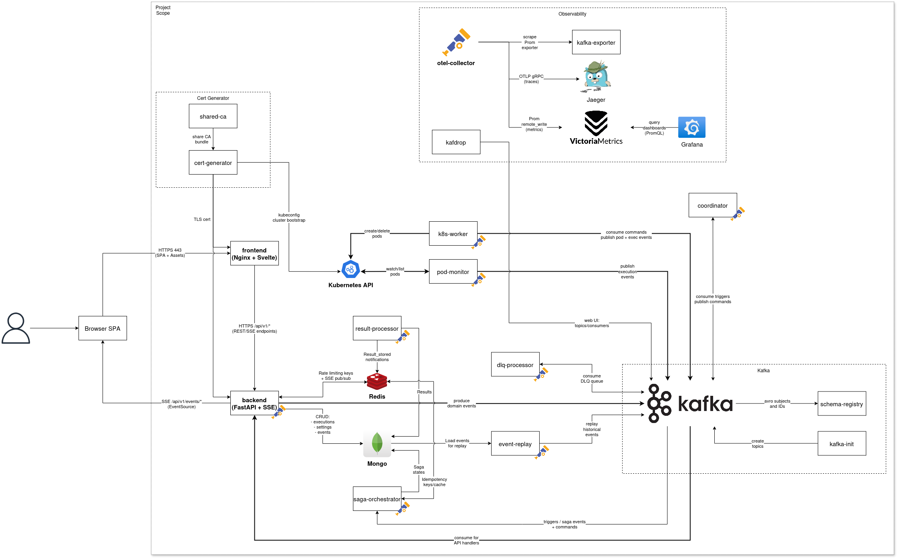

<p align="center">
 
 <h1 align="center"><b>Integr8sCode</b></h1>
</p>
<p align="center">
  <a href="https://github.com/HardMax71/Integr8sCode/actions/workflows/ruff.yml">
    
  </a>
  <a href="https://github.com/HardMax71/Integr8sCode/actions/workflows/mypy.yml">
    
  </a>
  <a href="https://github.com/HardMax71/Integr8sCode/actions/workflows/security.yml">
    
  </a>
  <a href="https://github.com/HardMax71/Integr8sCode/actions/workflows/docker.yml">
    
  </a>
  <a href="https://github.com/HardMax71/Integr8sCode/actions/workflows/stack-tests.yml">
    
  </a>
  <a href="https://github.com/HardMax71/Integr8sCode/actions/workflows/stack-tests.yml">
    
  </a>
  <a href="https://github.com/HardMax71/Integr8sCode/actions/workflows/frontend-ci.yml">
    
  </a>
</p>
<p align="center">
  <a href="https://app.codecov.io/gh/HardMax71/Integr8sCode">
    
  </a>
  <a href="https://app.codecov.io/gh/HardMax71/Integr8sCode/flags?flag=frontend">
    
  </a>
</p>
<p align="center">
  <a href="https://sonarcloud.io/dashboard?id=HardMax71_Integr8sCode">
    
  </a>
  <a href="https://sonarcloud.io/dashboard?id=HardMax71_Integr8sCode">
    
  </a>
  <a href="https://sonarcloud.io/dashboard?id=HardMax71_Integr8sCode">
    
  </a>
</p>

Welcome to **Integr8sCode**! This is a platform where you can run Python scripts online with ease. Just paste your
script, and the platform run it in an isolated environment within its own Kubernetes pod, complete with resource limits
to keep
things safe and efficient. You'll get the results back in no time.


> [!NOTE]
> A deployed and working version of Integr8sCode is available at https://app.integr8scode.cc/ .

<details>
<summary>How to deploy</summary>

1. Clone this repository
2. Check if docker is enabled, kubernetes is running and kubectl is installed
3. `docker-compose up --build`

- Frontend: `https://127.0.0.1:5001/`
- Backend: `https://127.0.0.1:443/`
  - To check if it works, you can use `curl -k https://127.0.0.1/api/v1/k8s-limits`, should return JSON with current limits
- Grafana: `http://127.0.0.1:3000` (login - `admin`, pw - `admin123`)


You may also find out that k8s doesn't capture metrics (`CPU` and `Memory` params are `null`), it may well be that metrics server
for k8s is turned off/not enabled. To enable, execute:
```bash
kubectl create -f https://raw.githubusercontent.com/pythianarora/total-practice/master/sample-kubernetes-code/metrics-server.yaml
```

and test output by writing `kubectl top node` in console, should output sth like:
```
PS C:\Users\User\Desktop\Integr8sCode> kubectl top node
NAME             CPU(cores)   CPU%   MEMORY(bytes)   MEMORY%
docker-desktop   267m         3%     4732Mi          29%
```

</details>

<details>
<summary>Sample test</summary>

You can check correctness of start by running a sample test script:
1. Open website at `https://127.0.0.1:5001/`, go to Editor
2. In code window, paste following code:
```python
from typing import TypeGuard

def is_string(value: object) -> TypeGuard[str]:
    return isinstance(value, str)

def example_function(data: object):
    match data:  # Match statement introduced in Python 3.10
        case int() if data > 10:
            print("An integer greater than 10")
        case str() if is_string(data):
            print(f"A string: {data}")
        case _:
            print("Something else")

example_function(15)
example_function("hello")
example_function([1, 2, 3])
```

First, select `>= Python 3.10` and run script, will output:
```
Status: completed
Execution ID: <some hex number>
Output:
  An integer greater than 10
  A string: hello
  Something else
```

Then, select `< Python 3.10` and do the same:
```
Status: completed
Execution ID: <some other hex number>
Output:
  File "/scripts/script.py", line 7
    match data:  # Match statement introduced in Python 3.10
          ^
SyntaxError: invalid syntax
```
This shows that pods with specified python versions are creating and working as expected. Btw, the latter throws error
cause `match-case` was introduced first in `Python 3.10`.

</details>


## Architecture Overview

> [!TIP]
> Full documentation is available at https://hardmax71.github.io/Integr8sCode/



The platform is built on three main pillars:

- Frontend: A sleek Svelte app that users interact with.
- Backend: Powered by FastAPI, Python, and MongoDB to handle all the heavy lifting.
- Kubernetes Cluster: Each script runs in its own pod, ensuring isolation and resource control.

## License

This project is licensed under the MIT License - see the [LICENSE](LICENSE) file for details.
