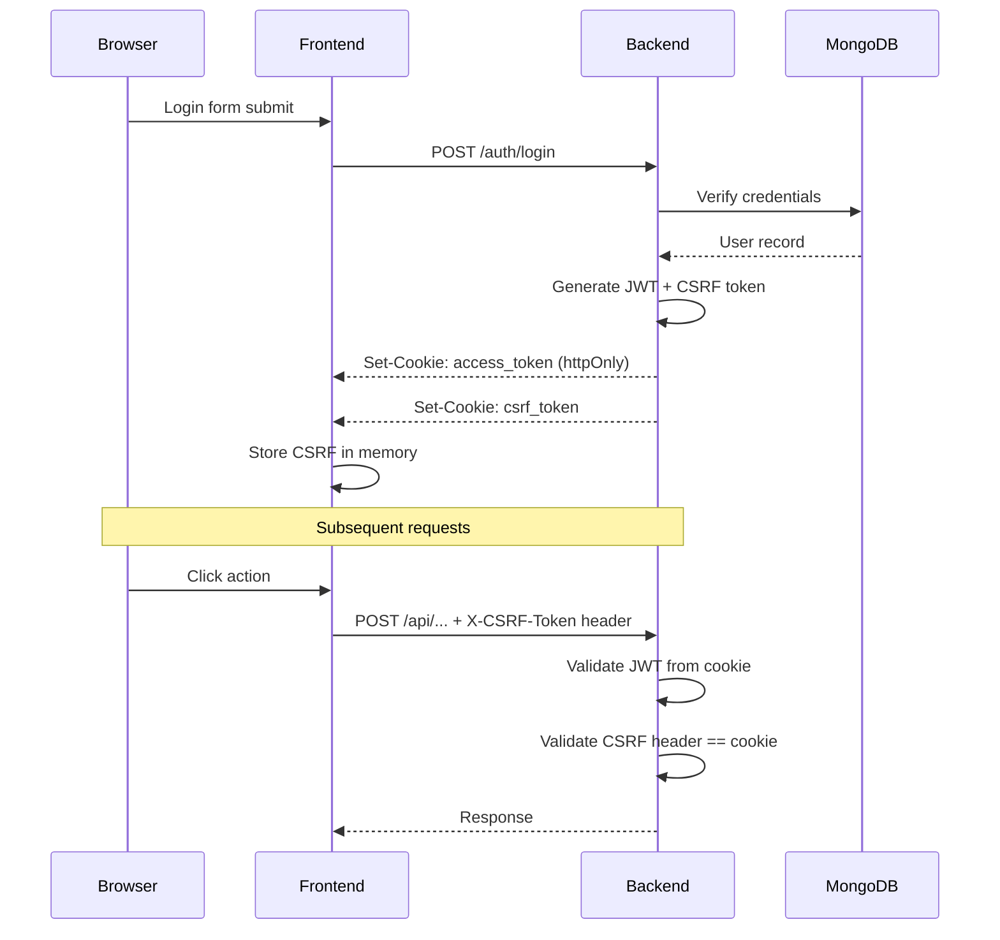

# Authentication

The platform uses cookie-based JWT authentication with CSRF protection via the double-submit pattern. This approach
keeps tokens secure (httpOnly cookies) while enabling CSRF protection for state-changing requests.

## Architecture



## Token Flow

Login creates two cookies:

| Cookie         | Properties                         | Purpose                         |
|----------------|------------------------------------|---------------------------------|
| `access_token` | httpOnly, secure, samesite=strict  | JWT for authentication          |
| `csrf_token`   | secure, samesite=strict (readable) | CSRF double-submit verification |

The `access_token` cookie is httpOnly, so JavaScript cannot read it—this prevents XSS attacks from stealing the token.
The `csrf_token` cookie is readable by JavaScript so the frontend can include it in request headers.

## Backend Implementation

### Password Hashing

Passwords are hashed using bcrypt via passlib:

```python
--8<-- "backend/app/core/security.py:password_hashing"
```

### JWT Creation

JWTs are signed with HS256 using a secret key from settings:

```python
--8<-- "backend/app/core/security.py:create_access_token"
```

The token payload contains the username in the `sub` claim and an expiration time. Token lifetime is configured via
`ACCESS_TOKEN_EXPIRE_MINUTES` (default: 24 hours / 1440 minutes).

### CSRF Validation

The double-submit pattern requires the CSRF token to be sent in both a cookie and a header. The
[`validate_csrf_token`](https://github.com/HardMax71/Integr8sCode/blob/main/backend/app/core/security.py) dependency
validates this for all authenticated POST/PUT/DELETE requests:

```python
--8<-- "backend/app/core/security.py:csrf_validation"
```

Safe methods (GET, HEAD, OPTIONS) and auth endpoints (login, register, logout) skip CSRF validation.

### Cookie Configuration

Login sets cookies with security best practices:

```python
--8<-- "backend/app/api/routes/auth.py:login_cookies"
```

| Setting    | Value  | Purpose                                     |
|------------|--------|---------------------------------------------|
| `httponly` | true   | Prevents JavaScript access (XSS protection) |
| `secure`   | true   | HTTPS only                                  |
| `samesite` | strict | Prevents CSRF via cross-site requests       |
| `path`     | /      | Cookie sent for all paths                   |

## Frontend Implementation

### Auth Store

The frontend maintains authentication state in a Svelte store with sessionStorage persistence:

```typescript
--8<-- "frontend/src/stores/auth.svelte.ts:AuthState"
```

The store caches verification results for 30 seconds to reduce server load:

```typescript
--8<-- "frontend/src/stores/auth.svelte.ts:auth_cache"
```

### CSRF Injection

The API interceptor automatically adds the CSRF token header to all non-GET requests:

```typescript
--8<-- "frontend/src/lib/api-interceptors.ts:csrf_injection"
```

### Session Handling

On 401 responses, the interceptor clears auth state and redirects to login, preserving the original URL for
post-login redirect:

```typescript
--8<-- "frontend/src/lib/api-interceptors.ts:error_handling"
```

## Login Lockout

After repeated failed login attempts, the account is temporarily locked to prevent brute-force attacks. The backend
tracks attempts per username in Redis with a sliding-window TTL — each failed attempt resets the lockout timer.

When the attempt threshold is reached, subsequent login attempts return **HTTP 423 (Locked)** with the detail
`"Account locked due to too many failed attempts"`. The lockout applies identically whether the username exists or not,
preventing username enumeration.

The lockout parameters are configured via `SystemSettings`:

| Setting                    | Default | Description                          |
|----------------------------|---------|--------------------------------------|
| `max_login_attempts`       | 5       | Failed attempts before lockout       |
| `lockout_duration_minutes` | 15      | How long the lockout lasts (minutes) |

The frontend displays a warning toast for 423 responses via the API interceptor.

## Registration Errors

Registration distinguishes between conflict types:

| Condition          | HTTP Status | Detail                                           |
|--------------------|-------------|--------------------------------------------------|
| Username taken     | 409         | `Username already registered`                    |
| Email taken        | 409         | `User already exists`                            |
| Password too short | 400         | `Password must be at least {min_len} characters` |

The minimum password length is enforced at both the schema level (`min_length=8` on `UserCreate`) and at runtime
from `SystemSettings.password_min_length` (default: 8, configurable by admins).

## Endpoints

<swagger-ui src="../reference/openapi.json" filter="authentication" docExpansion="none" defaultModelsExpandDepth="-1" supportedSubmitMethods="[]"/>

## Offline-First Behavior

The frontend uses an offline-first approach for auth verification. On network failure, it returns the cached auth state
rather than immediately logging out. This provides better UX during transient network issues but means server-revoked
tokens may remain "valid" locally for up to 30 seconds.

Security-critical operations should use `verifyAuth(forceRefresh=true)` to bypass the cache.

## Key Files

| File                                                                                                                     | Purpose                        |
|--------------------------------------------------------------------------------------------------------------------------|--------------------------------|
| [`core/security.py`](https://github.com/HardMax71/Integr8sCode/blob/main/backend/app/core/security.py)                   | JWT, password, CSRF utilities  |
| [`services/auth_service.py`](https://github.com/HardMax71/Integr8sCode/blob/main/backend/app/services/auth_service.py)   | Auth service layer             |
| [`api/routes/auth.py`](https://github.com/HardMax71/Integr8sCode/blob/main/backend/app/api/routes/auth.py)               | Auth endpoints                 |
| [`services/login_lockout.py`](https://github.com/HardMax71/Integr8sCode/blob/main/backend/app/services/login_lockout.py) | Redis-backed login lockout     |
| [`stores/auth.svelte.ts`](https://github.com/HardMax71/Integr8sCode/blob/main/frontend/src/stores/auth.svelte.ts)                      | Frontend auth state            |
| [`api-interceptors.ts`](https://github.com/HardMax71/Integr8sCode/blob/main/frontend/src/lib/api-interceptors.ts)        | CSRF injection, error handling |
