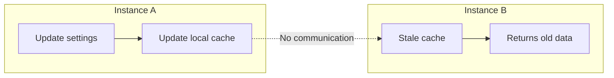
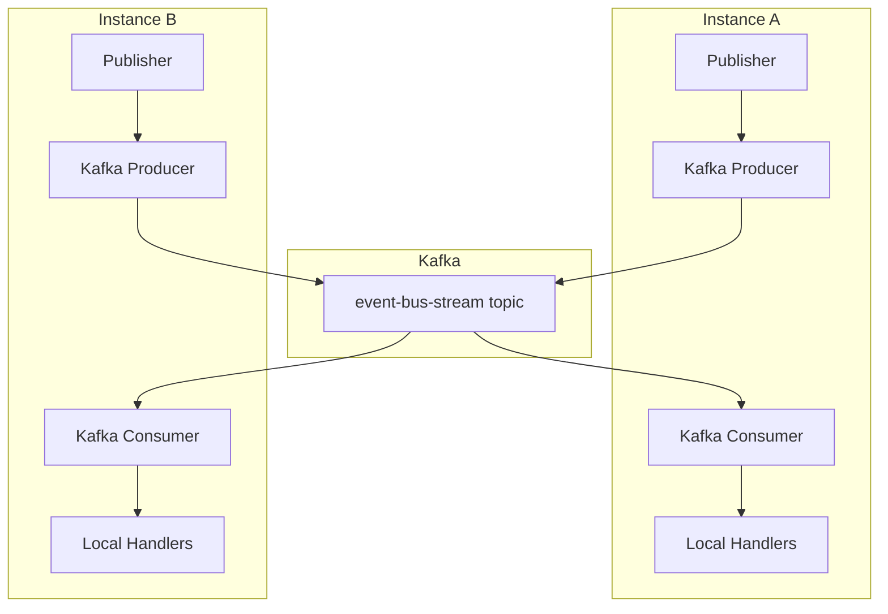
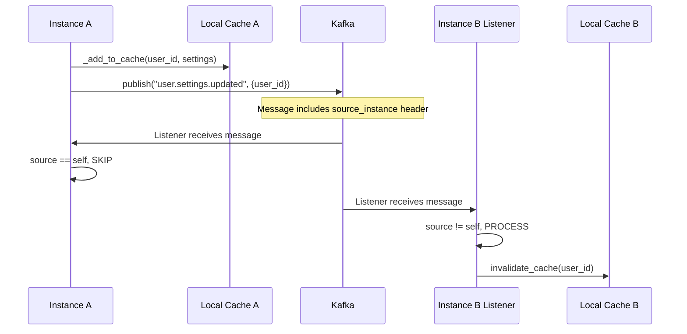

# Event bus

This document explains how the EventBus provides cross-instance communication for services that need to react to changes
happening on other instances. If you've wondered how cache invalidation works across multiple backend replicas, this is
where that question gets answered.

## The problem

When running multiple instances of the backend (horizontal scaling), each instance has its own in-memory cache. When
Instance A updates a user's settings, Instance B's cache becomes stale. Without coordination, Instance B would return
outdated data until its cache TTL expires.



The EventBus solves this by providing a Kafka-backed pub/sub mechanism for cross-instance events.

## Architecture

The EventBus uses Kafka as a message broker. When a service publishes an event, it goes to Kafka. Each instance has a
Kafka listener that receives events from other instances and distributes them to local subscribers.



The key insight is that publishers handle their own state changes directly. They don't need to receive their own events
back from Kafka. The EventBus filters out self-published messages so handlers only run for events from other instances.

## Self-filtering mechanism

Each EventBus instance has a unique ID. When publishing to Kafka, this ID is included as a message header:

```python
headers = [("source_instance", self._instance_id.encode("utf-8"))]
await self.producer.send_and_wait(topic=self._topic, value=value, headers=headers)
```

The Kafka listener checks this header and skips messages from itself:

```python
headers = dict(msg.headers) if msg.headers else {}
source = headers.get("source_instance", b"").decode("utf-8")
if source == self._instance_id:
    continue  # Skip self-published messages
```

This design means:

1. Publishers update their own state before calling `publish()`
2. The `publish()` call tells other instances about the change
3. Handlers only run for events from other instances

## Usage pattern

Services that need cross-instance communication follow this pattern:

```python
class MyService:
    async def initialize(self, event_bus_manager: EventBusManager) -> None:
        bus = await event_bus_manager.get_event_bus()

        async def _handle(evt: EventBusEvent) -> None:
            # This only runs for events from OTHER instances
            await self.invalidate_cache(evt.payload["id"])

        await bus.subscribe("my.event.*", _handle)

    async def update_something(self, id: str, data: dict) -> None:
        # 1. Update local state
        self._cache[id] = data

        # 2. Notify other instances
        bus = await self._event_bus_manager.get_event_bus()
        await bus.publish("my.event.updated", {"id": id})
```

## Pattern matching

Subscriptions support wildcard patterns using `fnmatch` syntax:

| Pattern                  | Matches                          |
|--------------------------|----------------------------------|
| `execution.*`            | All execution events             |
| `execution.123.*`        | All events for execution 123     |
| `*.completed`            | All completed events             |
| `user.settings.updated*` | Settings updates with any suffix |

## Flow diagram

Here's what happens when Instance A updates user settings:



## EventBusManager

The `EventBusManager` provides singleton access to the EventBus with proper lifecycle management:

```python
async def get_event_bus(self) -> EventBus:
    async with self._lock:
        if self._event_bus is None:
            self._event_bus = EventBus(self.settings, self.logger)
            await self._event_bus.__aenter__()
        return self._event_bus
```

Services receive the manager via dependency injection and call `get_event_bus()` when needed.

## Key files

| File                                                                                                                                     | Purpose                                     |
|------------------------------------------------------------------------------------------------------------------------------------------|---------------------------------------------|
| [`services/event_bus.py`](https://github.com/HardMax71/Integr8sCode/blob/main/backend/app/services/event_bus.py)                         | EventBus and EventBusManager implementation |
| [`services/user_settings_service.py`](https://github.com/HardMax71/Integr8sCode/blob/main/backend/app/services/user_settings_service.py) | Example usage for cache invalidation        |

## Related docs

- [User Settings Events](user-settings-events.md) — event sourcing with cache invalidation via EventBus
- [Event System Design](event-system-design.md) — domain events vs integration events
- [Kafka Topics](kafka-topic-architecture.md) — topic naming and partitioning
