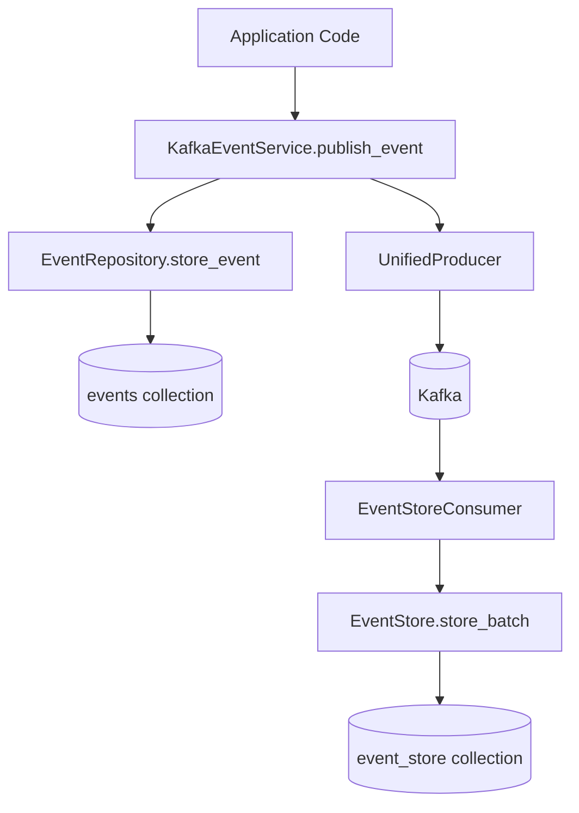
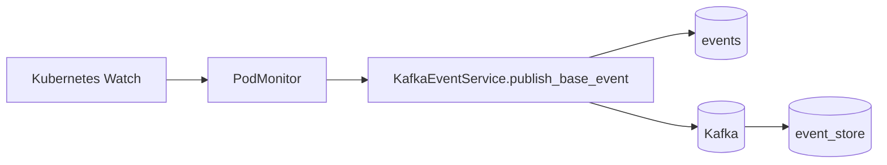

# Event storage architecture

## Two collections, one purpose

The system maintains *two separate MongoDB collections* for events: `events` and `event_store`. This implements a hybrid CQRS pattern where writes and reads are optimized for different use cases.

## EventDocument vs EventStoreDocument

**event_store** is the system's *permanent audit log* — an immutable append-only record of everything that happened:

- Sourced from Kafka via `EventStoreConsumer`
- No TTL — events persist indefinitely
- Used for replay, compliance, and forensics
- Single writer: the event store consumer

**events** is an *operational projection* — a working copy optimized for day-to-day queries:

- Sourced from application code via `KafkaEventService`
- 30-day TTL — old events expire automatically
- Used for admin dashboards, user-facing queries, analytics
- Written by any service publishing events

Both collections share identical schemas. The difference is *retention and purpose*.

## Write flow

When application code publishes an event, it flows through two paths:

1. `KafkaEventService.publish_event()` stores to `events` collection AND publishes to Kafka
2. `EventStoreConsumer` consumes from Kafka and stores to `event_store` collection

This dual-write ensures:

- **Immediate availability**: Events appear in `events` instantly for operational queries
- **Permanent record**: Events flow through Kafka to `event_store` for audit trail
- **Decoupling**: If Kafka consumer falls behind, operational queries remain fast

## Read patterns

Different repositories query different collections based on use case:

| Repository | Collection | Use Case |
|------------|------------|----------|
| `EventRepository` | events | User-facing queries, recent events |
| `AdminEventsRepository` | events | Admin dashboard, analytics |
| `EventStore` | event_store | Replay, audit, historical queries |

The admin console and user-facing features query `events` for fast access to recent data. The event store is reserved for replay scenarios and compliance needs.

## Why not just one collection?

**Storage costs**: The `events` collection with 30-day TTL keeps storage bounded. Without TTL, event volume would grow unbounded — problematic for operational queries that scan recent data.

**Query performance**: Operational queries (last 24 hours, user's recent events) benefit from a smaller, indexed dataset. Scanning a years-long audit log for recent events wastes resources.

**Retention policies**: Different data has different retention requirements. Operational data can expire. Audit logs often cannot.

**Failure isolation**: If the event store consumer falls behind (Kafka lag), operational queries remain unaffected. The `events` collection stays current through direct writes.

## Pod monitor integration

The `PodMonitor` watches Kubernetes pods and publishes lifecycle events. These events must appear in both collections:

`PodMonitor` uses `KafkaEventService.publish_base_event()` to:

1. Store pre-built events to `events` collection
2. Publish to Kafka for downstream consumers and `event_store`

This ensures pod events appear in admin dashboards immediately while maintaining the permanent audit trail.

## Key files

- `db/docs/event.py` — `EventDocument` and `EventStoreDocument` definitions
- `db/repositories/event_repository.py` — operational event queries
- `db/repositories/admin/admin_events_repository.py` — admin dashboard queries
- `events/event_store.py` — permanent event store operations
- `events/event_store_consumer.py` — Kafka to event_store consumer
- `services/kafka_event_service.py` — unified publish (store + Kafka)
- `services/pod_monitor/monitor.py` — pod lifecycle events
