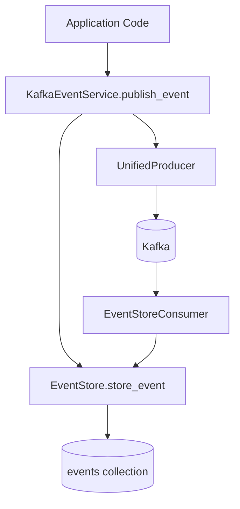

# Event storage architecture

## Unified events collection

The system stores all events in a single `events` MongoDB collection using `EventDocument`. This provides a unified
approach where all event data—whether from Kafka consumers, API operations, or pod monitors—flows into one collection
with consistent structure.

## EventDocument structure

`EventDocument` uses a flexible payload pattern:

```python
class EventDocument(Document):
    event_id: str           # Unique event identifier
    event_type: EventType   # Typed event classification
    event_version: str      # Schema version
    timestamp: datetime     # When event occurred
    aggregate_id: str       # Related entity (e.g., execution_id)
    metadata: EventMetadata # Service info, correlation, user context
    payload: dict[str, Any] # Event-specific data (flexible)
    stored_at: datetime     # When stored in MongoDB
    ttl_expires_at: datetime # Auto-expiration time
```

**Base fields** (`event_id`, `event_type`, `timestamp`, `aggregate_id`, `metadata`) are stored at document level for
efficient indexing.

**Event-specific fields** go into `payload` dict, allowing different event types to have different data without schema
changes.

## Storage pattern

When storing events, base fields stay at top level while everything else goes into payload:

```python
_BASE_FIELDS = {"event_id", "event_type", "event_version", "timestamp", "aggregate_id", "metadata"}

data = event.model_dump(exclude={"topic"})
payload = {k: data.pop(k) for k in list(data) if k not in _BASE_FIELDS}
doc = EventDocument(**data, payload=payload, stored_at=now, ttl_expires_at=ttl)
```

## Query pattern

For typed deserialization, flatten payload inline:

```python
d = doc.model_dump(exclude={"id", "revision_id", "stored_at", "ttl_expires_at"})
flat = {**{k: v for k, v in d.items() if k != "payload"}, **d.get("payload", {})}
event = schema_registry.deserialize_json(flat)
```

For MongoDB queries, access payload fields with dot notation:

```python
query["payload.execution_id"] = execution_id
query["metadata.correlation_id"] = correlation_id
```

## Write flow



1. `KafkaEventService.publish_event()` stores to `events` AND publishes to Kafka
2. `EventStoreConsumer` consumes from Kafka and stores to same `events` collection
3. Deduplication via unique `event_id` index handles double-writes gracefully

## Read patterns

All repositories query the same `events` collection:

| Repository              | Use Case                                             |
|-------------------------|------------------------------------------------------|
| `EventStore`            | Core event operations, replay, typed deserialization |
| `AdminEventsRepository` | Admin dashboard, analytics, browsing                 |
| `ReplayRepository`      | Replay session management, event streaming           |

## TTL and retention

Events have a configurable TTL (default 90 days). The `ttl_expires_at` field triggers MongoDB's TTL index for automatic
cleanup:

```python
ttl_expires_at = datetime.now(timezone.utc) + timedelta(days=self.ttl_days)
```

For permanent audit requirements, events can be archived to `EventArchiveDocument` before deletion.

## ReplayFilter

`ReplayFilter` provides a unified way to query events across all use cases:

```python
class ReplayFilter(BaseModel):
    event_ids: list[str] | None = None
    execution_id: str | None = None
    correlation_id: str | None = None
    aggregate_id: str | None = None
    event_types: list[EventType] | None = None
    start_time: datetime | None = None
    end_time: datetime | None = None
    user_id: str | None = None
    service_name: str | None = None
    custom_query: dict[str, Any] | None = None

    def to_mongo_query(self) -> dict[str, Any]:
        # Builds MongoDB query from filter fields
```

All event querying—admin browse, replay preview, event export—uses `ReplayFilter.to_mongo_query()` for consistency.

## Key files

- `db/docs/event.py` — `EventDocument` and `EventArchiveDocument` definitions
- `domain/replay/models.py` — `ReplayFilter`, `ReplayConfig`, `ReplaySessionState`
- `events/event_store.py` — event storage and retrieval operations
- `db/repositories/replay_repository.py` — replay-specific queries
- `db/repositories/admin/admin_events_repository.py` — admin dashboard queries
- `services/kafka_event_service.py` — unified publish (store + Kafka)
