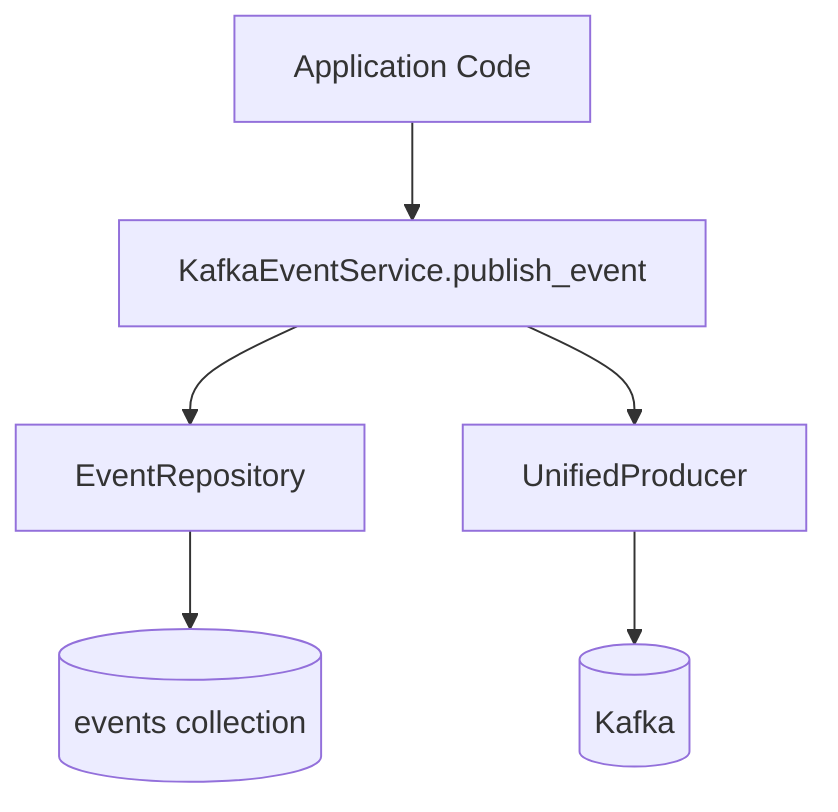

# Event storage architecture

## Unified events collection

The system stores all events in a single `events` MongoDB collection using `EventDocument`. This provides a unified
approach where all event data—whether from Kafka consumers, API operations, or pod monitors—flows into one collection
with consistent structure.

## EventDocument structure

`EventDocument` uses a flexible payload pattern. Base fields are stored at document level for efficient indexing, while
event-specific fields go into the `payload` dict:

```python
--8<-- "backend/app/db/docs/event.py:EventDocument"
```

## Storage pattern

When storing events, base fields stay at top level while everything else goes into payload. Repositories handle
serialization and deserialization at the boundary between domain models and Beanie documents.

## Query pattern

For MongoDB queries, access payload fields with dot notation:

```python
query["payload.execution_id"] = execution_id
query["aggregate_id"] = aggregate_id
```

## Write flow



`KafkaEventService.publish_event()` stores to `events` AND publishes to Kafka. Deduplication via unique `event_id` index
handles double-writes gracefully.

## Read patterns

All repositories query the same `events` collection:

| Repository              | Use Case                                             |
|-------------------------|------------------------------------------------------|
| `EventRepository`       | Core event operations, replay, typed deserialization |
| `AdminEventsRepository` | Admin dashboard, analytics, browsing                 |
| `ReplayRepository`      | Replay session management, event streaming           |

## TTL and retention

Events have a configurable TTL (default 90 days). The `ttl_expires_at` field triggers MongoDB's TTL index for automatic
cleanup. For permanent audit requirements, events can be archived to `EventArchiveDocument` before deletion.

## ReplayFilter

`ReplayFilter` provides a unified way to query events across all use cases:

```python
--8<-- "backend/app/domain/replay/models.py:ReplayError"
```

The `to_mongo_query()` method builds MongoDB queries from filter fields:

```python
--8<-- "backend/app/domain/replay/models.py:ReplayFilter"
```

All event querying—admin browse, replay preview, event export—uses `ReplayFilter.to_mongo_query()` for consistency.

## Key files

| File                                                                                                                                                                   | Purpose                                                |
|------------------------------------------------------------------------------------------------------------------------------------------------------------------------|--------------------------------------------------------|
| [`db/docs/event.py`](https://github.com/HardMax71/Integr8sCode/blob/main/backend/app/db/docs/event.py)                                                                 | `EventDocument` and `EventArchiveDocument` definitions |
| [`domain/replay/models.py`](https://github.com/HardMax71/Integr8sCode/blob/main/backend/app/domain/replay/models.py)                                                   | `ReplayFilter`, `ReplayConfig`, `ReplaySessionState`   |
| [`db/repositories/event_repository.py`](https://github.com/HardMax71/Integr8sCode/blob/main/backend/app/db/repositories/event_repository.py)                           | Event storage and retrieval operations                 |
| [`db/repositories/replay_repository.py`](https://github.com/HardMax71/Integr8sCode/blob/main/backend/app/db/repositories/replay_repository.py)                         | Replay-specific queries                                |
| [`db/repositories/admin/admin_events_repository.py`](https://github.com/HardMax71/Integr8sCode/blob/main/backend/app/db/repositories/admin/admin_events_repository.py) | Admin dashboard queries                                |
| [`services/kafka_event_service.py`](https://github.com/HardMax71/Integr8sCode/blob/main/backend/app/services/kafka_event_service.py)                                   | Unified publish (store + Kafka)                        |

## Related docs

- [User Settings Events](user-settings-events.md) — event sourcing pattern for user settings with TypeAdapter merging
- [Domain Dataclasses](domain-dataclasses.md) — why domain models use stdlib dataclasses
