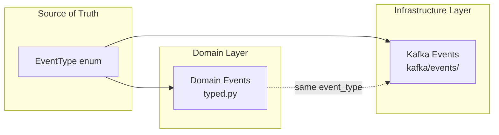
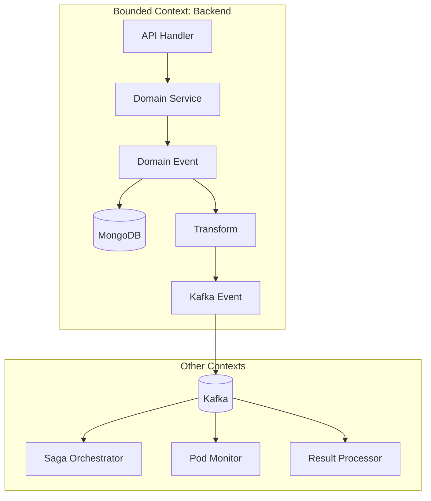
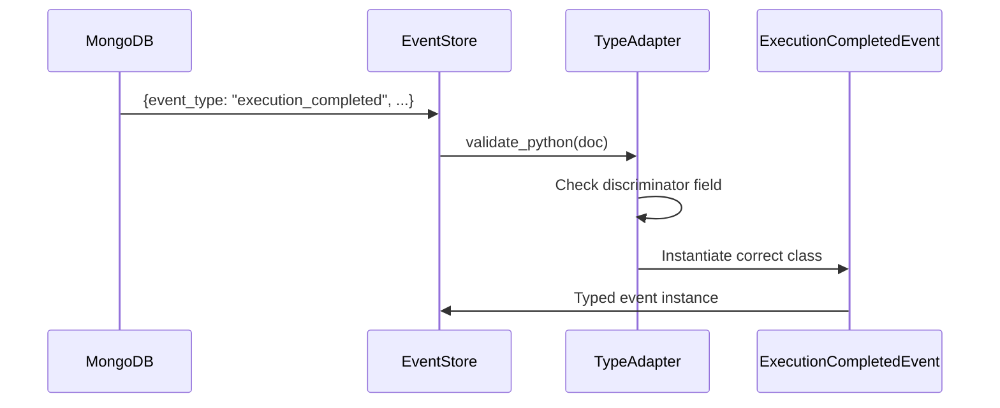

# Event system design

This document explains how events flow through the system, why there are multiple event representations, and how they work together. If you've looked at the codebase and wondered why we have both domain events and Kafka events that look almost identical, this is where that question gets answered.

## The three layers

Events in Integr8sCode exist in three forms:



The `EventType` enum defines all possible event types as strings. Domain events are Pydantic models used for storage in MongoDB and deserialization from the event store. Kafka events are Avro-compatible models used for serialization to Kafka topics. Both reference the same `EventType` values, ensuring consistency.

This might look like unnecessary duplication, but it's actually a deliberate architectural choice rooted in Domain-Driven Design.

## Why two event classes?

In DDD terminology, what we call "domain events" and "Kafka events" map to two different concepts: domain events and integration events.

Domain events are internal to the bounded context. They carry whatever information the domain needs, including storage-related fields like `stored_at` and `ttl_expires_at`. These events get stored in MongoDB and replayed during event sourcing operations.

Integration events cross bounded context boundaries. They flow through Kafka to other services or workers. They need to be serializable to Avro, which means they can't contain arbitrary Python objects. They carry routing information like the `topic` ClassVar.



The transformation between domain and Kafka events happens in `KafkaEventService`. When you call `publish_event()`, the service stores the domain event in MongoDB and publishes the corresponding Kafka event to the appropriate topic.

## How discriminated unions work

When events come back from MongoDB, we need to deserialize them into the correct Python class. A document with `event_type: "execution_completed"` should become an `ExecutionCompletedEvent` instance, not a generic dict.

Pydantic's discriminated unions handle this. Each event class declares its event type using a `Literal` type:

```python
class ExecutionCompletedEvent(BaseEvent):
    event_type: Literal[EventType.EXECUTION_COMPLETED] = EventType.EXECUTION_COMPLETED
    execution_id: str
    exit_code: int
    # ...
```

The `DomainEvent` type is a union of all event classes with a discriminator on `event_type`:

```python
DomainEvent = Annotated[
    ExecutionRequestedEvent
    | ExecutionCompletedEvent
    | ExecutionFailedEvent
    | ...  # all 53 event types
    Discriminator("event_type"),
]
```

The `domain_event_adapter` TypeAdapter validates incoming data against this union. When it sees `{"event_type": "execution_completed", ...}`, it knows to instantiate an `ExecutionCompletedEvent`.



This approach is more performant than trying each union member until one validates. The discriminator tells Pydantic exactly which class to use.

## Keeping things in sync

With three representations of each event, there's a risk of drift. You might add a new `EventType` value but forget to create the corresponding domain or Kafka event class. Or you might create a Kafka event but forget to add it to the `DomainEvent` union.

The `test_event_schema_coverage.py` test suite catches these problems:

```python
--8<-- "backend/tests/unit/domain/events/test_event_schema_coverage.py:59:72"
```

The test runs in CI and fails if any `EventType` value lacks a corresponding event class. It also checks the reverse: that no orphan event classes exist without matching enum values.

When adding a new event type, the workflow is:

1. Add the value to `EventType` enum
2. Create the domain event class in `typed.py`
3. Add it to the `DomainEvent` union
4. Create the Kafka event class in `kafka/events/`
5. Export it from `kafka/events/__init__.py`

If you miss a step, the test tells you exactly what's missing.

## The Avro connection

Kafka events inherit from `AvroBase` (via `pydantic-avro`), which enables automatic Avro schema generation. The schema registry stores these schemas and validates that producers and consumers agree on the format.

```python
--8<-- "backend/app/infrastructure/kafka/events/base.py:13:27"
```

Each Kafka event class also declares its target topic as a class variable. The producer uses this to route events to the correct topic without external mapping tables.

## Why not just one event class?

You could theoretically use the same class for both domain and Kafka purposes. The domain-specific fields (`stored_at`, `ttl_expires_at`) could be excluded from Avro serialization with `exclude=True`. The `topic` ClassVar wouldn't serialize anyway.

This is a valid simplification if your domain and integration events have identical payloads. But there are reasons to keep them separate:

The domain layer shouldn't know about Kafka topics. Adding `topic: ClassVar[KafkaTopic]` to a domain event couples it to infrastructure concerns. DDD purists would argue this violates the dependency rule.

Avro has constraints that don't apply to MongoDB. Avro schemas don't support arbitrary nested dicts, certain datetime formats, or MongoDB-specific types like ObjectId. Keeping Kafka events separate means you can optimize them for wire format without affecting domain logic.

The two layers can evolve independently. If you need to change how events are stored in MongoDB, you don't have to worry about breaking Kafka consumers. If you need to add a field to Kafka events for a new consumer, you can do so without touching the domain layer.

That said, if your events are simple and you want less code to maintain, unifying them is a reasonable choice. The current architecture prioritizes separation of concerns over minimizing duplication.

## Key files

| File | Purpose |
|------|---------|
| [`domain/enums/events.py`](https://github.com/HardMax71/Integr8sCode/blob/main/backend/app/domain/enums/events.py) | `EventType` enum with all event type values |
| [`domain/events/typed.py`](https://github.com/HardMax71/Integr8sCode/blob/main/backend/app/domain/events/typed.py) | Domain event classes and `DomainEvent` union |
| [`infrastructure/kafka/events/`](https://github.com/HardMax71/Integr8sCode/blob/main/backend/app/infrastructure/kafka/events/) | Kafka event classes organized by domain |
| [`services/kafka_event_service.py`](https://github.com/HardMax71/Integr8sCode/blob/main/backend/app/services/kafka_event_service.py) | Publishes events to both MongoDB and Kafka |
| [`tests/unit/domain/events/test_event_schema_coverage.py`](https://github.com/HardMax71/Integr8sCode/blob/main/backend/tests/unit/domain/events/test_event_schema_coverage.py) | Validates correspondence between enum and event classes |

## Related docs

- [Event Storage](event-storage.md) — how events are stored in MongoDB with the payload pattern
- [Kafka Topics](kafka-topic-architecture.md) — topic naming conventions and partitioning strategy
- [User Settings Events](user-settings-events.md) — event sourcing pattern with TypeAdapter merging
