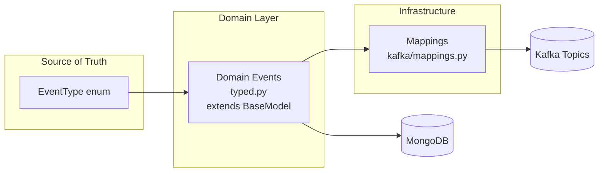

# Event system design

This document explains how events flow through the system and how domain events are both stored and serialized for Kafka transport.

## The unified event model

Events in Integr8sCode use a unified design where domain events are plain Pydantic models serialized as JSON:



The `EventType` enum defines all possible event types as strings. Domain events are Pydantic `BaseModel` subclasses, making them usable for both MongoDB storage and Kafka transport. FastStream handles JSON serialization natively when publishing and deserializing when consuming. The mappings module routes events to the correct Kafka topics.

This design eliminates duplication between "domain events" and "Kafka events" by making the domain event the single source of truth.

## Why a unified model?

Earlier designs maintained separate domain and Kafka event classes, arguing that domain events shouldn't know about infrastructure concerns. In practice, this created:

- Duplicate class definitions for every event type
- Transformation logic between layers
- Risk of drift when fields changed
- Extra maintenance burden

The unified approach addresses these issues:

- **Single definition**: Each event is defined once in `domain/events/typed.py`
- **JSON-native**: `BaseEvent` extends Pydantic `BaseModel`; FastStream serializes to JSON automatically
- **Storage-ready**: Events include storage fields (`stored_at`, `ttl_expires_at`) that MongoDB uses
- **Topic routing**: The `EVENT_TYPE_TO_TOPIC` mapping in `infrastructure/kafka/mappings.py` handles routing

Infrastructure concerns (Kafka topics) are kept separate through the mappings module rather than embedded in event classes.

## How discriminated unions work

When events come back from MongoDB, we need to deserialize them into the correct Python class. A document with `event_type: "execution_completed"` should become an `ExecutionCompletedEvent` instance, not a generic dict.

Pydantic's discriminated unions handle this. Each event class declares its event type using a `Literal` type:

```python
class ExecutionCompletedEvent(BaseEvent):
    event_type: Literal[EventType.EXECUTION_COMPLETED] = EventType.EXECUTION_COMPLETED
    execution_id: str
    exit_code: int
    # ...
```

The `DomainEvent` type is a union of all event classes with a discriminator on `event_type`:

```python
DomainEvent = Annotated[
    ExecutionRequestedEvent
    | ExecutionCompletedEvent
    | ExecutionFailedEvent
    | ...  # all 53 event types
    Discriminator("event_type"),
]
```

The `domain_event_adapter` TypeAdapter validates incoming data against this union. When it sees `{"event_type": "execution_completed", ...}`, it knows to instantiate an `ExecutionCompletedEvent`.


This approach is more performant than trying each union member until one validates. The discriminator tells Pydantic exactly which class to use.

## BaseEvent

The `BaseEvent` class provides common fields for all events:

```python
class BaseEvent(BaseModel):
    """Base fields for all domain events."""
    model_config = ConfigDict(from_attributes=True)

    event_id: str = Field(default_factory=lambda: str(uuid4()))
    event_type: EventType
    event_version: str = "1.0"
    timestamp: datetime = Field(default_factory=...)
    aggregate_id: str | None = None
    metadata: EventMetadata
    stored_at: datetime = Field(default_factory=...)
    ttl_expires_at: datetime = Field(default_factory=...)
```

Since `BaseEvent` is a plain Pydantic model, FastStream handles serialization and deserialization transparently — publishing calls `model.model_dump_json()` under the hood, and subscribers receive typed model instances from the incoming JSON.

## Topic routing

Events are routed to Kafka topics through the `EVENT_TYPE_TO_TOPIC` mapping:

```python
# infrastructure/kafka/mappings.py
EVENT_TYPE_TO_TOPIC: Dict[EventType, KafkaTopic] = {
    EventType.EXECUTION_REQUESTED: KafkaTopic.EXECUTION_EVENTS,
    EventType.EXECUTION_COMPLETED: KafkaTopic.EXECUTION_EVENTS,
    EventType.POD_CREATED: KafkaTopic.EXECUTION_EVENTS,
    EventType.SAGA_STARTED: KafkaTopic.SAGA_EVENTS,
    # ... all event types
}
```

Helper functions provide type-safe access:

```python
def get_topic_for_event(event_type: EventType) -> KafkaTopic:
    return EVENT_TYPE_TO_TOPIC.get(event_type, KafkaTopic.SYSTEM_EVENTS)

def get_event_class_for_type(event_type: EventType) -> type | None:
    return _get_event_type_to_class().get(event_type)
```

## Keeping things in sync

With the unified model, there's less risk of drift since each event is defined once. The `test_event_schema_coverage.py` test suite validates:

1. Every `EventType` has a corresponding domain event class
2. Every event class has a valid `event_type` default
3. The `DomainEvent` union includes all event types
4. No orphan classes exist without matching enum values

When adding a new event type:

1. Add the value to `EventType` enum
2. Create the event class in `typed.py` with the correct `event_type` default
3. Add it to the `DomainEvent` union
4. Add the topic mapping in `infrastructure/kafka/mappings.py`

If you miss a step, the test tells you exactly what's missing.

## Event flow


When publishing events, the `UnifiedProducer`:
1. Persists the event to MongoDB via `EventRepository`
2. Looks up the topic via `EVENT_TYPE_TO_TOPIC`
3. Publishes the Pydantic model to Kafka through `broker.publish()` (FastStream handles JSON serialization)

The producer handles both storage in MongoDB and publishing to Kafka in a single flow.

## Key files

| File | Purpose |
|------|---------|
| [`domain/enums/events.py`](https://github.com/HardMax71/Integr8sCode/blob/main/backend/app/domain/enums/events.py) | `EventType` enum with all event type values |
| [`domain/events/typed.py`](https://github.com/HardMax71/Integr8sCode/blob/main/backend/app/domain/events/typed.py) | All domain event classes and `DomainEvent` union |
| [`infrastructure/kafka/mappings.py`](https://github.com/HardMax71/Integr8sCode/blob/main/backend/app/infrastructure/kafka/mappings.py) | Event-to-topic routing and helper functions |
| [`events/core/producer.py`](https://github.com/HardMax71/Integr8sCode/blob/main/backend/app/events/core/producer.py) | UnifiedProducer — persists to MongoDB then publishes to Kafka |
| [`tests/unit/domain/events/test_event_schema_coverage.py`](https://github.com/HardMax71/Integr8sCode/blob/main/backend/tests/unit/domain/events/test_event_schema_coverage.py) | Validates correspondence between enum and event classes |

## Related docs

- [Event Storage](event-storage.md) — how events are stored in MongoDB with the payload pattern
- [Kafka Topics](kafka-topic-architecture.md) — topic naming conventions and partitioning strategy
- [User Settings Events](user-settings-events.md) — event sourcing pattern with TypeAdapter merging
