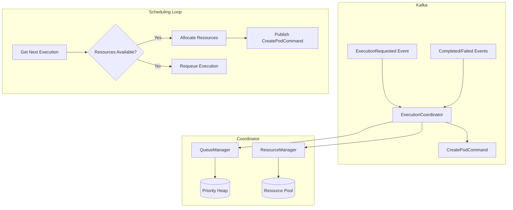

# Execution Queue

The ExecutionCoordinator manages a priority queue for script executions, allocating CPU and memory resources before
spawning pods. It consumes `ExecutionRequested` events, validates resource availability, and emits commands to the
Kubernetes worker via the saga system. Per-user limits and stale timeout handling prevent queue abuse.

## Architecture



## Queue Priority

Executions enter the queue with one of five priority levels. Lower numeric values are processed first:

```python
--8<-- "backend/app/services/coordinator/queue_manager.py:14:19"
```

The queue uses Python's `heapq` module, which efficiently maintains the priority ordering. When resources are
unavailable, executions are requeued with reduced priority to prevent starvation of lower-priority work.

## Per-User Limits

The queue enforces per-user execution limits to prevent a single user from monopolizing resources:

```python
--8<-- "backend/app/services/coordinator/queue_manager.py:42:54"
```

When a user exceeds their limit, new execution requests are rejected with an error message indicating the limit has been
reached.

## Stale Timeout

Executions that sit in the queue too long (default 1 hour) are automatically removed by a background cleanup task. This
prevents abandoned requests from consuming queue space indefinitely:

```python
--8<-- "backend/app/services/coordinator/queue_manager.py:243:267"
```

## Resource Allocation

The ResourceManager tracks a pool of CPU, memory, and GPU resources. Each execution requests an allocation based on
language defaults or explicit requirements:

```python
--8<-- "backend/app/services/coordinator/resource_manager.py:121:130"
```

The pool maintains minimum reserve thresholds to ensure the system remains responsive even under heavy load. Allocations
that would exceed the safe threshold are rejected, and the execution is requeued for later processing.

```python
--8<-- "backend/app/services/coordinator/resource_manager.py:135:148"
```

## Scheduling Loop

The coordinator runs a background scheduling loop that continuously pulls executions from the queue and attempts to
schedule them:

```python
--8<-- "backend/app/services/coordinator/coordinator.py:307:323"
```

A semaphore limits concurrent scheduling operations to prevent overwhelming the system during bursts of incoming
requests.

## Event Flow

The coordinator handles several event types:

1. **ExecutionRequested** - Adds execution to queue, publishes `ExecutionAccepted`
2. **ExecutionCancelled** - Removes from queue, releases resources if allocated
3. **ExecutionCompleted** - Releases allocated resources
4. **ExecutionFailed** - Releases allocated resources

When scheduling succeeds, the coordinator publishes a `CreatePodCommand` to the saga topic, triggering pod creation by
the Kubernetes worker.

## Configuration

| Parameter                     | Default | Description                          |
|-------------------------------|---------|--------------------------------------|
| `max_queue_size`              | 10000   | Maximum executions in queue          |
| `max_executions_per_user`     | 100     | Per-user queue limit                 |
| `stale_timeout_seconds`       | 3600    | When to discard old executions       |
| `max_concurrent_scheduling`   | 10      | Parallel scheduling operations       |
| `scheduling_interval_seconds` | 0.5     | Polling interval when queue is empty |
| `total_cpu_cores`             | 32.0    | Total CPU pool                       |
| `total_memory_mb`             | 65536   | Total memory pool (64GB)             |
| `overcommit_factor`           | 1.2     | Allow 20% resource overcommit        |

## Key Files

| File                                                                                                                                                   | Purpose                       |
|--------------------------------------------------------------------------------------------------------------------------------------------------------|-------------------------------|
| [`services/coordinator/coordinator.py`](https://github.com/HardMax71/Integr8sCode/blob/main/backend/app/services/coordinator/coordinator.py)           | Main coordinator service      |
| [`services/coordinator/queue_manager.py`](https://github.com/HardMax71/Integr8sCode/blob/main/backend/app/services/coordinator/queue_manager.py)       | Priority queue implementation |
| [`services/coordinator/resource_manager.py`](https://github.com/HardMax71/Integr8sCode/blob/main/backend/app/services/coordinator/resource_manager.py) | Resource pool and allocation  |
