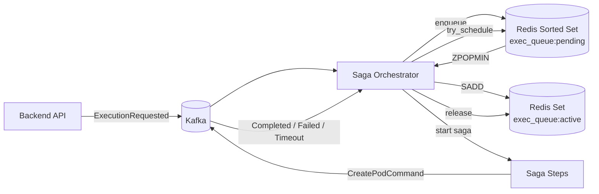

# Execution Queue

This document explains how the Redis-backed execution queue works, how the saga orchestrator drives scheduling, and how admins can manage priority. It's written for engineers who need to understand the scheduling pipeline or debug queue-related issues.

## Overview

When a user submits code, the backend publishes an `ExecutionRequested` event to Kafka. The saga orchestrator consumes it, pushes the execution into a Redis sorted set ranked by priority, and immediately attempts to schedule it. If the concurrency limit allows, the orchestrator pops the highest-priority item, starts a saga, and the saga steps publish a `CreatePodCommandEvent` to the K8s worker. When executions finish, the orchestrator releases the slot and schedules the next pending item.

The queue replaced an earlier in-memory `heapq` inside a dedicated coordinator worker. Moving to Redis gives persistence across restarts, atomic operations safe for horizontal scaling, and a single scheduling owner (the saga orchestrator) that validates before creating pods.

## Architecture



## Redis Data Model

The queue uses three Redis key patterns:

| Key | Type | Purpose | TTL |
|-----|------|---------|-----|
| `exec_queue:pending` | Sorted set | Pending executions ranked by priority score | None |
| `exec_queue:active` | Set | Execution IDs currently running (concurrency tracking) | None |
| `exec_queue:event:{execution_id}` | String | Serialized `ExecutionRequestedEvent` JSON | 24 hours |

### Priority Score Encoding

Each execution is stored in the sorted set with a composite score that encodes both priority level and enqueue time:

```
score = PRIORITY_BAND * 10^12 + unix_timestamp_ms
```

Priority bands:

| Priority | Band | Score range |
|----------|------|-------------|
| `CRITICAL` | 0 | `0` .. `999_999_999_999` |
| `HIGH` | 1 | `1_000_000_000_000` .. `1_999_999_999_999` |
| `NORMAL` | 2 | `2_000_000_000_000` .. `2_999_999_999_999` |
| `LOW` | 3 | `3_000_000_000_000` .. `3_999_999_999_999` |
| `BACKGROUND` | 4 | `4_000_000_000_000` .. `4_999_999_999_999` |

`ZPOPMIN` always returns the lowest score first, so `CRITICAL` items are scheduled before `NORMAL`, and within the same priority band, earlier submissions are scheduled first (FIFO).

### Atomic Scheduling with Lua

The `try_schedule` operation must atomically check the active count, pop from the pending set, and add to the active set. A server-side Lua script ensures this happens in a single Redis round-trip with no race conditions:

```lua
local active_key  = KEYS[1]
local pending_key = KEYS[2]
local max_active  = tonumber(ARGV[1])

local current = redis.call('SCARD', active_key)
if current >= max_active then
    return nil
end

local result = redis.call('ZPOPMIN', pending_key, 1)
if #result == 0 then
    return nil
end

local exec_id = result[1]
redis.call('SADD', active_key, exec_id)
return exec_id
```

This eliminates the TOCTOU race where two concurrent callers could both see `current < max_active` and schedule beyond the limit.

## Scheduling Triggers

Scheduling is **reactive** — the orchestrator calls `try_schedule_from_queue()` in response to events, plus a **periodic fallback** for crash recovery.

### Event-driven triggers

| Event | Queue action | Then |
|-------|-------------|------|
| `ExecutionRequested` | `enqueue(event)` | `try_schedule_from_queue()` |
| `ExecutionCompleted` | `release(execution_id)` | `try_schedule_from_queue()` |
| `ExecutionFailed` | `release(execution_id)` | `try_schedule_from_queue()` |
| `ExecutionTimeout` | `release(execution_id)` | `try_schedule_from_queue()` |
| `ExecutionCancelled` | `remove(execution_id)` | `try_schedule_from_queue()` |

The `try_schedule_from_queue` method loops, calling `try_schedule(max_concurrent)` until it returns `None` (either the concurrency cap is reached or the pending set is empty). Each successful pop starts a new saga.

### Periodic fallback

The saga orchestrator worker runs an APScheduler job every **10 seconds** that calls `try_schedule_from_queue()`. This handles the case where the worker restarted and missed events while down, or where a `release` was lost.

```python
scheduler.add_job(
    orchestrator.try_schedule_from_queue,
    trigger="interval",
    seconds=10,
    id="saga_try_schedule",
    max_instances=1,
    misfire_grace_time=30,
)
```

## Concurrency Control

The maximum number of concurrent executions is controlled by `max_concurrent_executions` in `SystemSettings`, loaded at scheduling time via `RuntimeSettingsLoader`. The default is **10**.

The Lua script enforces this by checking `SCARD(exec_queue:active)` before popping. An execution stays in the active set from the moment it is scheduled until the saga reaches a terminal state (`COMPLETED`, `FAILED`, `TIMEOUT`, or `CANCELLED`), at which point `release()` removes it.

## Queue Service API

`ExecutionQueueService` exposes these methods, all called by the saga orchestrator or admin service:

| Method | What it does |
|--------|-------------|
| `enqueue(event)` | `ZADD` to pending set + store event JSON. Returns queue position. |
| `try_schedule(max_active)` | Lua script: if active < max, `ZPOPMIN` + `SADD`. Returns `(execution_id, event)` or `None`. |
| `release(execution_id)` | `SREM` from active set + `DEL` event key. |
| `update_priority(execution_id, new_priority)` | Re-scores the pending sorted set entry. Returns `False` if not pending. |
| `remove(execution_id)` | Cleans up from pending set, active set, and event key. |
| `get_queue_status()` | Returns `{queue_depth, active_count}` via `ZCARD` + `SCARD`. |
| `get_pending_by_priority()` | Counts per priority band via `ZCOUNT` on score ranges. |

## Admin Priority Management

Admins can view and reprioritize queued executions through the admin API. All endpoints require admin authentication.

| Endpoint | Method | Description |
|----------|--------|-------------|
| `/api/v1/admin/executions/` | `GET` | List executions with status, priority, and user filters |
| `/api/v1/admin/executions/{id}/priority` | `PUT` | Change priority (updates both MongoDB and Redis queue) |
| `/api/v1/admin/executions/queue` | `GET` | Queue status: depth, active count, max concurrent, breakdown by priority |

When an admin changes priority, `AdminExecutionService` updates MongoDB (for persistence) and calls `queue_service.update_priority()` to re-score the Redis sorted set entry. The change takes effect on the next scheduling attempt.

## Metrics

`QueueMetrics` emits OpenTelemetry instruments for observability:

| Metric | Type | Description |
|--------|------|-------------|
| `queue.depth` | UpDownCounter | Pending executions (incremented on enqueue, decremented on schedule) |
| `queue.active` | UpDownCounter | Active executions (incremented on schedule, decremented on release) |
| `queue.enqueue.total` | Counter | Total executions enqueued |
| `queue.schedule.total` | Counter | Total executions scheduled from queue |
| `queue.wait_time` | Histogram | Time from enqueue to schedule, bucketed by priority |

Example PromQL queries:

```promql
# Current queue depth
queue_depth

# Scheduling throughput (per second, 5m window)
rate(queue_schedule_total[5m])

# P95 wait time by priority
histogram_quantile(0.95, rate(queue_wait_time_bucket[5m]))
```

## Key Files

| File | Purpose |
|------|---------|
| [`execution_queue.py`](https://github.com/HardMax71/Integr8sCode/blob/main/backend/app/services/execution_queue.py) | `ExecutionQueueService` — Redis queue operations |
| [`saga_orchestrator.py`](https://github.com/HardMax71/Integr8sCode/blob/main/backend/app/services/saga/saga_orchestrator.py) | Saga orchestrator — scheduling triggers and saga lifecycle |
| [`run_saga_orchestrator.py`](https://github.com/HardMax71/Integr8sCode/blob/main/backend/workers/run_saga_orchestrator.py) | Worker entry point with APScheduler jobs |
| [`queue.py`](https://github.com/HardMax71/Integr8sCode/blob/main/backend/app/core/metrics/queue.py) | `QueueMetrics` OpenTelemetry instruments |
| [`admin_execution_service.py`](https://github.com/HardMax71/Integr8sCode/blob/main/backend/app/services/admin/admin_execution_service.py) | Admin service for listing executions and updating priority |
| [`executions.py`](https://github.com/HardMax71/Integr8sCode/blob/main/backend/app/api/routes/admin/executions.py) | Admin API routes |

## Related docs

- [Kafka Topic Architecture](kafka-topic-architecture.md) — topic layout and consumer groups
- [Services Overview](services-overview.md) — how all services fit together
- [Saga Orchestrator](../components/workers/saga_orchestrator.md) — saga lifecycle and compensation
- [Metrics Reference](../operations/metrics-reference.md) — full metrics catalog
