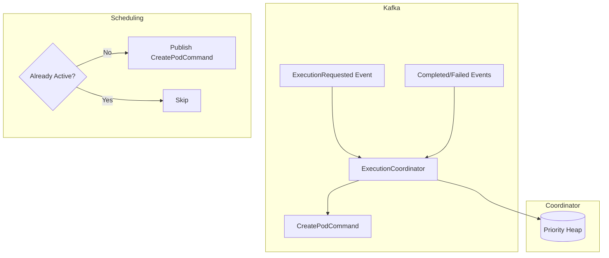

# Execution Queue

The ExecutionCoordinator manages a priority queue for script executions. It consumes `ExecutionRequested` events, queues
them by priority, and emits `CreatePodCommand` events to the Kubernetes worker. Per-user limits and stale timeout
handling prevent queue abuse. Actual resource enforcement happens at the Kubernetes level via pod manifests.

## Architecture



## Queue Priority

Executions enter the queue with one of five priority levels. Lower numeric values are processed first:

```python
--8<-- "backend/app/services/coordinator/coordinator.py:ExecutionCoordinator"
```

The queue uses Python's `heapq` module, which efficiently maintains the priority ordering.

## Per-User Limits

The queue enforces per-user execution limits to prevent a single user from monopolizing resources:

```python
--8<-- "backend/app/services/coordinator/coordinator.py:handle_execution_requested"
```

When a user exceeds their limit, new execution requests are rejected with an error message indicating the limit has been
reached.

## Stale Timeout

Executions that sit in the queue too long (default 1 hour) are lazily swept when the queue is full. This prevents
abandoned requests from consuming queue space indefinitely.

## Reactive Scheduling

The coordinator does not use a background polling loop. Scheduling is event-driven: when an execution is added at
position 0 in the queue, or when an active execution completes, fails, or is cancelled, the coordinator immediately
tries to schedule the next queued execution. A dedup guard (`_active_executions` set) prevents double-publishing
`CreatePodCommand` for the same execution.

Resource limits (CPU, memory) are enforced by Kubernetes via pod manifest `resources.requests` and `resources.limits`,
not by the coordinator.

## Event Flow

The coordinator handles several event types:

1. **ExecutionRequested** - Adds execution to queue, publishes `ExecutionAccepted`, triggers scheduling if at front
2. **ExecutionCancelled** - Removes from queue, triggers scheduling of next item
3. **ExecutionCompleted** - Removes from active set, triggers scheduling of next item
4. **ExecutionFailed** - Removes from active set, triggers scheduling of next item

When scheduling succeeds, the coordinator publishes a `CreatePodCommand` to the saga topic, triggering pod creation by
the Kubernetes worker.

## Configuration

| Parameter                 | Default | Description                    |
|---------------------------|---------|--------------------------------|
| `max_queue_size`          | 10000   | Maximum executions in queue    |
| `max_executions_per_user` | 100     | Per-user queue limit           |
| `stale_timeout_seconds`   | 3600    | When to discard old executions |

## Key Files

| File                                                                                                                                                   | Purpose                       |
|--------------------------------------------------------------------------------------------------------------------------------------------------------|-------------------------------|
| [`services/coordinator/coordinator.py`](https://github.com/HardMax71/Integr8sCode/blob/main/backend/app/services/coordinator/coordinator.py) | Coordinator service with integrated priority queue |
