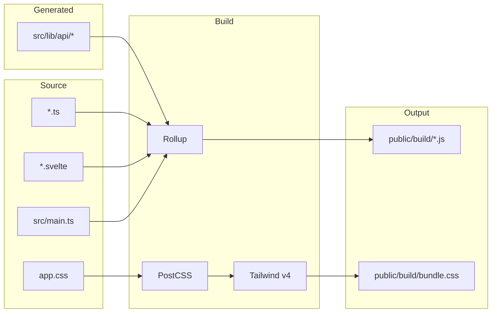
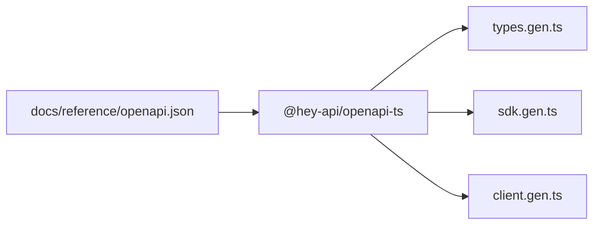

# Frontend build system

This document explains how the frontend codebase is built, what libraries are involved, and how different parts connect at compile time and runtime. It's written for developers who need to modify the build pipeline or understand how the frontend works.

## Overview

The frontend is a Svelte single-page application bundled with Rollup. It uses TypeScript for type safety, Tailwind CSS v4 for styling, and a generated SDK for type-safe API calls. The build outputs static files to `public/build/` which are served by nginx in production or by a custom HTTPS dev server during development.



## Rollup configuration

The `rollup.config.js` file configures the entire build pipeline. It produces ES modules with code splitting, enabling parallel loading of vendor code and application code.

### Entry point

The build starts from `src/main.ts`, which imports the API client setup, mounts the Svelte `App` component, and imports global CSS:

```typescript
import './lib/api/setup';
import App from './App.svelte';
import './app.css';

const app = new App({
  target: document.body,
});
```

### Code splitting

Rollup splits the bundle into chunks to improve load performance. The `manualChunks` configuration separates large dependencies:

| Chunk | Contents |
|-------|----------|
| `vendor` | Svelte, svelte-routing, axios |
| `codemirror` | All CodeMirror packages for the editor |
| Application chunks | Route components and shared code |

This means users don't re-download vendor code when application code changes, and the editor chunk only loads when needed.

### Plugins

The plugin pipeline processes files in order:

1. **replace** — Substitutes `process.env.VITE_BACKEND_URL` with an empty string, allowing relative API paths
2. **svelte** — Compiles `.svelte` files with TypeScript preprocessing via `svelte-preprocess`
3. **postcss** — Processes CSS through PostCSS, extracting styles to `bundle.css`
4. **typescript** — Compiles TypeScript files with source maps
5. **json** — Allows importing JSON files
6. **resolve** — Resolves `node_modules` imports for browser usage, preferring ES modules
7. **commonjs** — Converts CommonJS modules to ES modules
8. **terser** (production only) — Minifies JavaScript, removes console logs, runs two compression passes

### Development server

In development mode (`npm run dev`), Rollup watches for changes and a custom HTTPS server starts automatically. The server handles two responsibilities:

1. **Static file serving** — Serves files from `public/`, falling back to `index.html` for SPA routing
2. **API proxying** — Forwards `/api/*` requests to the backend container over HTTPS

The proxy uses a custom `https.Agent` that trusts the local CA certificate at `/shared_ca/mkcert-ca.pem`, allowing secure communication with the backend during development. The server listens on port 5001.

## TypeScript configuration

The `tsconfig.json` configures TypeScript compilation:

- Target: ES2020 with ESNext modules
- Strict mode enabled
- Module resolution set to bundler mode for Rollup compatibility
- Svelte component types enabled via `svelte-preprocess`

TypeScript catches type errors during development and the build fails if any exist, preventing broken code from reaching production.

## API SDK generation

The frontend uses a generated SDK for type-safe API calls instead of manual fetch requests. This SDK is created from the backend's OpenAPI specification using `@hey-api/openapi-ts`.

### Generation pipeline



Run `npm run generate:api` to regenerate the SDK. The configuration in `openapi-ts.config.ts` specifies:

- Input: `../docs/reference/openapi.json` (the backend's OpenAPI spec)
- Output: `src/lib/api/` with Prettier formatting
- Plugins: TypeScript types, SDK functions, and fetch client

### Generated files

| File | Purpose |
|------|---------|
| `types.gen.ts` | TypeScript interfaces for all request/response models |
| `sdk.gen.ts` | Function for each API endpoint, fully typed |
| `client.gen.ts` | HTTP client with interceptor support |
| `index.ts` | Re-exports types and SDK functions |
| `setup.ts` | Manual file that configures the client (not generated) |

### Client configuration

The `setup.ts` file configures the generated client:

```typescript
client.setConfig({
    baseUrl: '',        // Relative URLs, proxied in dev
    credentials: 'include',  // Send cookies for auth
});

client.interceptors.request.use((request) => {
    const token = get(csrfToken);
    if (token && ['POST', 'PUT', 'DELETE', 'PATCH'].includes(request.method)) {
        request.headers.set('X-CSRF-Token', token);
    }
    return request;
});
```

The interceptor automatically adds CSRF tokens to mutating requests, pulling the token from the auth store. This happens transparently for all SDK calls.

### Usage pattern

Components import SDK functions and types directly:

```typescript
import {
    getNotificationsApiV1NotificationsGet,
    type NotificationResponse,
} from '../lib/api';

const { data, error } = await getNotificationsApiV1NotificationsGet({
    query: { limit: 20 }
});
```

The SDK returns `{ data, error }` tuples, making error handling explicit without try/catch boilerplate.

## Tailwind CSS v4

The frontend uses Tailwind CSS v4 with the new CSS-first configuration. Unlike v3, there's no `tailwind.config.js` — all configuration lives in CSS.

### PostCSS integration

PostCSS processes CSS through `@tailwindcss/postcss`:

```javascript
// postcss.config.cjs
module.exports = {
  plugins: {
    "@tailwindcss/postcss": {},
  },
}
```

### CSS configuration

The `src/app.css` file contains all Tailwind configuration using v4's new at-rules:

```css
/* Import Tailwind */
@import "tailwindcss";

/* Forms plugin */
@plugin "@tailwindcss/forms" {
  strategy: class;
}

/* Class-based dark mode */
@variant dark (&:where(.dark, .dark *));

/* Custom theme tokens */
@theme {
  --color-primary: #3b82f6;
  --color-bg-default: #f8fafc;
  --font-sans: 'Inter', ui-sans-serif, system-ui;
  /* ... */
}

/* Custom utilities */
@utility animate-fadeIn {
  animation: fadeIn 0.3s ease-in-out;
}
```

### Theme structure

The theme defines semantic color tokens for both light and dark modes:

| Token | Light | Dark |
|-------|-------|------|
| `bg-default` | `#f8fafc` | `#0f172a` |
| `fg-default` | `#1e293b` | `#e2e8f0` |
| `border-default` | `#e2e8f0` | `#334155` |

Components use these tokens (e.g., `bg-bg-default dark:bg-dark-bg-default`) for consistent theming. The `@variant dark` rule enables the `.dark` class on `<html>` to trigger dark mode.

### Layer organization

Styles are organized into Tailwind layers:

- **base** — Element defaults, form styles, scrollbars, CodeMirror overrides
- **components** — Reusable patterns like `.btn`, `.card`, `.form-input-standard`

## Svelte stores

Reactive state is managed through Svelte stores in `src/stores/`:

| Store | Purpose |
|-------|---------|
| `auth.ts` | Authentication state, login/logout, CSRF token |
| `theme.ts` | Theme preference (light/dark/auto) with localStorage persistence |
| `toastStore.ts` | Toast notifications queue |
| `notificationStore.ts` | Server notifications with pagination |

Stores use the generated SDK for API calls and persist state to localStorage where appropriate. The auth store exposes a `csrfToken` store that the API client interceptor reads for request signing.

## Build commands

| Command | Purpose |
|---------|---------|
| `npm run dev` | Start Rollup in watch mode with HTTPS dev server |
| `npm run build` | Production build with minification |
| `npm run generate:api` | Regenerate SDK from OpenAPI spec |

## File structure

```
frontend/
├── public/
│   ├── index.html          # HTML shell
│   └── build/              # Rollup output
├── src/
│   ├── main.ts             # Entry point
│   ├── App.svelte          # Root component with routing
│   ├── app.css             # Tailwind config and global styles
│   ├── components/         # Reusable components
│   ├── routes/             # Page components
│   ├── stores/             # Svelte stores
│   ├── lib/
│   │   ├── api/            # Generated SDK + setup
│   │   ├── auth-init.ts    # Auth verification on load
│   │   ├── settings-cache.ts
│   │   └── user-settings.ts
│   └── styles/             # Additional CSS modules
├── rollup.config.js        # Build configuration
├── postcss.config.cjs      # PostCSS plugins
├── tsconfig.json           # TypeScript config
└── openapi-ts.config.ts    # SDK generator config
```

## Local development

Start the development stack:

```bash
# From project root
docker compose up -d

# In frontend directory
npm install
npm run dev
```

The dev server runs at `https://localhost:5001`. API requests proxy to the backend container. Changes to `.svelte`, `.ts`, and `.css` files trigger automatic rebuilds.

### Regenerating the API client

When backend endpoints change:

1. Update the backend and restart it
2. Fetch the new OpenAPI spec (the docs workflow does this automatically)
3. Run `npm run generate:api`
4. Fix any TypeScript errors from changed types

### Adding new routes

1. Create a component in `src/routes/`
2. Add a `<Route>` entry in `App.svelte`
3. Use SDK functions for API calls
4. Use semantic color tokens for styling

## Production build

The production build runs `npm run build`, which:

1. Compiles TypeScript with source maps
2. Processes Svelte components in production mode (no dev warnings)
3. Extracts and minifies CSS
4. Splits code into chunks
5. Minifies JavaScript with Terser (removes console.log)
6. Outputs to `public/build/`

The Docker build copies `public/` to nginx, which serves static files and proxies `/api/` to the backend.

## Troubleshooting

### TypeScript errors after SDK regeneration

If the backend changed response types, update components to match. The SDK provides exact types — check `types.gen.ts` for the new structure.

### Styles not applying

Ensure the class exists in Tailwind's default utilities or is defined in `app.css`. Check for typos in semantic token names (e.g., `bg-default` vs `bg-bg-default`).

### Dev server certificate errors

The dev server requires certificates at `./certs/server.key` and `./certs/server.crt`, and the CA at `/shared_ca/mkcert-ca.pem`. Run the cert-generator container first via Docker Compose.

### API calls failing in development

Verify the backend is running and healthy. The dev server proxies to `https://backend:443` — check Docker networking if the container can't resolve the hostname.
