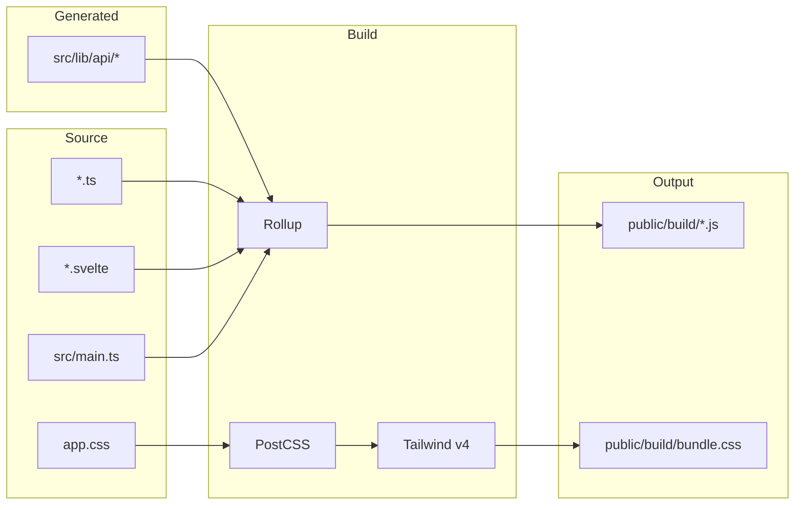
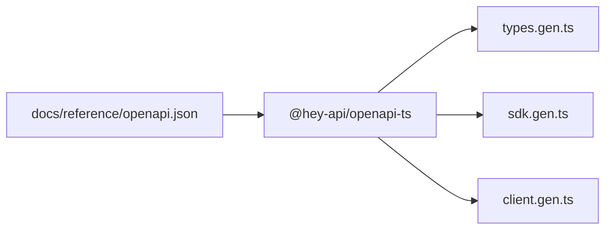

# Frontend build system

The frontend is a Svelte 5 single-page application bundled with Rollup. It uses TypeScript for type safety, Tailwind CSS v4 for styling, and a generated SDK for type-safe API calls. The build outputs static files to `public/build/` which are served by nginx in production or by a custom HTTPS dev server during development. For details on the Svelte 5 runes API and migration patterns, see [Svelte 5 Migration](svelte5-migration.md).



## Rollup configuration

The `rollup.config.js` file configures the entire build pipeline, producing ES modules with code splitting for parallel loading of vendor and application code. The build starts from `src/main.ts`, which imports the API client setup, mounts the Svelte `App` component using Svelte 5's `mount()` function, and imports global CSS:

```typescript
import { mount } from 'svelte';
import './lib/api/setup';
import App from './App.svelte';
import './app.css';

const app = mount(App, {
  target: document.body,
});
```

Rollup splits the bundle into chunks to improve load performance. The `manualChunks` configuration separates large dependencies into a `vendor` chunk (Svelte, svelte5-router), a `codemirror` chunk (all CodeMirror packages), and application chunks for routes and shared code. This means users don't re-download vendor code when application code changes, and the editor chunk only loads when needed.

The plugin pipeline processes files in order: **replace** substitutes `process.env.VITE_BACKEND_URL` with an empty string for relative API paths; **svelte** compiles `.svelte` files with TypeScript preprocessing and `runes: true` for Svelte 5; **postcss** processes CSS and extracts styles to `bundle.css`; **typescript** compiles TypeScript with source maps; **json** allows importing JSON files; **resolve** handles `node_modules` imports preferring ES modules; **commonjs** converts CommonJS to ES modules; and **terser** (production only) minifies JavaScript, removes console logs, and runs two compression passes.

In development mode (`npm run dev`), Rollup watches for changes and a custom HTTPS server starts automatically. The server serves files from `public/` with SPA fallback to `index.html`, and proxies `/api/*` requests to the backend container over HTTPS. The proxy uses a custom `https.Agent` that trusts the local CA certificate at `/shared_ca/mkcert-ca.pem`, allowing secure communication with the backend during development on port 5001.

## TypeScript configuration

The `tsconfig.json` targets ES2020 with ESNext modules, enables strict mode, sets module resolution to bundler mode for Rollup compatibility, and enables Svelte component types via `svelte-preprocess`. TypeScript catches type errors during development and the build fails if any exist, preventing broken code from reaching production.

## API SDK generation

The frontend uses a generated SDK for type-safe API calls instead of manual fetch requests. This SDK is created from the backend's OpenAPI specification using `@hey-api/openapi-ts`.



Run `npm run generate:api` to regenerate the SDK. The configuration in `openapi-ts.config.ts` specifies the input as `../docs/reference/openapi.json`, outputs to `src/lib/api/` with Prettier formatting, and generates TypeScript types, SDK functions, and a fetch client. The generated files include `types.gen.ts` (TypeScript interfaces for all request/response models), `sdk.gen.ts` (functions for each API endpoint, fully typed), `client.gen.ts` (HTTP client with interceptor support), and `index.ts` (re-exports for convenient imports). There's also a manual `setup.ts` file that configures the client with relative URLs and cookie credentials, and adds an interceptor that automatically attaches CSRF tokens to mutating requests:

```typescript
client.setConfig({
    baseUrl: '',
    credentials: 'include',
});

client.interceptors.request.use((request) => {
    const token = get(csrfToken);
    if (token && ['POST', 'PUT', 'DELETE', 'PATCH'].includes(request.method)) {
        request.headers.set('X-CSRF-Token', token);
    }
    return request;
});
```

Components import SDK functions and types directly. The SDK returns `{ data, error }` tuples, making error handling explicit without try/catch boilerplate:

```typescript
import { getNotificationsApiV1NotificationsGet, type NotificationResponse } from '../lib/api';

const { data, error } = await getNotificationsApiV1NotificationsGet({ query: { limit: 20 } });
```

## Tailwind CSS v4

The frontend uses Tailwind CSS v4 with the new CSS-first configuration. Unlike v3, there's no `tailwind.config.js` — all configuration lives in CSS. PostCSS processes CSS through `@tailwindcss/postcss`, and the `src/app.css` file contains all Tailwind configuration using v4's new at-rules:

```css
@import "tailwindcss";

@plugin "@tailwindcss/forms" { strategy: class; }
@variant dark (&:where(.dark, .dark *));

@theme {
  --color-primary: #3b82f6;
  --color-bg-default: #f8fafc;
  --font-sans: 'Inter', ui-sans-serif, system-ui;
}

@utility animate-fadeIn {
  animation: var(--animate-fadeIn);
}
```

The theme defines semantic color tokens for both light and dark modes (`bg-default`, `fg-default`, `border-default`, etc.) which components use for consistent theming. The `@variant dark` rule enables the `.dark` class on `<html>` to trigger dark mode. Styles are organized into Tailwind layers: **base** for element defaults, form styles, scrollbars, and CodeMirror overrides; **components** for reusable patterns like `.btn`, `.card`, and `.form-input-standard`.

## Svelte stores and state

The frontend uses a hybrid approach to state management. Svelte stores in `src/stores/` handle global, shared state: `auth.ts` manages authentication state, login/logout, and CSRF tokens; `theme.ts` handles theme preference with localStorage persistence; `toastStore.ts` manages the toast notification queue; and `notificationStore.ts` handles server notifications with pagination. Stores use the generated SDK for API calls and persist state to localStorage where appropriate. The auth store exposes a `csrfToken` store that the API client interceptor reads for request signing.

Svelte 5 runes (`$state`, `$derived`, `$effect`) handle component-local state. Store subscriptions remain unchanged from Svelte 4 — the `$storeName` syntax auto-subscribes to any store:

```svelte
<script lang="ts">
  import { isAuthenticated } from '../stores/auth';

  let loading = $state(false);
  let items = $state<Item[]>([]);
  let itemCount = $derived(items.length);
</script>

{#if $isAuthenticated}
  <span>Items: {itemCount}</span>
{/if}
```

For detailed patterns and migration guidance, see [Svelte 5 Migration](svelte5-migration.md).

## File structure

```
frontend/
├── public/
│   ├── index.html          # HTML shell
│   └── build/              # Rollup output
├── src/
│   ├── main.ts             # Entry point
│   ├── App.svelte          # Root component with routing
│   ├── app.css             # Tailwind config and global styles
│   ├── components/         # Reusable components
│   ├── routes/             # Page components
│   ├── stores/             # Svelte stores
│   ├── lib/
│   │   ├── api/            # Generated SDK + setup
│   │   ├── auth-init.ts    # Auth verification on load
│   │   ├── settings-cache.ts
│   │   └── user-settings.ts
│   └── styles/             # Additional CSS modules
├── rollup.config.js        # Build configuration
├── postcss.config.cjs      # PostCSS plugins
├── tsconfig.json           # TypeScript config
└── openapi-ts.config.ts    # SDK generator config
```

## Build commands

| Command | Purpose |
|---------|---------|
| `npm run dev` | Start Rollup in watch mode with HTTPS dev server |
| `npm run build` | Production build with minification |
| `npm run generate:api` | Regenerate SDK from OpenAPI spec |

## Local development

Start the development stack from the project root with `docker compose up -d`, then in the frontend directory run `npm install && npm run dev`. The dev server runs at `https://localhost:5001` with API requests proxying to the backend container. Changes to `.svelte`, `.ts`, and `.css` files trigger automatic rebuilds.

When backend endpoints change, update the backend and restart it, fetch the new OpenAPI spec (the docs workflow does this automatically), run `npm run generate:api`, and fix any TypeScript errors from changed types. To add new routes, create a component in `src/routes/`, add a `<Route>` entry in `App.svelte`, use SDK functions for API calls, and use semantic color tokens for styling.

## Production build

The production build runs `npm run build`, which compiles TypeScript with source maps, processes Svelte components in production mode without dev warnings, extracts and minifies CSS, splits code into chunks, minifies JavaScript with Terser removing console.log calls, and outputs everything to `public/build/`. The Docker build copies `public/` to nginx, which serves static files and proxies `/api/` to the backend.

## Troubleshooting

If you see TypeScript errors after SDK regeneration, check `types.gen.ts` for the new structure and update components to match the changed response types. 

For styles not applying, ensure the class exists in Tailwind's default utilities or is defined in `app.css`, and check for typos in semantic token names (e.g., `bg-default` vs `bg-bg-default`). 

Dev server certificate errors mean the certificates at `./certs/server.key` and `./certs/server.crt` are missing, or the CA at `/shared_ca/mkcert-ca.pem` isn't available — run the cert-generator container first via Docker Compose. 

If API calls fail in development, verify the backend is running and healthy; the dev server proxies to `https://backend:443`, so check Docker networking if the container can't resolve the hostname.
