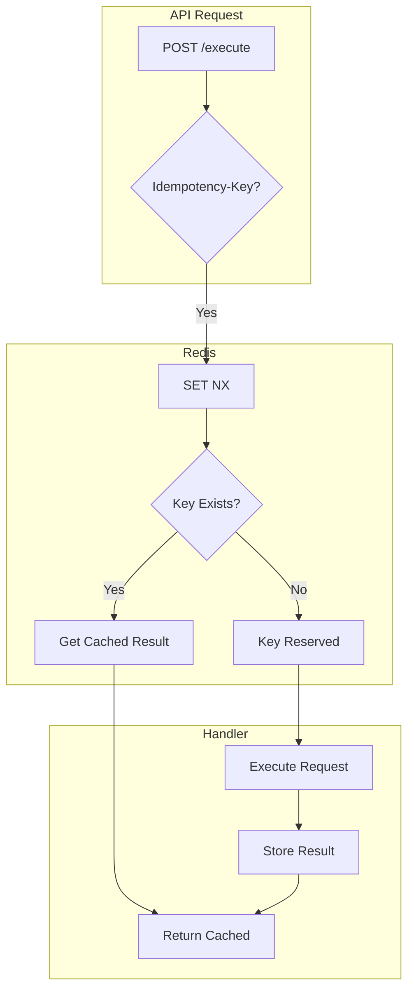

# Idempotency

The platform implements idempotency protection for HTTP API requests using a simple Redis-based pattern. When a client provides an `Idempotency-Key` header, duplicate requests return the cached result instead of re-executing.

## Architecture



## Usage

Clients include the `Idempotency-Key` header to enable duplicate protection:

```bash
curl -X POST https://api.example.com/api/v1/execute \
  -H "Authorization: Bearer $TOKEN" \
  -H "Idempotency-Key: my-unique-request-id" \
  -d '{"script": "print(1)", "lang": "python", "lang_version": "3.11"}'
```

If the same key is sent again within the TTL window (24 hours), the API returns the cached response without re-executing.

## Implementation

The idempotency layer uses Redis `SET NX EX` for atomic reservation:

```python
--8<-- "backend/app/db/repositories/redis/idempotency_repository.py"
```

### Key Format

Keys are namespaced by user to prevent cross-user collisions:

```
idempotent:exec:{user_id}:{idempotency_key}
```

### Flow

1. **Reserve**: `SET NX` attempts to claim the key atomically
2. **Check**: If key exists, fetch cached result
3. **Execute**: If new, process the request
4. **Store**: Save result JSON for future duplicates

## Configuration

| Parameter     | Default  | Description                        |
|---------------|----------|------------------------------------|
| `KEY_PREFIX`  | `idempotent` | Redis key namespace            |
| `default_ttl` | `86400`  | TTL in seconds (24 hours)          |

## Why This Design

The previous implementation (~600 lines) included:

- Multiple key strategies (event-based, content-hash, custom)
- Processing state tracking with timeouts
- Background stats collection
- Middleware wrappers for Kafka consumers
- Result caching with size limits

Analysis showed only HTTP API idempotency was actually used, and Kafka consumer idempotency was handled elsewhere. The simplified design:

- **35 lines** vs ~600 lines
- **3 methods** vs complex state machine
- **No background tasks**
- **No unused abstractions**

## Key Files

| File | Purpose |
|------|---------|
| [`db/repositories/redis/idempotency_repository.py`](https://github.com/HardMax71/Integr8sCode/blob/main/backend/app/db/repositories/redis/idempotency_repository.py) | Redis-based idempotency |
| [`api/routes/execution.py`](https://github.com/HardMax71/Integr8sCode/blob/main/backend/app/api/routes/execution.py) | HTTP API usage |
