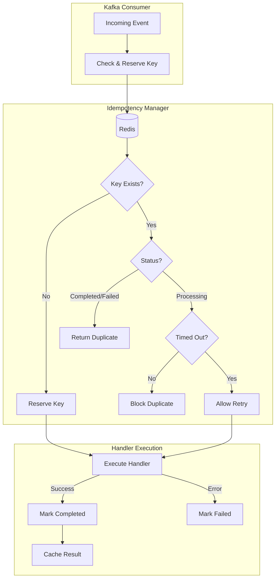

# Idempotency

The platform implements at-least-once event delivery with idempotency protection to prevent duplicate processing. When a
Kafka message is delivered multiple times (due to retries, rebalances, or failures), the idempotency layer ensures the
event handler executes only once. Results can be cached for fast duplicate responses.

## Architecture



## Key Strategies

The idempotency manager supports three strategies for generating keys from events:

**Event-based** uses the event's unique ID and type. This is the default and works for events where the ID is guaranteed
unique (like UUIDs generated at publish time).

**Content hash** generates a SHA-256 hash of the event's payload, excluding metadata like timestamps and event IDs. Use
this when the same logical operation might produce different event IDs but identical content.

**Custom** allows the caller to provide an arbitrary key. Useful when idempotency depends on business logic (e.g., "one
execution per user per minute").

```python
--8<-- "backend/app/services/idempotency/idempotency_manager.py:generate_key"
```

## Status Lifecycle

Each idempotency record transitions through defined states:

```python
--8<-- "backend/app/domain/idempotency/models.py:IdempotencyStatus"
```

When an event arrives, the manager checks for an existing key. If none exists, it creates a record in `PROCESSING` state
and returns control to the handler. On success, the record moves to `COMPLETED`; on error, to `FAILED`. Both terminal
states block duplicate processing for the TTL duration.

If a key is found in `PROCESSING` state but has exceeded the processing timeout (default 5 minutes), the manager assumes
the previous processor crashed and allows a retry.

## Handler Integration

Event handlers use the `with_idempotency` helper in `events/handlers.py` to wrap handler execution
with automatic duplicate detection. The helper checks and reserves the key, runs the handler, then
marks the result as completed or failed:

```python
--8<-- "backend/app/events/handlers.py:with_idempotency"
```

`IdempotencyManager` is injected via Dishka into each worker's handler registrations. The saga
orchestrator skips idempotency since saga steps have their own deduplication logic.

## Redis Storage

Idempotency records are stored in Redis with automatic TTL expiration. The `SET NX EX` command provides atomic
reservation—if two processes race to claim the same key, only one succeeds:

```python
--8<-- "backend/app/services/idempotency/redis_repository.py:insert_processing"
```

## Configuration

| Parameter                    | Default       | Description                          |
|------------------------------|---------------|--------------------------------------|
| `key_prefix`                 | `idempotency` | Redis key namespace                  |
| `default_ttl_seconds`        | `3600`        | How long completed keys are retained |
| `processing_timeout_seconds` | `300`         | When to assume a processor crashed   |
| `enable_result_caching`      | `true`        | Store handler results for duplicates |
| `max_result_size_bytes`      | `1048576`     | Maximum cached result size (1MB)     |

```python
--8<-- "backend/app/services/idempotency/idempotency_manager.py:IdempotencyConfig"
```

## Result Caching

When `enable_result_caching` is true, the manager stores the handler's result JSON alongside the completion status.
Subsequent duplicates can return the cached result without re-executing the handler. This is useful for idempotent
queries where the response should be consistent.

Results exceeding `max_result_size_bytes` are silently dropped from the cache but the idempotency protection still
applies.

## Metrics

The idempotency system exposes several metrics for monitoring:

- `idempotency_cache_hits` - Key lookups that found an existing record
- `idempotency_cache_misses` - Key lookups that created new records
- `idempotency_duplicates_blocked` - Events rejected as duplicates
- `idempotency_keys_active` - Current number of active keys (updated periodically)

## Key Files

| File                                                                                                                                                         | Purpose                                   |
|--------------------------------------------------------------------------------------------------------------------------------------------------------------|-------------------------------------------|
| [`services/idempotency/idempotency_manager.py`](https://github.com/HardMax71/Integr8sCode/blob/main/backend/app/services/idempotency/idempotency_manager.py) | Core idempotency logic                    |
| [`services/idempotency/redis_repository.py`](https://github.com/HardMax71/Integr8sCode/blob/main/backend/app/services/idempotency/redis_repository.py)       | Redis storage adapter                     |
| [`events/handlers.py`](https://github.com/HardMax71/Integr8sCode/blob/main/backend/app/events/handlers.py)                                                   | `with_idempotency` helper for event handlers |
| [`domain/idempotency/`](https://github.com/HardMax71/Integr8sCode/tree/main/backend/app/domain/idempotency)                                                  | Domain models                             |
