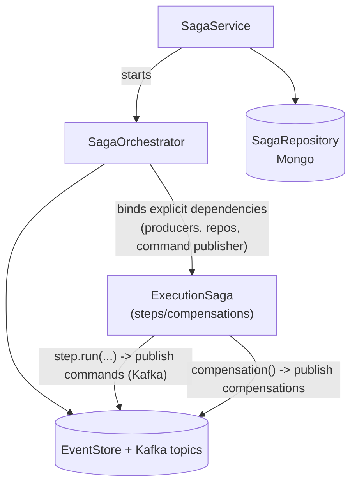
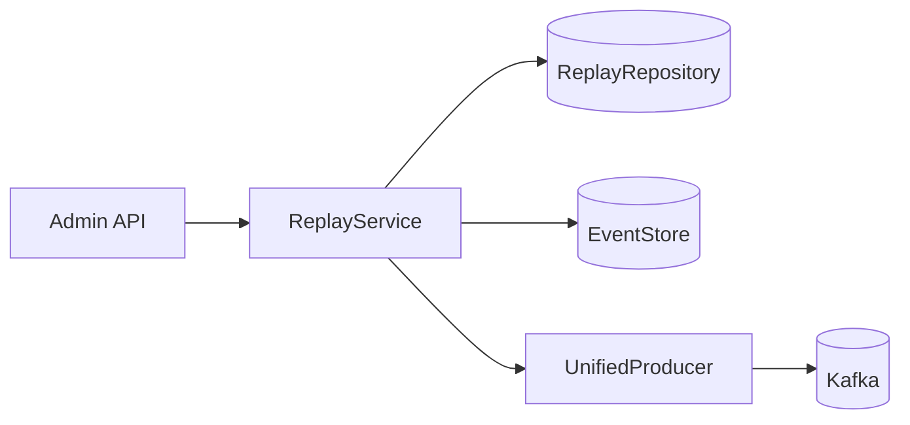
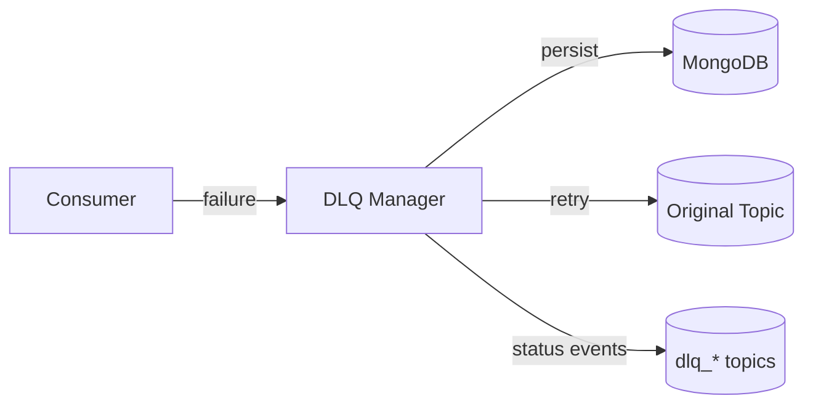

# Kafka topic architecture

## 1-topic-per-event-type

The system uses a **1:1 mapping** between `EventType` enum values and Kafka topics. Each event type gets its own dedicated topic. The topic name IS the `EventType` string value — no prefix, no transformation.

```
Topic name = EventType.EXECUTION_REQUESTED
           = "execution_requested"
```

Since `EventType` extends `StringEnum` (which extends `str`), no `.value` accessor is needed — the enum member IS the string.

## Why one topic per event type?

Previous designs multiplexed many event types onto shared topics (e.g. `execution_events` carried 9 different event types consumed by 4 separate consumer groups). This created problems:

- **Body-based filtering**: Every consumer decoded every message just to check `event_type`, wasting CPU
- **Catch-all handlers**: Unmatched events were silently dropped by `on_unhandled` handlers
- **Tight coupling**: Unrelated event types shared partition counts, retention policies, and consumer group offsets
- **Debugging difficulty**: Hard to reason about which consumer is processing what

The 1:1 approach eliminates all of these:

- **No filtering**: Each `@broker.subscriber(topic)` receives exactly one event type with its typed Pydantic model
- **No catch-alls**: Nothing to drop — every message on a topic matches the subscriber's type
- **Independent tuning**: Each topic can have its own partition count and retention policy
- **Clear ownership**: Easy to see which consumer groups subscribe to which event types

## Topic categories and configuration

Topics are grouped into categories for configuration purposes (partition count, retention):

| Category | Partitions | Retention | Event Types |
|----------|-----------|-----------|-------------|
| Execution | 6 | 7 days | `execution_requested`, `execution_completed`, `execution_failed`, etc. |
| Pod | 3 | 1 day | `pod_created`, `pod_scheduled`, `pod_running`, etc. |
| Command | 3 | 1 day | `create_pod_command`, `delete_pod_command`, etc. |
| User/Security | 3 | 30 days | `user_registered`, `security_violation`, etc. |
| Default | 3 | 7 days | Everything else (saga, notification, DLQ, etc.) |

Configuration is defined in `infrastructure/kafka/topics.py` using category sets.

## Consumer groups

Each worker subscribes to only the topics it needs, with its own consumer group:

| Consumer Group | Subscribed Topics |
|---------------|-------------------|
| `k8s-worker` | `create_pod_command`, `delete_pod_command` |
| `result-processor` | `execution_completed`, `execution_failed`, `execution_timeout` |
| `saga-orchestrator` | `execution_requested`, `execution_completed`, `execution_failed`, `execution_timeout`, `execution_cancelled` |
| `notification-service` | `execution_completed`, `execution_failed`, `execution_timeout` |
| `sse-bridge-pool` | 16 event types (execution + pod lifecycle + result) |

Multiple consumer groups can subscribe to the same topic — Kafka delivers each message to every group independently.

## Request flow

When a user submits code, the API creates an `ExecutionRequestedEvent` and publishes it to the `execution_requested` topic. Multiple consumers receive it:

1. **Saga orchestrator**: Creates a saga, enqueues the execution in a Redis-backed priority queue, and publishes a `CreatePodCommandEvent`
2. **SSE bridge**: Pushes the event to the user's browser in real-time

The saga orchestrator publishes `CreatePodCommandEvent` to the `create_pod_command` topic. The K8s worker — the sole consumer — creates the pod. Pod lifecycle events flow back through their respective topics.

## Scaling

With dedicated topics per event type, each can be scaled independently:

- High-throughput execution events get 6 partitions
- Lower-volume pod events use 3 partitions
- Command topics (work queues) use 3 partitions, optimized for the worker's consumption pattern

## Failure isolation

If the K8s worker crashes, only `create_pod_command` and `delete_pod_command` topics accumulate messages. The rest of the system continues normally — SSE streams updates, the saga orchestrator processes requests, notifications fire.

## Sagas



Sagas coordinate multi-step workflows where each step publishes commands to Kafka and the orchestrator tracks progress in MongoDB. If a step fails, *compensation actions* roll back previous steps by publishing compensating events. This keeps long-running operations reliable without distributed transactions.

Key design choices:

- Dependencies injected *explicitly* rather than pulled from context
- Only *serializable* data persisted — sagas can resume after restarts

## Replay



The replay system re-emits historical events from EventStore back to Kafka. Useful for:

- Rebuilding projections
- Testing new consumers
- Recovering from data issues

Create a replay session with filters (time range, event type), and ReplayService reads matching events from MongoDB and publishes to the target topic. Sessions track progress — pause and resume long replays as needed.

## Dead letters



When a consumer fails to process an event, the DLQ manager receives it via direct `handle_message()` calls (not Kafka consumption). Messages are persisted to MongoDB and the manager handles retry logic with *exponential backoff* and configurable thresholds. Retry policies are determined by event type category (execution events get aggressive retries, pod events get cautious retries). Status events (`dlq_message_received`, `dlq_message_retried`, `dlq_message_discarded`) are published to their own per-event-type topics.

## Event schemas

Key files:

- `domain/events/typed.py` — all Pydantic event models (plain `BaseModel` subclasses)
- `infrastructure/kafka/topics.py` — category-based topic configs (partitions, retention)
- `events/core/producer.py` — UnifiedProducer (persists to MongoDB, publishes to Kafka)
- `events/handlers.py` — FastStream subscriber registrations for all workers

All events are Pydantic models with strict typing. FastStream handles JSON serialization natively — the producer publishes Pydantic instances directly via `broker.publish()`, and subscribers receive typed model instances. Pydantic validation on both ends ensures structural agreement between producers and consumers.
