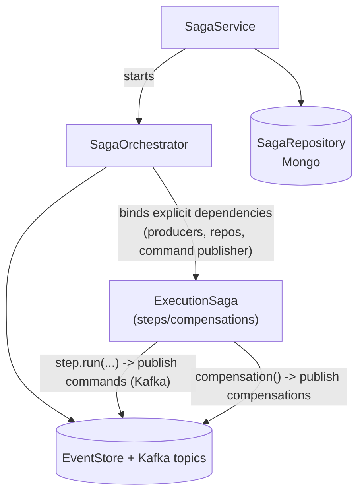
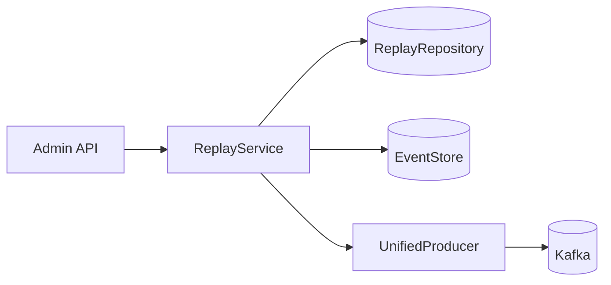
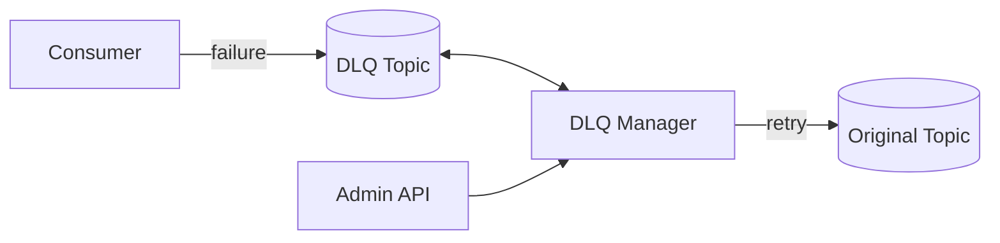

# Kafka topic architecture

## Why two topics?

The system uses *two separate Kafka topics* for execution flow: `execution_events` and `execution_tasks`. This might seem redundant since both can contain the same `ExecutionRequestedEvent`, but the separation is essential for scalability and maintainability.

## Events vs tasks

**execution_events** is the system's *event stream* — an append-only log capturing everything that happens to executions throughout their lifecycle:

- User requests an execution
- Execution starts, completes, or fails
- Pods are created or terminated
- Status updates and log entries

Multiple services consume this topic: SSE streams updates to users, projection service maintains read-optimized views, saga orchestrator manages workflows, monitoring tracks health. These consumers care about *completeness and ordering* because they're building a comprehensive picture of system state.

**execution_tasks** is a *work queue*. It contains only events representing actual work to be done — executions that have been validated, authorized, rate-limited, and scheduled. When the saga orchestrator publishes to `execution_tasks`, it's saying "this needs to be done now" rather than "this happened." The Kubernetes worker, the *sole consumer* of this topic, just needs to know what pods to create.

## Request flow

When a user submits code, the API creates an `ExecutionRequestedEvent` and publishes it to `execution_events`. This acknowledges the request and makes it part of the permanent record.

The saga orchestrator subscribes to `execution_events` and begins processing:

- Has the execution passed rate limiting (handled at API level)?
- Are sufficient resources available?
- What state is the execution workflow in?

Some requests get rejected at the API level. Others proceed through the saga workflow. The saga orchestrator tracks state transitions and issues commands.

Only when the saga orchestrator determines an execution is *ready to proceed* does it publish to `execution_tasks`. This represents a state transition — the event has moved from being a request to being *scheduled work*.

The Kubernetes worker then consumes from `execution_tasks`, creates resources (ConfigMaps, Pods), and publishes a `PodCreatedEvent` back to `execution_events`. It doesn't need to know about rate limits or queuing — all that complexity has been handled upstream.

## Performance and scaling

The `execution_events` topic is busy. For every execution, there might be a dozen or more events: requested, queued, started, pod status updates, log entries, completion, cleanup. Hundreds of executions per minute means *thousands* of events flowing through.

If the Kubernetes worker had to consume from this firehose, it would receive every event type and need to filter down to just the ready-to-process `ExecutionRequestedEvents`. This filtering would consume CPU and bandwidth, and couple worker performance to overall event volume.

With separate topics, the worker receives *only what it needs*. If `execution_events` processes 1000 events/minute but only 50 executions are scheduled, the worker sees only those 50. This allows focus on the core responsibility: creating and managing pods.

The separation enables independent scaling:

- `execution_events`: many partitions for high throughput, numerous concurrent consumers
- `execution_tasks`: fewer partitions optimized for the worker's pattern (pod creation is expensive, less parallelism is sometimes better)

## Operations

Separate topics provide crucial isolation. When troubleshooting:

- If `execution_tasks` is backing up → the Kubernetes worker is struggling
- If `execution_events` is backing up → need to identify which consumer is the bottleneck

Different retention policies make sense too. `execution_events` needs long retention (90+ days) as the audit log and source of truth. `execution_tasks` can have short retention — once processed, a few days is enough for recovery scenarios.

Monitoring becomes more precise. Different SLAs for different stages:

- `ExecutionRequestedEvent` in `execution_events` within 100ms of API receipt
- Up to 30 seconds acceptable before appearing in `execution_tasks`

## Failure handling

If the Kubernetes worker crashes, `execution_tasks` accumulates messages but the rest of the system continues normally. Users can submit executions, the saga orchestrator processes events, other services consume `execution_events`. When the worker recovers, it picks up where it left off.

In a single-topic architecture, a slow worker would cause backpressure affecting *all* consumers. SSE might delay updates. Projections might fall behind. The entire system degrades because one component can't keep up.

The saga orchestrator acts as a *shock absorber* between user requests and pod creation. It manages workflow state and resource coordination without affecting upstream producers or downstream workers. Kafka provides natural backpressure and queuing, while Redis-backed rate limiting handles capacity management at the API level.

## Extensibility

This pattern provides flexibility for evolution:

- Add GPU workers or long-running job workers → introduce additional task topics without modifying core event flow
- Add security scanning or batch processing stages → insert between `execution_events` and `execution_tasks`
- Add scheduled executions → `schedule_events` for audit, `schedule_tasks` for scheduling work

The pattern of separating *event streams* from *task queues* applies broadly.

## Sagas

Sagas coordinate multi-step workflows where each step publishes commands to Kafka and the orchestrator tracks progress in MongoDB. If a step fails, *compensation actions* roll back previous steps by publishing compensating events. This keeps long-running operations reliable without distributed transactions.

Key design choices:

- Dependencies injected *explicitly* rather than pulled from context
- Only *serializable* data persisted — sagas can resume after restarts

## Replay

The replay system re-emits historical events from EventStore back to Kafka. Useful for:

- Rebuilding projections
- Testing new consumers
- Recovering from data issues

Create a replay session with filters (time range, event type), and ReplayService reads matching events from MongoDB and publishes to the target topic. Sessions track progress — pause and resume long replays as needed.

## Dead letters

When a consumer fails to process an event after multiple retries, it lands in the dead letter queue. The DLQ manager handles retry logic with *exponential backoff* and configurable thresholds.

Admins can:

- Inspect failed events through the API
- Fix the underlying issue
- Replay events back to the original topic
- Delete or archive events that repeatedly fail

## Event schemas

Key files:

- `domain/events/typed.py` — all Pydantic event models (extends `AvroBase` for Avro serialization)
- `infrastructure/kafka/mappings.py` — event-to-topic routing and helper functions
- `events/schema/schema_registry.py` — schema manager
- `events/core/{producer,consumer,dispatcher}.py` — unified Kafka plumbing

All events are Pydantic models with *strict typing* that extend `AvroBase` for Avro schema generation. The mappings module routes each event type to its destination topic via `EVENT_TYPE_TO_TOPIC`. Schema Registry integration ensures producers and consumers agree on structure, catching incompatible changes *before* runtime failures. The unified producer and consumer classes handle serialization, error handling, and observability.
