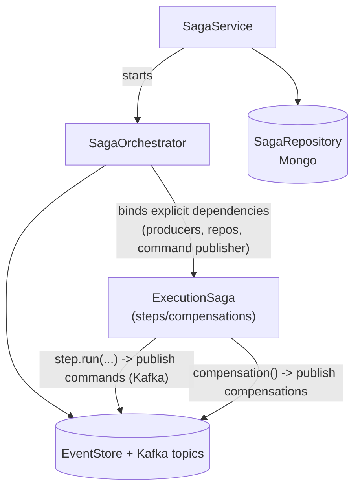

# Kafka Topic Architecture: Execution Events vs Execution Tasks

## The Design Decision

In our event-driven architecture, we faced a critical design decision about how to handle execution requests flowing through the system. Should we publish ExecutionRequestedEvent to the general execution_events topic where all execution-related events live, or should we use a dedicated execution_tasks topic specifically for work that needs to be processed by the Kubernetes worker? After considerable analysis and real-world testing, we chose to maintain separate topics, and this document explains why this separation is not just beneficial but essential for our system's scalability and maintainability.

## Understanding the Fundamental Difference

At first glance, it might seem redundant to have both execution_events and execution_tasks topics, especially since they can contain the same ExecutionRequestedEvent. However, these topics serve fundamentally different purposes in our architecture, and understanding this distinction is crucial.

The execution_events topic is our system's event stream. It's an append-only log that captures everything that happens to executions throughout their lifecycle. When a user requests an execution, when it starts, when it completes or fails, when pods are created or terminated - all these events flow through execution_events. This topic is consumed by multiple services that need to react to these state changes: the SSE service streams updates to users, the projection service maintains read-optimized views, the saga orchestrator manages complex workflows, and monitoring services track system health. These consumers care about the completeness and ordering of events because they're building a comprehensive picture of the system's state.

The execution_tasks topic, on the other hand, is a work queue. It contains only those events that represent actual work to be done - specifically, executions that have been validated, authorized, rate-limited, and scheduled for processing. When the coordinator publishes an ExecutionRequestedEvent to execution_tasks, it's not saying "this happened" but rather "this needs to be done now." The Kubernetes worker, the sole consumer of this topic, doesn't care about the broader context or history; it just needs to know what pods to create.

## The Flow of an Execution Request

To understand why this separation matters, let's trace the journey of an execution request through our system. When a user submits code to be executed, the API creates an ExecutionRequestedEvent and publishes it to execution_events. This is the system acknowledging that a request has been made - it's now part of the permanent record.

The coordinator service, which subscribes to execution_events, picks up this event and begins its validation process. It checks whether the user has exceeded their rate limit, whether there are sufficient resources available, whether the execution should be prioritized or queued. This processing takes time and involves complex business logic. Some requests might be rejected immediately due to rate limiting. Others might sit in a priority queue for minutes waiting for resources. Still others might be cancelled before they ever start.

Only when the coordinator determines that an execution is ready to proceed does it republish the ExecutionRequestedEvent to execution_tasks. This republishing represents a crucial state transition. The event has moved from being a request to being scheduled work. The coordinator has essentially blessed this execution and allocated resources for it.

The Kubernetes worker, meanwhile, has a simple job. It consumes from execution_tasks, creates the appropriate Kubernetes resources (ConfigMaps, Pods, NetworkPolicies), and publishes a PodCreatedEvent back to execution_events to inform the system that the work has begun. It doesn't need to know about rate limits, queuing, or resource allocation - all that complexity has been handled upstream.

## Performance and Scaling Implications

The performance benefits of this separation become apparent when we consider the volume and nature of events in each topic. The execution_events topic is incredibly busy. For every execution, we might see a dozen or more events: requested, queued, started, multiple pod status updates, log entries, completion or failure, and cleanup. If we're processing hundreds of executions per minute, that's thousands of events flowing through execution_events.

Now imagine if the Kubernetes worker had to consume from this firehose of events. It would receive every ExecutionRequestedEvent, but also every status update, every log entry, every completion notification. It would need to filter through all of this to find just the ExecutionRequestedEvents, and then further filter to identify which ones are actually ready for processing versus which ones are still queued or have been rejected. This filtering would consume CPU cycles and network bandwidth, and more critically, it would couple the worker's performance to the overall event volume in the system.

With separate topics, the Kubernetes worker receives only what it needs: validated, scheduled execution requests ready for processing. If execution_events is processing 1000 events per minute but only 50 executions are actually being scheduled, the worker sees only those 50 events. This dramatic reduction in processing overhead allows the worker to focus on its core responsibility: creating and managing Kubernetes pods.

The separation also enables independent scaling strategies. The execution_events topic might be configured with many partitions to handle high throughput and support numerous concurrent consumers. Each service that subscribes to execution_events can consume from multiple partitions in parallel, spreading the load. The execution_tasks topic, however, might have fewer partitions optimized for the Kubernetes worker's consumption pattern. Since pod creation is relatively expensive and we want to control the rate at which pods are created, we might actually want less parallelism here.

## Operational Advantages

From an operational perspective, separate topics provide crucial isolation and control. When troubleshooting issues, operators can examine the depth of the execution_tasks queue to understand exactly how many executions are waiting to be processed. This is a clear, actionable metric. If execution_tasks is backing up, we know the Kubernetes worker is struggling. If execution_events is backing up, we need to look at all consumers to identify the bottleneck.

The separation also allows for different retention policies. The execution_events topic needs long retention - perhaps 90 days or more - because it's our audit log and source of truth for system state. We might need to look back weeks to understand a pattern of failures or investigate a user complaint. The execution_tasks topic, however, can have much shorter retention. Once an execution has been processed, there's no need to keep it in the queue for long. A few days of retention might be sufficient for recovery scenarios.

Monitoring and alerting become more precise with separate topics. We can set different SLAs for different stages of processing. Perhaps we expect ExecutionRequestedEvents to appear in execution_events within 100ms of API receipt, but we're comfortable with up to 30 seconds of queuing before they appear in execution_tasks. These different expectations reflect the different purposes of the topics.

## Handling Failure Scenarios

The separated architecture also provides better failure handling. If the Kubernetes worker crashes or needs maintenance, execution_tasks will accumulate messages, but the rest of the system continues functioning normally. Users can still submit executions, the coordinator can still validate and queue them, and other services can continue processing execution_events. When the worker comes back online, it picks up where it left off, processing the backlog of tasks.

Consider what would happen in a single-topic architecture if the Kubernetes worker fell behind. It would slow down consumption from execution_events, potentially causing backpressure that affects all other consumers. The SSE service might delay sending updates to users. The projection service might fall behind in updating read models. The entire system would degrade because one component couldn't keep up.

The coordinator acts as a shock absorber between user requests and pod creation. It can implement sophisticated queuing strategies, prioritization, and resource management without affecting either the upstream event producers or the downstream Kubernetes worker. If we need to temporarily slow down pod creation due to cluster capacity issues, the coordinator can hold executions in its internal queue while still acknowledging receipt by publishing to execution_events.

## Future Evolution

This architectural pattern also provides flexibility for future evolution. If we decide to add different types of workers - perhaps one for GPU workloads, another for long-running jobs - we could introduce additional task topics without modifying the core event flow. The coordinator could route different types of executions to different task topics based on their requirements.

We might also introduce more sophisticated processing stages. Perhaps certain executions need security scanning before processing, or we want to batch similar executions for efficiency. These additional stages can be inserted between execution_events and execution_tasks without disrupting existing consumers.

The pattern we've established here - separating event streams from task queues - can be applied to other domains in our system. If we add support for scheduled executions, we might have schedule_events for audit and schedule_tasks for the actual scheduling work. If we implement distributed training jobs, we might have training_events and training_tasks.

## Saga orchestration



Sagas coordinate multi-step workflows where each step publishes commands to Kafka and the orchestrator tracks progress in MongoDB. If a step fails, compensation actions roll back previous steps by publishing compensating events. The saga pattern keeps long-running operations reliable without distributed transactions. Dependencies like producers and repositories are injected explicitly rather than pulled from context, and only serializable data gets persisted so sagas can resume after restarts.

## Event replay

```
  /api/v1/replay/sessions (admin) --> ReplayService
         |                               |
         |                               |-- ReplayRepository (Mongo) for sessions
         |                               |-- EventStore queries filters/time ranges
         |                               |-- UnifiedProducer to Kafka (target topic)
         v                               v
    JSON summaries                    Kafka topics (private)
```

The replay system lets admins re-emit historical events from the EventStore back to Kafka. This is useful for rebuilding projections, testing new consumers, or recovering from data issues. You create a replay session with filters like time range or event type, and the ReplayService reads matching events from MongoDB and publishes them to the target topic. The session tracks progress so you can pause and resume long replays.

## Dead letter queue

```
  Kafka DLQ topic <-> DLQ manager (retry/backoff, thresholds)
  /api/v1/admin/events/* -> admin repos (Mongo) for events query/delete
```

When a consumer fails to process an event after multiple retries, the event lands in the dead letter queue topic. The DLQ manager handles retry logic with exponential backoff and configurable thresholds. Admins can inspect failed events through the API, fix the underlying issue, and replay them back to the original topic. Events that repeatedly fail can be manually deleted or archived after investigation.

## Topic and event structure

```
infrastructure/kafka/events/* : Pydantic event models
infrastructure/kafka/mappings.py: event -> topic mapping
events/schema/schema_registry.py: schema manager
events/core/{producer,consumer,dispatcher}.py: unified Kafka plumbing
```

All events are defined as Pydantic models with strict typing. The mappings module routes each event type to its destination topic. Schema Registry integration ensures producers and consumers agree on event structure, catching incompatible changes before they cause runtime failures. The unified producer and consumer classes handle serialization, error handling, and observability so individual services don't reinvent the wheel.
