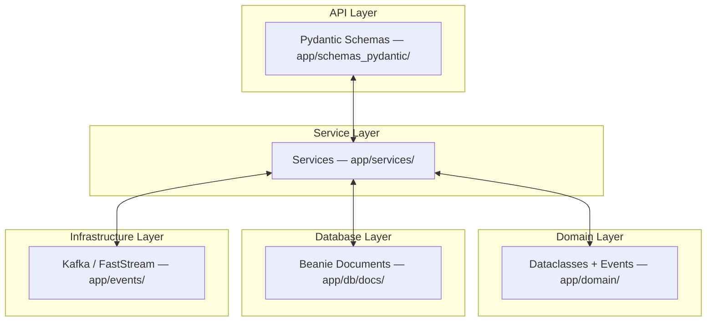

# Model conversion patterns

This document describes patterns for converting between domain models, Pydantic schemas, and ODM documents.

## Why these patterns

The codebase separates concerns into layers: domain models are pure Python dataclasses with no framework dependencies,
while Pydantic models handle API schemas, database documents, and Kafka events. Conversion happens at
boundaries—repositories and services—not inside models.

## Model layers



API routes receive and return Pydantic schemas. Services orchestrate business logic using domain dataclasses.
Repositories translate between domain objects and infrastructure (MongoDB documents, Kafka events). Each layer speaks
its own language; conversion bridges them.

## Conversion patterns

### Dataclass to dict

Use `asdict()` with a dict comprehension for enum conversion and optional None filtering:

```python
from dataclasses import asdict

# With enum conversion and None filtering
update_dict = {
    k: (v.value if hasattr(v, "value") else v)
    for k, v in asdict(domain_obj).items()
    if v is not None
}
```

### Pydantic to dict

Use `model_dump()` directly:

```python
data = pydantic_obj.model_dump(exclude_none=True)  # Skip None values
data = pydantic_obj.model_dump(mode="json")        # JSON-compatible output
```

### Dict to Pydantic

Use `model_validate()` or constructor unpacking:

```python
obj = SomeModel.model_validate(data)
obj = SomeModel(**data)
```

### Pydantic to Pydantic

Use `model_validate()` when models have `from_attributes=True`:

```python
class User(BaseModel):
    model_config = ConfigDict(from_attributes=True)

user = User.model_validate(user_response)
```

### Dict to dataclass

Use constructor unpacking, handling nested objects explicitly. Since stdlib dataclasses don't auto-convert nested dicts,
nested dataclass fields must be constructed manually:

```python
domain_obj = DomainModel(**data)

# With nested conversion (nested dataclass from Beanie document)
data = doc.model_dump(exclude={"id", "revision_id"})
if metadata := data.get("metadata"):
    data["metadata"] = DomainMetadata(**metadata)
domain_obj = DomainModel(**data)
```

## Repository examples

Repositories are the primary conversion boundary. They translate between domain objects and database documents.

### Saving domain to document

```python
async def store_event(self, event: Event) -> str:
    data = asdict(event)
    data["metadata"] = {
        k: (v.value if hasattr(v, "value") else v)
        for k, v in asdict(event.metadata).items()
    }
    doc = EventDocument(**data)
    await doc.insert()
```

### Loading document to domain

```python
async def get_event(self, event_id: str) -> Event | None:
    doc = await EventDocument.find_one({"event_id": event_id})
    if not doc:
        return None
    data = doc.model_dump(exclude={"id", "revision_id"})
    if metadata := data.get("metadata"):
        data["metadata"] = DomainMetadata(**metadata)
    return Event(**data)
```

### Updating with typed input

```python
async def update_session(self, session_id: str, updates: SessionUpdate) -> bool:
    update_dict = {
        k: (v.value if hasattr(v, "value") else v)
        for k, v in asdict(updates).items()
        if v is not None
    }
    if not update_dict:
        return False
    doc = await SessionDocument.find_one({"session_id": session_id})
    if not doc:
        return False
    await doc.set(update_dict)
    return True
```

## Anti-patterns

Avoid approaches that scatter conversion logic or couple layers incorrectly.

| Anti-pattern                     | Why it's bad                                              |
|----------------------------------|-----------------------------------------------------------|
| Manual field-by-field conversion | Verbose, error-prone, breaks when fields change           |
| Pydantic in domain layer         | Couples domain to framework; domain should be pure Python |
| Conversion logic in models       | Scatters boundary logic; keep it in repositories/services |

Thin wrappers that delegate to `model_dump()` with specific options are fine. For example, `BaseEvent.to_dict()` applies
`by_alias=True, mode="json"` consistently across all events—the anti-pattern is manually listing fields.

## Quick reference

| From      | To        | Method                                                                         |
|-----------|-----------|--------------------------------------------------------------------------------|
| Dataclass | Dict      | `{k: (v.value if hasattr(v, "value") else v) for k, v in asdict(obj).items()}` |
| Pydantic  | Dict      | `obj.model_dump()`                                                             |
| Dict      | Pydantic  | `Model.model_validate(data)` or `Model(**data)`                                |
| Pydantic  | Pydantic  | `TargetModel.model_validate(source)`                                           |
| Dict      | Dataclass | `DataclassModel(**data)`                                                       |
