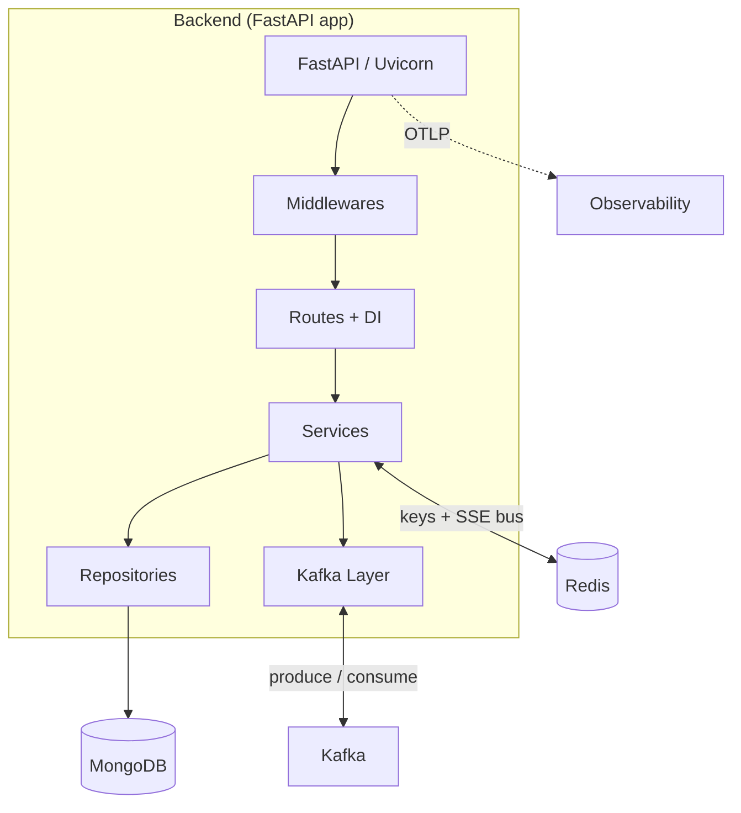
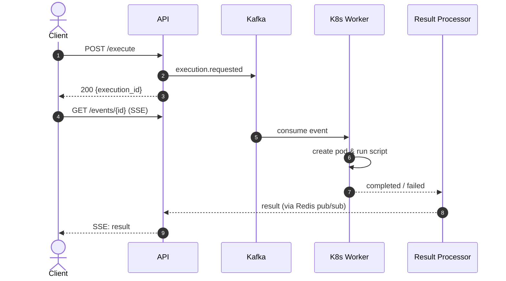
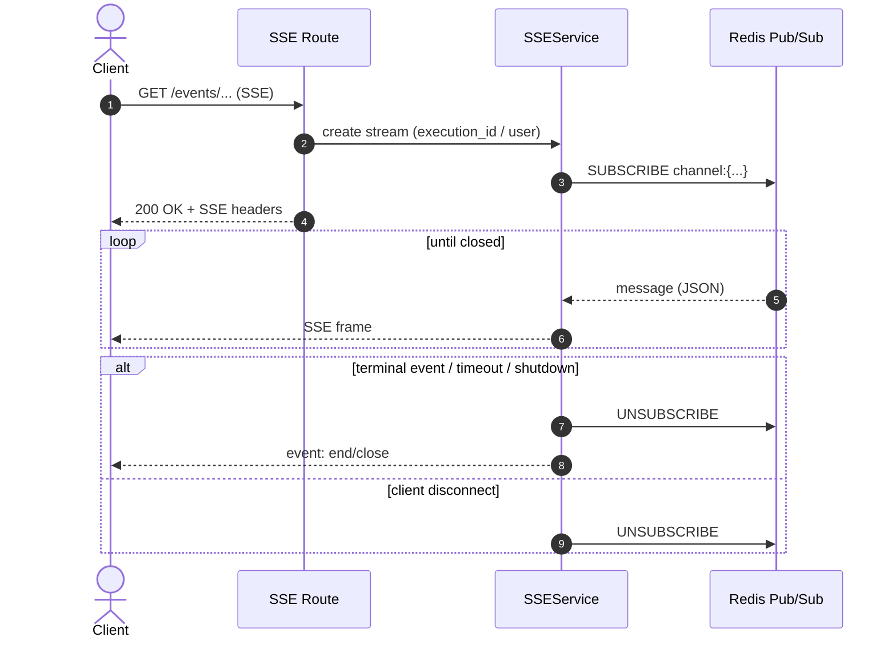
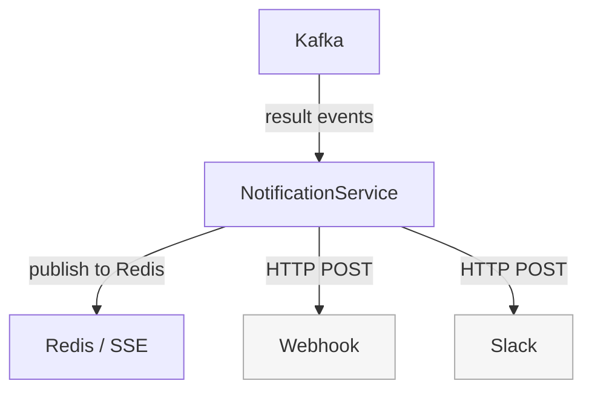

# Architecture overview

Integr8sCode lets users submit Python scripts through a Svelte SPA. The FastAPI backend validates requests, publishes events to Kafka, and streams results back via SSE. Kafka workers coordinate isolated Kubernetes pods that run the code, collect results into MongoDB, and push them through Redis pub/sub so any API instance can deliver them over SSE.

-   :material-layers-outline:{ .lg .middle } **[Middleware](middleware.md)**

    Request processing pipeline — CORS, metrics, rate limiting, CSRF, size limits

-   :material-cog-outline:{ .lg .middle } **[Services](services-overview.md)**

    Business logic — execution, notifications, SSE, idempotency, saved scripts

-   :material-transit-connection-variant:{ .lg .middle } **[Kafka Topics](kafka-topic-architecture.md)**

    Event-driven backbone — topic layout, producers, consumers, event store

-   :material-broadcast:{ .lg .middle } **[SSE](../components/sse/sse-architecture.md)**

    Real-time streaming — Redis pub/sub fan-out, partitioned routing

-   :material-robot-industrial-outline:{ .lg .middle } **[Workers](../components/workers/index.md)**

    Background processes — coordinator, K8s, pod monitor, result processor, saga

## System overview

The SPA hits the frontend, which proxies to the API over HTTPS; the API
serves both REST and SSE. Kafka carries events as JSON (serialized by FastStream) with Zookeeper backing it; kafka-
init seeds topics. All workers are separate containers subscribed to Kafka; the k8s-worker talks to the
Kubernetes API to run code, the pod-monitor watches pods, the result-processor writes results to Mongo
and nudges Redis for SSE fanout, and the saga-orchestrator coordinates long flows with Mongo and Redis.
Traces and metrics from every service go to the OpenTelemetry Collector, which exports traces to Jaeger
and metrics to VictoriaMetrics; Grafana reads from VictoriaMetrics, and Kafdrop gives you a quick Kafka
UI. The cert generator and shared CA provide TLS for frontend and backend and help bootstrap kube access.

## Backend wiring

??? note "Legend"
    - **Middlewares**: CORS, Metrics, RateLimit, CSRF, RequestSizeLimit, CacheControl
    - **Routes + DI**: REST and SSE endpoints wired by Dishka
    - **Services**: Execution, Events, SSE, Idempotency, Notifications, User Settings, Rate Limit, Saved Scripts, Replay, Saga API
    - **Kafka Layer**: UnifiedProducer, FastStream subscribers, EventStore
    - **Observability**: OTel Collector → VictoriaMetrics (metrics) + Jaeger (traces)

FastAPI under Uvicorn exposes REST and SSE routes. Requests pass through six middleware layers before reaching Dishka-wired route handlers that call services. Services use Mongo-backed repositories for state and a unified Kafka layer to publish and consume events. Redis handles rate limiting and SSE fanout. Workers are separate processes shown in the system diagram above.

## Execution lifecycle

When a client submits a script, the API validates the request, checks [rate limits](rate-limiting.md) and [idempotency](idempotency.md), then persists the execution record to MongoDB and publishes an `execution.requested` event to Kafka. The client immediately gets back an execution ID and opens an SSE connection to receive updates.

The K8s Worker consumes the event, spins up an isolated pod, and runs the script. [Pod Monitor](../components/workers/pod_monitor.md) watches for completion, timeout, or failure, then publishes the outcome back to Kafka. Result Processor writes the final state to MongoDB and pushes a notification through Redis pub/sub. The SSE connection, subscribed to that execution's Redis channel, forwards the result to the client. The whole flow is async and event-driven — the API never blocks waiting for execution.

## SSE architecture

The SSE layer uses Redis pub/sub as a broadcast bus so that any API instance can deliver events to any connected client, regardless of which instance originally handled the request. When a client opens an SSE connection, the SSE route passes the execution ID or user ID to SSEService, which subscribes to the corresponding Redis channel. Events flow through Redis from producers like the Result Processor or NotificationService. Each SSEService instance listens on its subscribed channels and forwards incoming messages as SSE frames to the client. This design means you can scale API instances horizontally without sticky sessions since Redis handles the fan-out.

Streams terminate in a few ways. For execution streams, the result_stored event signals completion and the connection closes gracefully. For notification streams, the client stays connected until they disconnect or the server shuts down. In both cases, the service unsubscribes from Redis to clean up resources. Timeouts and heartbeats keep connections alive and detect stale clients.

## Kafka, sagas, and event replay

The system uses Kafka as the backbone for all async communication. [Sagas](../components/workers/saga_orchestrator.md) coordinate multi-step workflows with compensation logic, the [replay system](../components/workers/event_replay.md) lets admins re-emit historical events, and the [dead letter queue](../components/dead-letter-queue.md) catches failed messages for manual inspection.

## Notifications

NotificationService consumes execution result events from Kafka and routes them to the appropriate channel. In-app notifications go through Redis pub/sub to SSE connections, while external integrations (webhooks, Slack) receive HTTP POSTs directly.

## API surface

The public surface is REST and SSE endpoints under `/api/v1/`. Everything else (MongoDB, Redis, Kafka, Kubernetes API, background workers) stays internal. The Svelte frontend talks to the backend via fetch and EventSource with [cookie-based auth](authentication.md). [Admin routes](../operations/admin-api.md) under `/api/v1/admin/` are protected by role checks; see the [API Reference](../reference/api-reference.md) for the full endpoint list.
