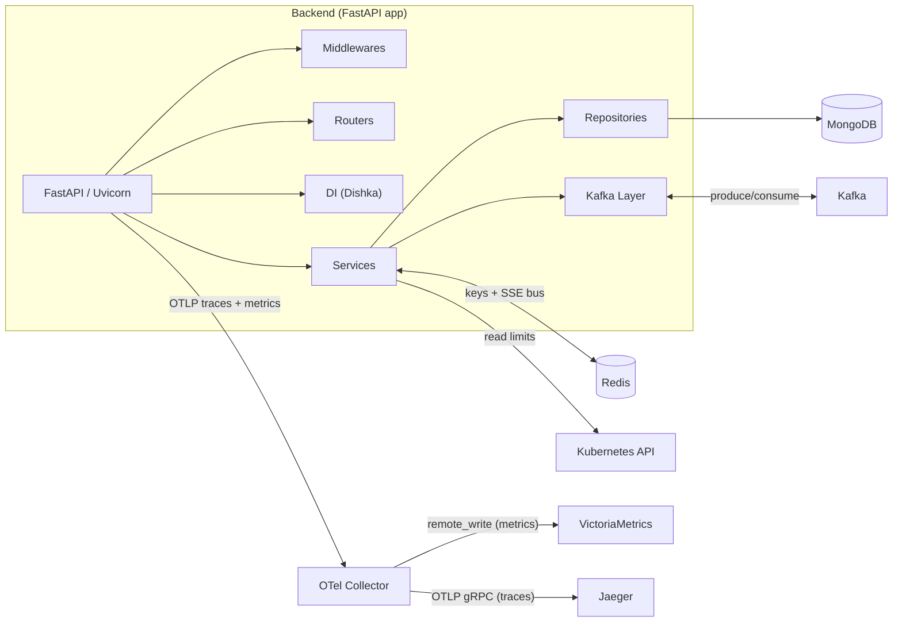
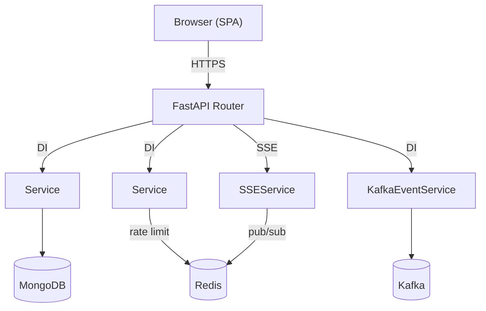
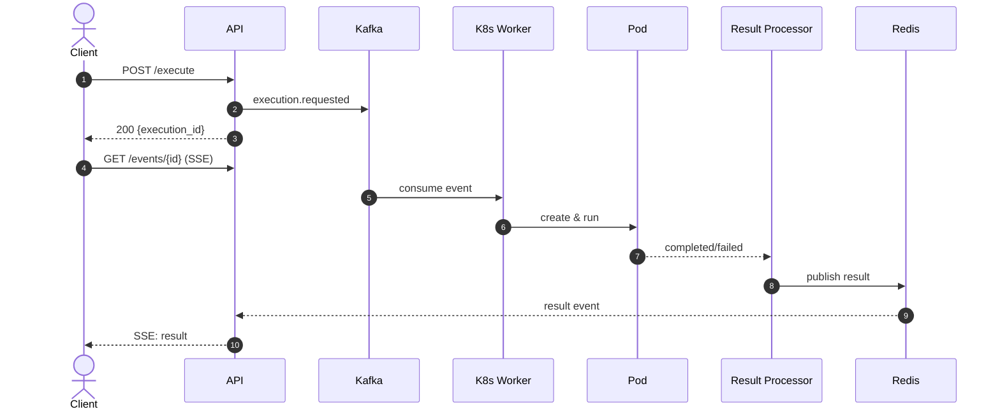
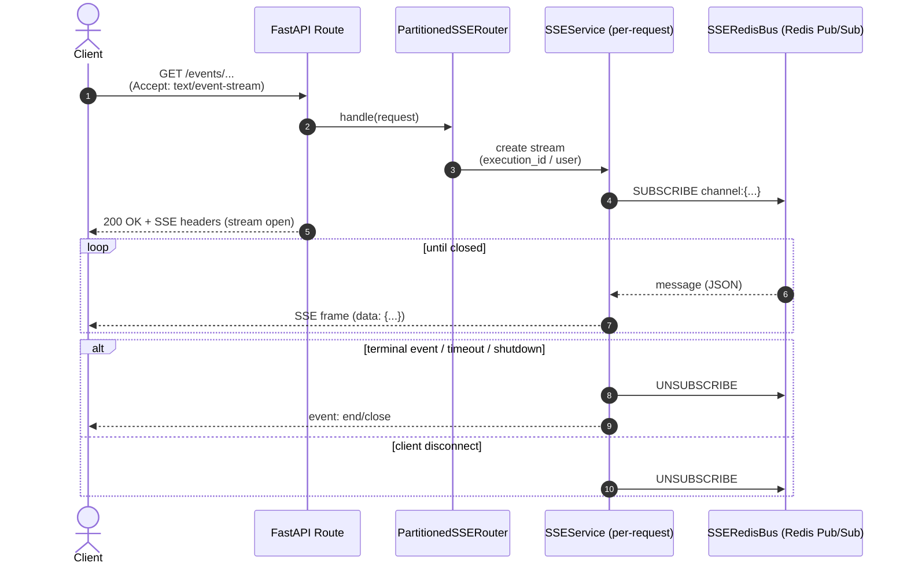
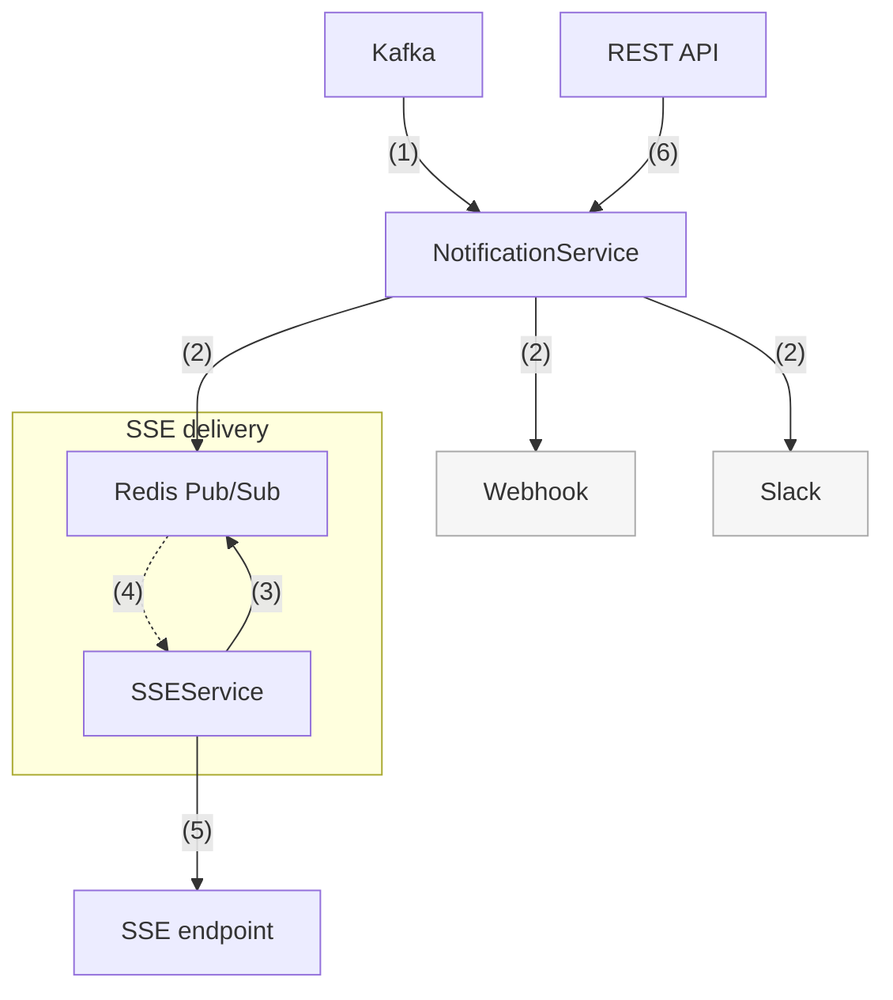

# Architecture overview

In this file, you can find broad description of main components of project architecture.
For details on specific components, see:

- [SSE Architecture](../components/sse/sse-architecture.md)
- [Dead Letter Queue](../components/dead-letter-queue.md)
- [Kafka Topics](kafka-topic-architecture.md)
- [Workers](../components/workers/pod_monitor.md)

!!! note "Event Streaming"
    Kafka event streaming is disabled by default (`ENABLE_EVENT_STREAMING=false`). Set this to `true` in your
    environment to enable the full event-driven architecture.

## System overview

The SPA hits the frontend, which proxies to the API over HTTPS; the API
serves both REST and SSE. Kafka carries events as JSON (serialized by FastStream) with Zookeeper backing it; kafka-
init seeds topics. All workers are separate containers subscribed to Kafka; the k8s-worker talks to the
Kubernetes API to run code, the pod-monitor watches pods, the result-processor writes results to Mongo
and nudges Redis for SSE fanout, and the saga-orchestrator coordinates long flows with Mongo and Redis.
Traces and metrics from every service go to the OpenTelemetry Collector, which exports traces to Jaeger
and metrics to VictoriaMetrics; Grafana reads from VictoriaMetrics, and Kafdrop gives you a quick Kafka
UI. The cert generator and shared CA provide TLS for frontend and backend and help bootstrap kube access.

## Backend wiring

??? note "Legend"
    - **Routers**: REST + SSE endpoints
    - **DI (Dishka)**: Dependency injection & providers
    - **Services**: Execution, Events, SSE, Idempotency, Notifications, User Settings, Rate Limit, Saved Scripts, Replay, Saga API
    - **Kafka Layer**: UnifiedProducer, FastStream subscribers, EventStore

FastAPI under Uvicorn exposes REST and SSE routes, with middleware and DI wiring the core services.
Those services use Mongo-backed repositories for state and a unified Kafka layer to publish and react
to events. FastStream handles Pydantic JSON serialization for all Kafka messages. Redis handles rate limiting and SSE fanout.
Telemetry flows through the OpenTelemetry Collector—metrics to VictoriaMetrics for Grafana and traces
to Jaeger. Kubernetes interactions are read via the API. This view focuses on the app’s building blocks;
event workers live in the system diagram.

## Request flow

Routers resolve dependencies via Dishka and call services. Services talk to Mongo, Redis, Kafka based on the route; SSE streams push via Redis bus to all workers.

## Execution lifecycle

When a client submits a script, the API validates the request, checks rate limits and idempotency, then persists the execution record to MongoDB and publishes an execution.requested event to Kafka. The client immediately gets back an execution ID and opens an SSE connection to receive updates.

The K8s Worker consumes the event, spins up an isolated pod, and runs the script. Pod Monitor watches for completion, timeout, or failure, then publishes the outcome back to Kafka. Result Processor picks this up, writes the final state to MongoDB, and pushes a notification through Redis pub/sub. SSE connection, subscribed to that execution's Redis channel, receives the result and forwards it to the client. The stream closes once result_stored arrives. The whole flow is async and event-driven, so the API never blocks waiting for execution to finish.

## SSE architecture

The SSE layer uses Redis pub/sub as a broadcast bus so that any API instance can deliver events to any connected client, regardless of which instance originally handled the request. When a client opens an SSE connection, the PartitionedSSERouter assigns it to a partition based on execution ID or user ID, and the SSEService subscribes to the corresponding Redis channel. Events flow through Redis from producers like the Result Processor or NotificationService. Each SSEService instance listens on its subscribed channels and forwards incoming messages as SSE frames to the client. This design means you can scale API instances horizontally without sticky sessions since Redis handles the fan-out.

Streams terminate in a few ways. For execution streams, the result_stored event signals completion and the connection closes gracefully. For notification streams, the client stays connected until they disconnect or the server shuts down. In both cases, the service unsubscribes from Redis to clean up resources. Timeouts and heartbeats keep connections alive and detect stale clients.

## Kafka, sagas, and event replay

The system uses Kafka as the backbone for all async communication. Sagas coordinate multi-step workflows with compensation logic, the replay system lets admins re-emit historical events, and the dead letter queue catches failed messages for manual inspection. For details on topic architecture, event structure, and the saga pattern, see [Kafka Topics](kafka-topic-architecture.md).

## Notifications

??? note "Legend"
    1. Kafka delivers execution result events (completed, failed, timeout)
    2. NotificationService publishes to Redis for in-app delivery, or sends HTTP POST to external webhooks and Slack
    3. SSEService subscribes to Redis channels by user_id
    4. Redis pushes JSON events to SSEService
    5. SSEService streams frames to connected clients
    6. REST API handles fetch, mark-read, and subscription management

Notifications flow from Kafka through the NotificationService, which routes them to the appropriate channel. In-app notifications go through Redis pub/sub to SSE connections, while external integrations get HTTP POSTs directly. The REST endpoint lets users manage their notification history and preferences.

## API surface

The public surface is REST and SSE endpoints under `/api/v1/`. Everything else (MongoDB, Redis, Kafka, Kubernetes API, background workers) stays internal. The Svelte frontend talks to the backend via fetch and EventSource with cookie-based auth. Admin routes under `/api/v1/admin/` are protected by role checks. For the full endpoint list with examples, see [API Reference](../reference/api-reference.md).
