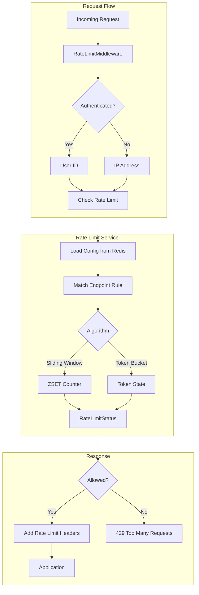

# Rate Limiting

The platform uses Redis-backed rate limiting with per-user and per-endpoint controls. Two algorithms are
available—sliding window for precise time-based limits and token bucket for bursty workloads. Authenticated users are
tracked by user ID; anonymous requests fall back to IP-based limiting.

## Architecture



## Algorithms

The rate limiter supports two algorithms, selectable per rule.

**Sliding window** tracks requests in a Redis sorted set, with timestamps as scores. Each request adds an entry; stale
entries outside the window are pruned. This provides precise limiting but uses more memory for high-traffic endpoints.

**Token bucket** maintains a bucket of tokens that refill at a constant rate. Each request consumes one token. When
empty, requests are rejected until tokens refill. The `burst_multiplier` controls how many extra tokens can accumulate
beyond the base limit, allowing controlled bursts.

```python
--8<-- "backend/app/domain/rate_limit/rate_limit_models.py:EndpointGroup"
```

## Default Rules

The platform ships with default rate limits organized by endpoint group. Higher priority rules match first:

| Pattern              | Group     | Limit   | Window | Priority |
|----------------------|-----------|---------|--------|----------|
| `^/api/v1/execute`   | execution | 10 req  | 60s    | 10       |
| `^/api/v1/auth/.*`   | auth      | 20 req  | 60s    | 7        |
| `^/api/v1/admin/.*`  | admin     | 100 req | 60s    | 5        |
| `^/api/v1/events/.*` | sse       | 5 req   | 60s    | 3        |
| `^/api/v1/ws`        | websocket | 5 req   | 60s    | 3        |
| `^/api/v1/.*`        | api       | 60 req  | 60s    | 1        |

Execution endpoints have the strictest limits since they spawn Kubernetes pods. The catch-all API rule (priority 1)
applies to any endpoint not matching a more specific pattern.

!!! note "WebSocket rule"
    The `/api/v1/ws` pattern is reserved for future WebSocket support. The platform currently uses Server-Sent Events
    (SSE) for real-time updates via `/api/v1/events/*`.

## Middleware Integration

The `RateLimitMiddleware` intercepts every HTTP request except a set of excluded paths (health checks, auth endpoints,
static assets):

```python
--8<-- "backend/app/core/middlewares/rate_limit.py:RateLimitMiddleware"
```

For authenticated requests, the middleware uses the user ID from the request state. Anonymous requests are identified by
client IP address:

```python
--8<-- "backend/app/core/middlewares/rate_limit.py:extract_user_id"
```

## Response Headers

Every response includes rate limit headers so clients can implement backoff logic:

| Header                  | Description                                          |
|-------------------------|------------------------------------------------------|
| `X-RateLimit-Limit`     | Maximum requests allowed in the window               |
| `X-RateLimit-Remaining` | Requests remaining in current window                 |
| `X-RateLimit-Reset`     | Unix timestamp when the window resets                |
| `Retry-After`           | Seconds to wait before retrying (429 responses only) |

When a request is rejected, the middleware returns a 429 response with these headers plus a JSON body:

```json
{
  "detail": "Rate limit exceeded",
  "retry_after": 45,
  "reset_at": "2024-01-15T10:30:00+00:00"
}
```

## Usage Statistics

Administrators can query current rate limit usage for any user via the admin API. The response follows the
[IETF RateLimit headers draft](https://datatracker.ietf.org/doc/draft-ietf-httpapi-ratelimit-headers/) convention,
using a single `remaining` field that represents available capacity regardless of the underlying algorithm:

```python
--8<-- "backend/app/domain/rate_limit/rate_limit_models.py:EndpointUsageStats"
```

For sliding window, `remaining` is calculated as `limit - requests_in_window`. For token bucket, it's the current token
count. This unified representation lets clients implement backoff logic without caring which algorithm is in use.

## Per-User Overrides

Administrators can customize limits for specific users through the admin API. User overrides support:

- **Bypass**: Completely disable rate limiting for the user
- **Global multiplier**: Scale all limits up or down (e.g., 2.0 doubles the limit)
- **Custom rules**: Add user-specific rules that take priority over defaults

```python
--8<-- "backend/app/domain/rate_limit/rate_limit_models.py:UserRateLimit"
```

## Redis Storage

Rate limit state is stored in Redis with automatic TTL expiration. The sliding window algorithm uses sorted sets:

```python
--8<-- "backend/app/services/rate_limit_service.py:check_sliding_window"
```

Token bucket state is stored as JSON with the current token count and last refill time:

```python
--8<-- "backend/app/services/rate_limit_service.py:check_token_bucket"
```

Configuration is cached in Redis for 5 minutes to reduce database load while allowing dynamic updates.

## Configuration

Rate limiting is controlled by TOML settings:

| Variable                  | Default          | Description                                          |
|---------------------------|------------------|------------------------------------------------------|
| `RATE_LIMIT_REDIS_PREFIX` | `rate_limit:`    | Redis key prefix for isolation                       |
| `RATE_LIMIT_ALGORITHM`    | `sliding_window` | Algorithm to use (`sliding_window` or `token_bucket`)|
| `RATE_LIMIT_DEFAULT_REQUESTS` | `100`        | Default request limit                                |
| `RATE_LIMIT_DEFAULT_WINDOW`   | `60`         | Default window in seconds                            |
| `RATE_LIMIT_BURST_MULTIPLIER` | `1.5`        | Burst multiplier for token bucket                    |

The system gracefully degrades when Redis is unavailable—requests are allowed through rather than failing closed.

## Key Files

| File                                                                                                                               | Purpose                                    |
|------------------------------------------------------------------------------------------------------------------------------------|--------------------------------------------|
| [`services/rate_limit_service.py`](https://github.com/HardMax71/Integr8sCode/blob/main/backend/app/services/rate_limit_service.py) | Rate limit algorithms and Redis operations |
| [`core/middlewares/rate_limit.py`](https://github.com/HardMax71/Integr8sCode/blob/main/backend/app/core/middlewares/rate_limit.py) | ASGI middleware for request interception   |
| [`domain/rate_limit/`](https://github.com/HardMax71/Integr8sCode/tree/main/backend/app/domain/rate_limit)                          | Domain models and default configuration    |
