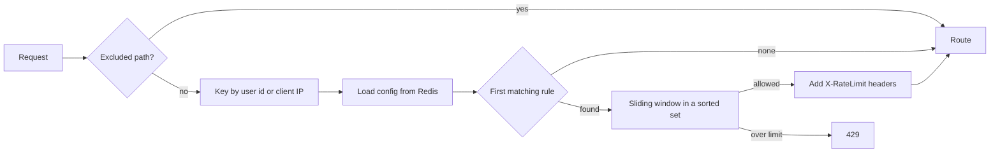

# Rate limiting

Rate limiting is a Redis-backed check in `RateLimitMiddleware`. A signed-in request is counted against its user, and any other request against its client IP. The middleware runs before the route's authentication, so it verifies the access token itself.


```mermaid
flowchart LR
    REQ[Request] --> EX{Excluded path?}
    EX -->|yes| APP[Route]
    EX -->|no| KEY[Key by user id or client IP]
    KEY --> CFG[Load config from Redis]
    CFG --> RULE{First matching rule}
    RULE -->|none| APP
    RULE -->|found| SW[Sliding window in a sorted set]
    SW -->|allowed| HDR[Add X-RateLimit headers] --> APP
    SW -->|over limit| REJ[429]
```

## Which requests are checked

Every HTTP request goes through the middleware except these:

```python
--8<-- "backend/app/core/middlewares/rate_limit.py:excluded_paths"
```

Login, register and logout are skipped by exact path, and the health prefix covers `/api/v1/health/live`. Setting `RATE_LIMIT_ENABLED = false` turns the whole check off, which `config.test.toml` does.

The bucket key is the user id from a valid access token, or the client IP when there's no token or it doesn't verify:

```python
--8<-- "backend/app/core/middlewares/rate_limit.py:extract_user_id"
```

`decode_user_id` checks the signature and expiry and reads the token's `user_id` claim, which login sets. A forged or expired cookie fails that check, so it can't pick someone else's bucket. Tokens issued before the claim existed fall back to the IP until they expire. `get_client_ip` uses the socket peer address. It reads `X-Forwarded-For` (first entry) or `X-Real-IP` only when the peer is a loopback or private address, which is the case behind the frontend nginx.

## Rules

`RateLimitService` loads a `RateLimitConfig` from the Redis key `rate_limit:config`, which has no expiry. If the key is missing, it uses `RateLimitConfig.get_default_config()` without storing it. Rules are sorted by priority, highest first, and the first pattern that matches the path wins:

| Pattern | Group | Limit | Priority |
|---------|-------|-------|----------|
| `^/api/v1/execute` | execution | 10 per 60s | 10 |
| `^/api/v1/auth/.*` | auth | 20 per 60s | 7 |
| `^/api/v1/admin/.*` | admin | 100 per 60s | 5 |
| `^/api/v1/events/.*` | sse | 5 per 60s | 3 |
| `^/api/v1/ws` | websocket | 5 per 60s | 3 |
| `^/api/v1/.*` | api | 60 per 60s | 1 |

All six use the sliding window. The middleware matches the raw path before routing, so a rule also counts requests to URLs that don't exist. Since login, register and logout are excluded, `/api/v1/auth/me` is the only real route the auth rule covers. No route lives under `/api/v1/ws`, so the websocket rule only counts requests that end in 404.

The counter key is `rate_limit:sw:<user id>:<path>`, or `rate_limit:sw:ip:<addr>:<path>` for anonymous requests, with the raw request path. A limit therefore applies to each URL separately, not to the group: two different execution IDs under `/api/v1/events/executions/` get two separate budgets of 5.

## Algorithms

The sliding window keeps one sorted-set entry per request, with the timestamp as both member and score. Two requests with the exact same timestamp therefore share one entry and count once. Each check drops entries older than the window, adds the current one, counts, and refreshes the TTL to twice the window:

```python
--8<-- "backend/app/services/rate_limit_service.py:check_sliding_window"
```

If the count is over the limit, the request is rejected and `retry_after` is computed from the oldest entry still in the window.

The token bucket runs as a Lua script that refills `limit / window` tokens per second up to `limit * burst_multiplier` and stores the state as JSON:

```python
--8<-- "backend/app/services/rate_limit_service.py:check_token_bucket"
```

No default rule uses it, so only a per-user override with a token bucket rule reaches this path.

## Responses

Allowed requests that go through the check get three headers. Requests where no rule matched get them too, with a limit of 999999. Excluded paths skip the check and get none, and so does every request while `RATE_LIMIT_ENABLED` is off.

| Header | Value |
|--------|-------|
| `X-RateLimit-Limit` | limit of the matched rule |
| `X-RateLimit-Remaining` | requests left in the window |
| `X-RateLimit-Reset` | Unix timestamp of the window end |
| `Retry-After` | seconds to wait, on 429 only (60 if unknown) |

A rejected request gets 429 with this body:

```json
{"detail": "Rate limit exceeded", "retry_after": 45, "reset_at": "2026-01-15T10:30:00+00:00"}
```

The service also counts `rate_limit.requests.total`, `rate_limit.allowed.total`, `rate_limit.rejected.total` and `rate_limit.bypass.total`, labelled with the path after IDs are replaced by `*`. The `algorithm` label on `rate_limit.requests.total` also takes `bypassed`, `no_limit` and `redis_error`.

## Per-user overrides

The admin API (`/api/v1/admin/rate-limits/{user_id}`) stores a `UserRateLimit` in `RateLimitConfig.user_overrides`, keyed by the real user ID:

```python
--8<-- "backend/app/domain/rate_limit/rate_limit_models.py:UserRateLimit"
```

A user without an override gets the neutral defaults: no bypass, a multiplier of 1 and no own rules. The check applies the override of the user the request is keyed by, and the usage stats in the same admin view read the counters indexed under `rate_limit:index:{user_id}`, which the check writes for signed-in requests.

## Failure mode

Rate limiting fails open. When a Redis call fails, the service logs the error, counts the request with `algorithm="redis_error"` and lets it through, so a Redis outage doesn't take the API down with it.

## Settings

Only two settings are read. `RATE_LIMIT_ENABLED` switches the middleware on or off, and `RATE_LIMIT_REDIS_PREFIX` (default `rate_limit:`) prefixes every key. `RATE_LIMITS`, `RATE_LIMIT_ALGORITHM`, `RATE_LIMIT_DEFAULT_REQUESTS`, `RATE_LIMIT_DEFAULT_WINDOW` and `RATE_LIMIT_BURST_MULTIPLIER` exist in `Settings` but nothing uses them ([#293](https://github.com/HardMax71/Integr8sCode/issues/293)). The limits come from `get_default_config()`.
