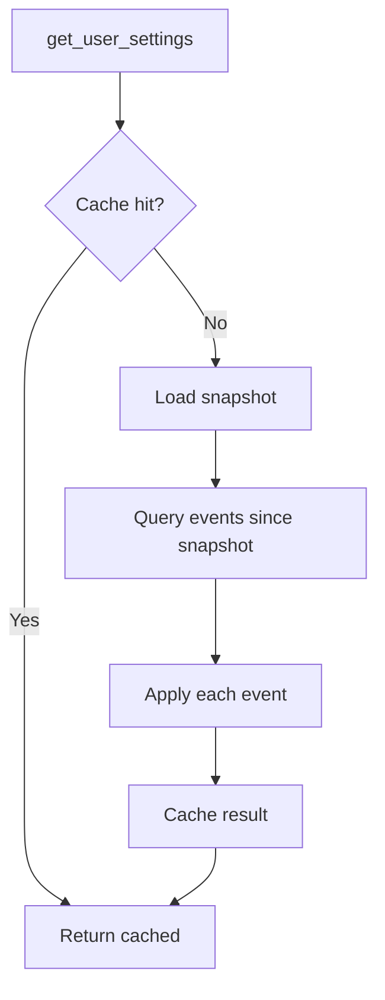

# User settings events

This document explains how user settings are stored, updated, and reconstructed using event sourcing with a unified
event type and TypeAdapter-based merging.

## Unified event approach

All user settings changes emit a single `USER_SETTINGS_UPDATED` event type. There are no specialized events for theme,
notifications, or editor settings. This eliminates branching in both publishing and consuming code.

```python
--8<-- "backend/app/infrastructure/kafka/events/user.py:72:86"
```

The `changed_fields` list identifies which settings changed. Typed fields (`theme`, `notifications`, `editor`, etc.)
contain the new values in Avro-compatible form.

## TypeAdapter pattern

The service uses Pydantic's `TypeAdapter` for dict-based operations without reflection or branching:

```python
--8<-- "backend/app/services/user_settings_service.py:22:23"
```

### Updating settings

The `update_user_settings` method merges changes into current settings, publishes an event, and manages snapshots:

```python
--8<-- "backend/app/services/user_settings_service.py:91:118"
```

### Applying events

When reconstructing settings from events, `_apply_event` merges each event's changes:

```python
--8<-- "backend/app/services/user_settings_service.py:212:223"
```

The `validate_python` call handles nested dict-to-dataclass conversion, enum parsing, and type coercion automatically.
See [Pydantic Dataclasses](pydantic-dataclasses.md) for details.

## Settings reconstruction



Snapshots are created automatically when event count exceeds threshold (10 events). This bounds reconstruction cost
while preserving full event history for auditing.

## Cache layer

Settings are cached with TTL to avoid repeated reconstruction:

```python
--8<-- "backend/app/services/user_settings_service.py:33:40"
```

Cache invalidation happens via [EventBus](event-bus.md) subscription. The EventBus filters out self-published messages,
so the handler only runs for events from other instances:

```python
--8<-- "backend/app/services/user_settings_service.py:56:70"
```

After each update, the service updates its local cache directly, then publishes to the event bus to trigger cache
invalidation on other instances.

## Settings history

The `get_settings_history` method returns a list of changes extracted from events:

```python
--8<-- "backend/app/services/user_settings_service.py:167:184"
```

## Key files

| File                                                                                                                                                         | Purpose                                                      |
|--------------------------------------------------------------------------------------------------------------------------------------------------------------|--------------------------------------------------------------|
| [`services/user_settings_service.py`](https://github.com/HardMax71/Integr8sCode/blob/main/backend/app/services/user_settings_service.py)                     | Settings service with caching and event sourcing             |
| [`services/event_bus.py`](https://github.com/HardMax71/Integr8sCode/blob/main/backend/app/services/event_bus.py)                                             | Cross-instance event distribution                            |
| [`domain/user/settings_models.py`](https://github.com/HardMax71/Integr8sCode/blob/main/backend/app/domain/user/settings_models.py)                           | `DomainUserSettings`, `DomainUserSettingsUpdate` dataclasses |
| [`infrastructure/kafka/events/user.py`](https://github.com/HardMax71/Integr8sCode/blob/main/backend/app/infrastructure/kafka/events/user.py)                 | `UserSettingsUpdatedEvent` definition                        |
| [`db/repositories/user_settings_repository.py`](https://github.com/HardMax71/Integr8sCode/blob/main/backend/app/db/repositories/user_settings_repository.py) | Snapshot and event queries                                   |

## Related docs

- [Event Bus](event-bus.md) — cross-instance communication with self-filtering
- [Pydantic Dataclasses](pydantic-dataclasses.md) — TypeAdapter and dict-to-model conversion
