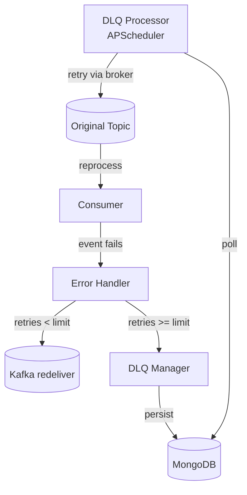

# Dead letter queue

## Why it exists

Picture this: your Kafka consumer is happily processing events when suddenly it hits a poison pill - maybe a malformed event, a database outage, or just a bug in your code. Without a Dead Letter Queue (DLQ), that event would either block your entire consumer (if you keep retrying forever) or get lost forever (if you skip it). Neither option is great for an event-sourced system where events are your source of truth.

The DLQ acts as a safety net. When an event fails processing after a reasonable number of retries, instead of losing it, we persist it to MongoDB where it can be examined, fixed, and potentially replayed later.

## How it works

The DLQ implementation in Integr8sCode persists failed messages directly to MongoDB (no DLQ Kafka topic). The DLQ manager handles persistence and the DLQ processor worker retries messages on a schedule.

### Failure handling

When event handling fails in consumers, the DLQ manager (`app/dlq/manager.py`) packages the failed event with all its context — the original topic, error message, retry count, and metadata about when and where it failed — and persists it directly to MongoDB.

### DLQ processor

The `run_dlq_processor` is a separate APScheduler-based worker that periodically checks MongoDB for retryable DLQ messages. When it finds eligible messages, it republishes them to their original Kafka topics via a manually started broker.

Different topics have different retry strategies configured:

- **Execution requests** get aggressive retries with exponential backoff - these are critical user operations
- **Pod events** get fewer retries with longer delays - these are less critical monitoring events
- **Resource allocation** events get immediate retries - these need quick resolution

The processor also implements safety features like:
- Maximum age checks (messages older than 7 days are discarded)
- Permanent failure handling (after max retries, messages are archived)
- Test event filtering in production

## Message flow

When a consumer fails to process an event, it invokes the registered error callback. The DLQ handler tracks how many times this specific event has failed. If the count is under the retry limit, the handler simply logs and returns, letting Kafka redeliver the message on its next poll. Once the retry limit is exceeded, the DLQ manager persists the message with full failure context (original topic, error message, retry count, timestamps) directly to MongoDB.

The DLQ processor worker runs on an APScheduler schedule, querying MongoDB for retryable messages. Depending on the retry policy, it either republishes the message to its original Kafka topic via a manually started broker, or archives it if maximum attempts have been exhausted.

## Configuration

The DLQ system is configured through settings:

- `DLQ_MAX_RETRY_ATTEMPTS`: Global maximum retries (default: 5)
- `DLQ_RETRY_DELAY_HOURS`: Base delay between retries (default: 1 hour)
- `DLQ_MAX_AGE_DAYS`: How long to keep trying (default: 7 days)
- `DLQ_BATCH_SIZE`: How many DLQ messages to process at once (default: 100)

Each topic can override these with custom retry policies in the DLQ processor configuration. The key is finding the balance between giving transient failures time to resolve and not keeping dead messages around forever.

## Failure modes

If the DLQ processor itself fails, messages stay safely in MongoDB. When the processor restarts, it picks up where it left off.

The system is designed to be resilient but not perfect. In catastrophic scenarios, you still have Kafka's built-in durability and the ability to replay topics from the beginning if needed.

## Key files

| File                                                                                                                     | Purpose                |
|--------------------------------------------------------------------------------------------------------------------------|------------------------|
| [`run_dlq_processor.py`](https://github.com/HardMax71/Integr8sCode/blob/main/backend/workers/run_dlq_processor.py)       | DLQ processor worker   |
| [`manager.py`](https://github.com/HardMax71/Integr8sCode/blob/main/backend/app/dlq/manager.py)                           | DLQ management logic   |
| [`dlq.py`](https://github.com/HardMax71/Integr8sCode/blob/main/backend/app/api/routes/dlq.py)                            | Admin API routes       |
