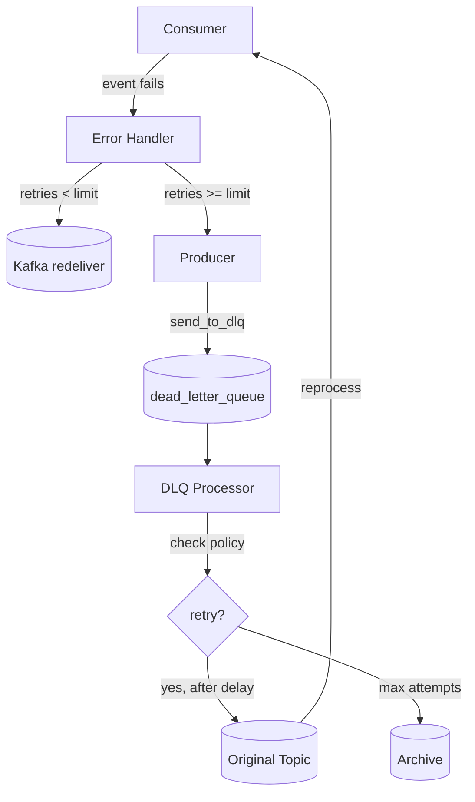

# Dead letter queue

## Why it exists

Picture this: your Kafka consumer is happily processing events when suddenly it hits a poison pill - maybe a malformed event, a database outage, or just a bug in your code. Without a Dead Letter Queue (DLQ), that event would either block your entire consumer (if you keep retrying forever) or get lost forever (if you skip it). Neither option is great for an event-sourced system where events are your source of truth.

The DLQ acts as a safety net. When an event fails processing after a reasonable number of retries, instead of losing it, we send it to a special "dead letter" topic where it can be examined, fixed, and potentially replayed later.

## How it works

The DLQ implementation in Integr8sCode follows a producer-agnostic pattern. Producers can route failed events to the DLQ; a dedicated DLQ manager/processor consumes DLQ messages, persists them, and applies retry/discard policies. Here's how the pieces fit together:

### Producer side

Every `UnifiedProducer` instance has a `send_to_dlq()` method that knows how to package up a failed event with all its context - the original topic, error message, retry count, and metadata about when and where it failed. When called, it creates a special DLQ message and sends it to the `dead_letter_queue` topic in Kafka.

The beauty here is that the producer doesn't make decisions about *when* to send something to DLQ - it just provides the mechanism. The decision-making happens at a higher level.

### Consumer side  

When event handling fails in normal consumers, producers may call `send_to_dlq()` to persist failure context. The DLQ manager is the single component that reads the DLQ topic and orchestrates retries according to policy.

For example, the event store consumer sets up its error handling like this:

```python
if self.producer:
    dlq_handler = create_dlq_error_handler(
        producer=self.producer,
        original_topic="event-store", 
        max_retries=3
    )
    self.consumer.register_error_callback(dlq_handler)
```

This handler tracks retry counts per event. If an event fails 3 times, it gets sent to DLQ. The consumer itself doesn't know about any of this - it just calls the error callback and moves on.

### DLQ processor

The `run_dlq_processor` is a separate service that monitors the dead letter queue topic. It's responsible for the retry orchestration. When it sees a message in the DLQ, it applies topic-specific retry policies to determine when (or if) to retry sending that message back to its original topic.

Different topics have different retry strategies configured:

- **Execution requests** get aggressive retries with exponential backoff - these are critical user operations
- **Pod events** get fewer retries with longer delays - these are less critical monitoring events  
- **Resource allocation** events get immediate retries - these need quick resolution
- **WebSocket events** use fixed intervals - these are real-time updates that become stale quickly

The processor also implements safety features like:
- Maximum age checks (messages older than 7 days are discarded)
- Permanent failure handling (after max retries, messages are archived)
- Test event filtering in production

## Message flow



When a consumer fails to process an event, it invokes the registered error callback. The DLQ handler tracks how many times this specific event has failed. If the count is under the retry limit, the handler simply logs and returns, letting Kafka redeliver the message on its next poll. Once the retry limit is exceeded, the handler calls `producer.send_to_dlq()`, which packages the event together with failure context (original topic, error message, retry count, timestamps) and publishes it to the `dead_letter_queue` topic.

The DLQ processor service consumes from this topic and applies topic-specific retry policies. Depending on the policy, it either schedules the message for redelivery to its original topic after an appropriate delay, or archives it if maximum attempts have been exhausted. When redelivered, the message goes back through normal consumer processing. If it fails again, the cycle repeats until either success or final archival

## Configuration

The DLQ system is configured through environment variables in the `dlq-processor` service:

- `DLQ_MAX_RETRY_ATTEMPTS`: Global maximum retries (default: 5)
- `DLQ_RETRY_DELAY_HOURS`: Base delay between retries (default: 1 hour)
- `DLQ_MAX_AGE_DAYS`: How long to keep trying (default: 7 days)
- `DLQ_BATCH_SIZE`: How many DLQ messages to process at once (default: 100)

Each topic can override these with custom retry policies in the DLQ processor configuration. The key is finding the balance between giving transient failures time to resolve and not keeping dead messages around forever.

## Failure modes

If the DLQ processor itself fails, messages stay safely in the `dead_letter_queue` topic - Kafka acts as the durable buffer. When the processor restarts, it picks up where it left off.

If sending to DLQ fails (extremely rare - would mean Kafka is down), the producer logs a critical error but doesn't crash the consumer. This follows the principle that it's better to lose one message than to stop processing everything.

The system is designed to be resilient but not perfect. In catastrophic scenarios, you still have Kafka's built-in durability and the ability to replay topics from the beginning if needed.

## Key files

| File                                                                                                                     | Purpose                |
|--------------------------------------------------------------------------------------------------------------------------|------------------------|
| [`run_dlq_processor.py`](https://github.com/HardMax71/Integr8sCode/blob/main/backend/workers/run_dlq_processor.py)       | DLQ processor worker   |
| [`manager.py`](https://github.com/HardMax71/Integr8sCode/blob/main/backend/app/dlq/manager.py)                           | DLQ management logic   |
| [`unified_producer.py`](https://github.com/HardMax71/Integr8sCode/blob/main/backend/app/events/unified_producer.py)      | `send_to_dlq()` method |
| [`dlq.py`](https://github.com/HardMax71/Integr8sCode/blob/main/backend/app/api/routes/dlq.py)                            | Admin API routes       |
