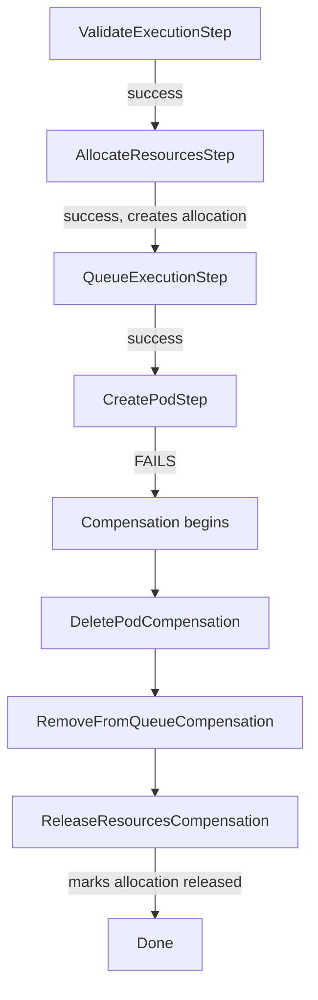

# Resource allocation

## Why it exists

When you run code on Integr8sCode, behind the scenes the system spins up a Kubernetes pod with specific CPU and memory limits. But what happens if a thousand users all hit "Run" at the same time? Without some form of throttling, you'd either exhaust cluster resources or start rejecting requests with cryptic errors.

The resource allocation system acts as a booking ledger for execution resources. Before creating a pod, the system checks how many executions are already running for that language and either proceeds or backs off. If something goes wrong mid-execution, the allocation gets released so it doesn't count against the limit forever.

## How it works

Resource allocation is a step within the execution saga — the distributed transaction pattern that orchestrates the full lifecycle of running user code. The `AllocateResourcesStep` runs early in the saga, right after validation:

```
ExecutionRequested
  → ValidateExecutionStep
  → AllocateResourcesStep  ← creates allocation record
  → QueueExecutionStep
  → CreatePodStep
  → MonitorExecutionStep
```

When the step executes, it does two things:

1. **Counts active allocations** for the requested language
2. **Enforces a concurrency limit** (currently 100 per language)

If the limit hasn't been reached, it creates an allocation record with status "active". If any later step fails, the saga's compensation mechanism kicks in and `ReleaseResourcesCompensation` marks the allocation as "released".

## Data model

Each allocation tracks everything needed for resource accounting:

| Field | Description |
|-------|-------------|
| `allocation_id` | Unique identifier (same as execution_id) |
| `execution_id` | The execution this allocation belongs to |
| `language` | Programming language (used for per-language limits) |
| `cpu_request` / `cpu_limit` | Kubernetes CPU settings |
| `memory_request` / `memory_limit` | Kubernetes memory settings |
| `status` | Either "active" or "released" |
| `allocated_at` | When the allocation was created |
| `released_at` | When it was released (if applicable) |

## Saga compensation

The beauty of tying resource allocation to the saga pattern is automatic cleanup. Consider this failure scenario:



If pod creation fails for any reason, the saga automatically runs compensation steps in reverse order. The `ReleaseResourcesCompensation` step finds the allocation record and marks it as "released", freeing up that slot for another execution.

Without this pattern, you'd need manual cleanup logic scattered throughout the codebase, likely with edge cases where allocations leak and slowly eat into your concurrency budget.

## Repository interface

The `ResourceAllocationRepository` provides three simple operations:

```python
# Check how many executions are running for a language
count = await repo.count_active("python")

# Create a new allocation
await repo.create_allocation(
    allocation_id=execution_id,
    execution_id=execution_id,
    language="python",
    cpu_request="100m",
    memory_request="128Mi",
    cpu_limit="500m",
    memory_limit="256Mi",
)

# Release an allocation (called during compensation)
await repo.release_allocation(allocation_id)
```

The repository uses MongoDB through Beanie ODM. Allocations are indexed by `allocation_id`, `execution_id`, `language`, and `status` for efficient queries.

## Failure modes

**If MongoDB is unavailable:** The allocation step fails, which fails the saga, which means no pod gets created. The user sees an error, but the system stays consistent.

**If an allocation leaks (never released):** This would happen if both the saga and its compensation failed catastrophically. The allocation would stay "active" forever, counting against the limit. In practice, you'd want a periodic cleanup job to release stale allocations older than, say, the maximum execution timeout plus a buffer.

**If the count query is slow:** Under high load, counting active allocations could become a bottleneck. The current implementation uses a simple count query, but this could be optimized with a cached counter or Redis if needed.

## Configuration

The concurrency limit is currently hardcoded to 100 per language in `AllocateResourcesStep`. To change this, modify the check in `execution_saga.py`:

```python
if active_count >= 100:  # <- adjust this value
    raise ValueError("Resource limit exceeded")
```

Future improvements could make this configurable per-language or dynamically adjustable based on cluster capacity.

## Key files

| File                                                                                                                                          | Purpose                  |
|-----------------------------------------------------------------------------------------------------------------------------------------------|--------------------------|
| [`execution_saga.py`](https://github.com/HardMax71/Integr8sCode/blob/main/backend/app/services/saga/execution_saga.py)                        | Saga with allocation step |
| [`resource_allocation_repository.py`](https://github.com/HardMax71/Integr8sCode/blob/main/backend/app/db/repositories/resource_allocation_repository.py) | MongoDB operations       |
