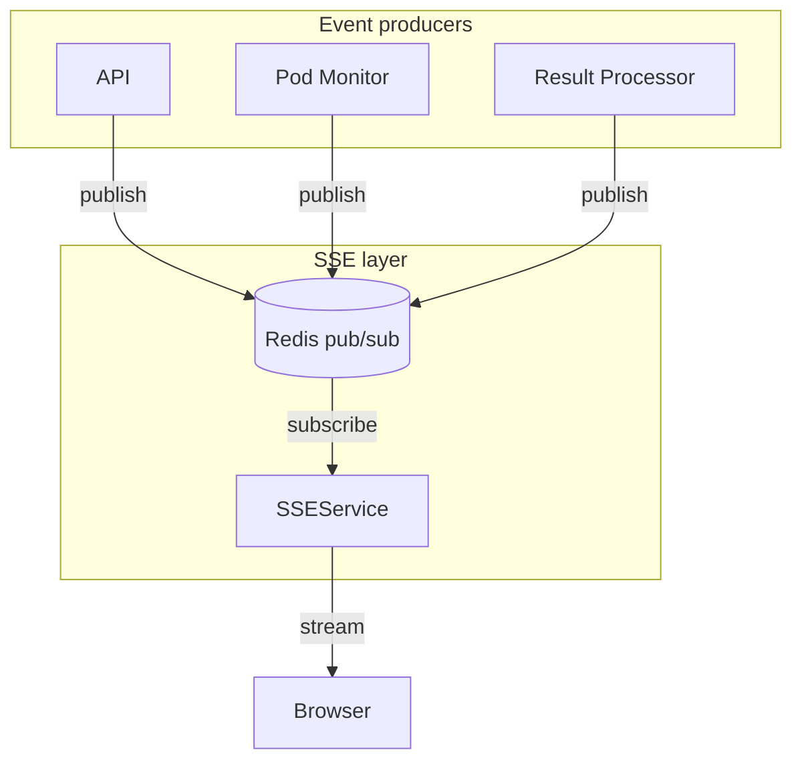

# SSE architecture

Server-Sent Events is the real-time communication channel between backend and frontend. Think of it as a one-way street where the server pushes updates to the browser whenever something interesting happens. Unlike WebSockets (which were removed), SSE is simpler, more reliable, and perfect for server-to-client communication.

## Event flow



When a user submits code, the API returns an execution ID and the frontend opens an SSE connection to `/api/v1/events/executions/{id}`. The SSEService subscribes to a Redis channel keyed by execution ID (`sse:exec:{id}`). Events from producers (API, Pod Monitor, Result Processor) are published to Redis. The SSEService receives them and streams to the browser.

Events include: `execution.requested`, `execution.queued`, `pod.created`, `pod.running`, `execution.completed`, `execution.failed`, `result_stored`.

## Components

### SSE service

`app/services/sse/sse_service.py` manages client connections and streams events. When a client connects, it subscribes to a Redis channel via SSERedisBus and yields events as they arrive. Handles connection lifecycle, initial status fetch from repository, and terminal event detection (`result_stored`, `execution_failed`, `execution_timeout`).

### Redis bus

`app/services/sse/redis_bus.py` wraps Redis pub/sub operations. Provides `publish_event(execution_id, event)` and `open_subscription(execution_id)` for execution streams, plus `publish_notification(user_id, payload)` and `open_notification_subscription(user_id)` for user notification streams. Channels are named `sse:exec:{id}` and `sse:notif:{user_id}`.

## Operations

Browsers automatically reconnect dropped SSE connections. Every SSE connection requires authentication via JWT token, validated before establishing connection. Users can only subscribe to their own executions (ownership verified, admin users exempt).

## Why not WebSockets?

WebSockets were initially implemented but removed because SSE is sufficient for server-to-client communication, simpler connection management, better proxy compatibility (many corporate proxies block WebSockets), excellent browser support with automatic reconnection, and works great with HTTP/2 multiplexing.

## Testing SSE endpoints

Testing SSE endpoints in E2E tests is tricky. Our tests use `httpx.AsyncClient` with `ASGITransport` to run against the FastAPI app in-process without starting a real server. The problem is that httpx's ASGITransport buffers entire responses before returning, which causes tests to hang indefinitely when streaming SSE — the response never "completes" because SSE streams are infinite by design.

This is a [known limitation](https://github.com/encode/httpx/issues/2186) with no fix in sight (there's an open PR since January 2024 but it hasn't been merged).

The solution is [async-asgi-testclient](https://github.com/vinissimus/async-asgi-testclient), an alternative ASGI test client that properly handles streaming. It's added as a dev dependency and used alongside httpx — httpx for regular requests, async-asgi-testclient for SSE endpoints.

The test fixtures copy authentication cookies and CSRF tokens from the httpx client to the SSE client, so both share the same session:

```python
@pytest_asyncio.fixture
async def sse_client(app: FastAPI, test_user: AsyncClient) -> SSETestClient:
    client = SSETestClient(app)
    for name, value in test_user.cookies.items():
        client.cookie_jar.set(name, value)
    if csrf := test_user.headers.get("X-CSRF-Token"):
        client.headers["X-CSRF-Token"] = csrf
    return client
```

Tests then verify that SSE endpoints return the correct content-type and stream data:

```python
async def test_notification_stream(self, sse_client: SSETestClient) -> None:
    async with sse_client:
        response = await sse_client.get("/api/v1/events/notifications/stream", stream=True)
        assert response.status_code == 200
        assert "text/event-stream" in response.headers.get("content-type", "")
```

## Key files

| File                                                                                                                | Purpose                |
|---------------------------------------------------------------------------------------------------------------------|------------------------|
| [`sse_service.py`](https://github.com/HardMax71/Integr8sCode/blob/main/backend/app/services/sse/sse_service.py)     | Client connections     |
| [`redis_bus.py`](https://github.com/HardMax71/Integr8sCode/blob/main/backend/app/services/sse/redis_bus.py)         | Redis pub/sub wrapper  |
