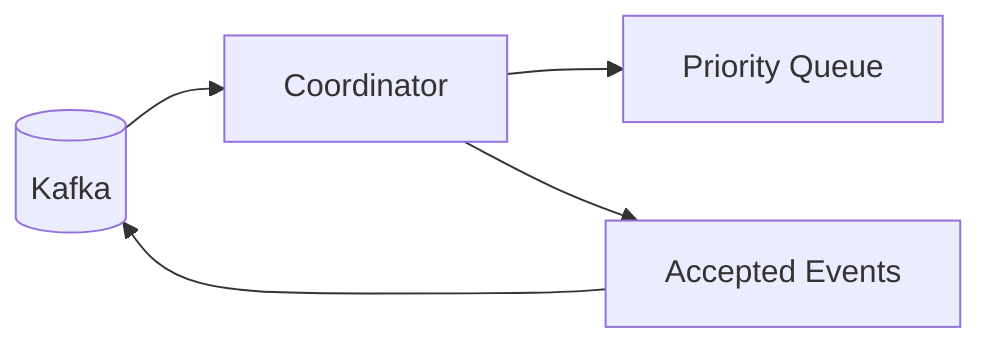

# Coordinator

The coordinator owns admission and queuing policy for executions. It enforces per-user limits to prevent any single user
from monopolizing the system and manages the priority queue for scheduling. Resource limits (CPU, memory) are enforced
by Kubernetes via pod manifests, not by the coordinator.



## How it works

When an `ExecutionRequested` event arrives, the coordinator checks:

1. Is the queue full? (max 10,000 pending)
2. Has this user exceeded their limit? (max 100 concurrent)

If checks pass, the execution is queued and `ExecutionAccepted` is published. Scheduling is reactive: when an execution
lands at the front of the queue, or when an active execution completes/fails/is cancelled, the coordinator immediately
pops the next item and publishes a `CreatePodCommand`. A dedup guard prevents double-publishing for the same execution.

## Priority queue

Executions are processed in priority order. Lower numeric values are processed first:

```python
--8<-- "backend/app/services/coordinator/coordinator.py:32:37"
```

## Configuration

| Parameter                 | Default | Description                |
|---------------------------|---------|----------------------------|
| `max_queue_size`          | 10,000  | Maximum pending executions |
| `max_executions_per_user` | 100     | Per-user limit             |
| `stale_timeout_seconds`   | 3,600   | Stale execution timeout    |

## Topics

- **Consumes**: `execution_events` (requested, completed, failed, cancelled)
- **Produces**: `execution_events` (accepted)

## Key files

| File                                                                                                                           | Purpose                       |
|--------------------------------------------------------------------------------------------------------------------------------|-------------------------------|
| [`run_coordinator.py`](https://github.com/HardMax71/Integr8sCode/blob/main/backend/workers/run_coordinator.py)          | Entry point                                        |
| [`coordinator.py`](https://github.com/HardMax71/Integr8sCode/blob/main/backend/app/services/coordinator/coordinator.py) | Coordinator service with integrated priority queue  |

## Deployment

```yaml
coordinator:
  build:
    dockerfile: workers/Dockerfile.coordinator
```

Usually runs as a single replica. Leader election via Redis is available if scaling is needed.
