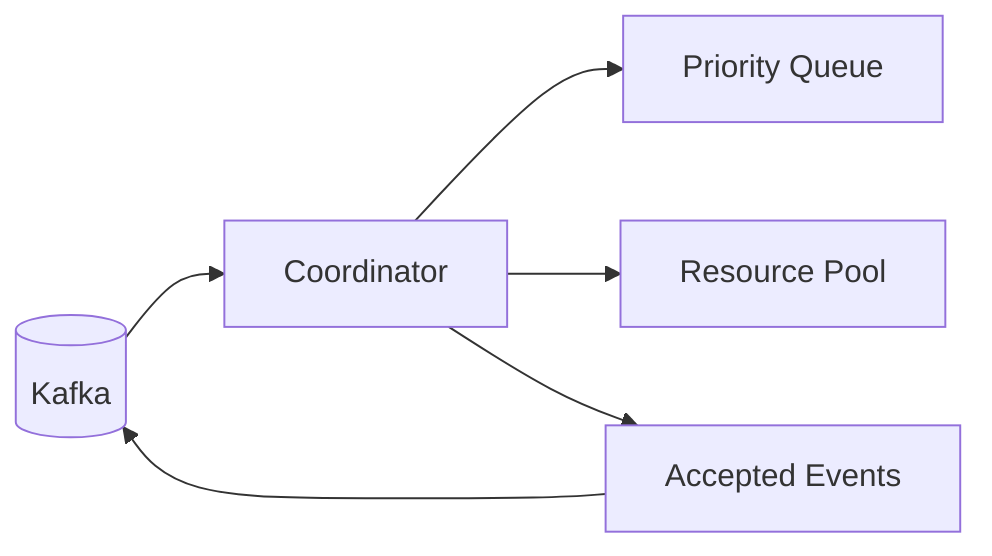

# Coordinator

The coordinator owns admission and queuing policy for executions. It decides which executions can proceed based on
available resources and enforces per-user limits to prevent any single user from monopolizing the system.



## How it works

When an `ExecutionRequested` event arrives, the coordinator checks:

1. Is the queue full? (max 10,000 pending)
2. Has this user exceeded their limit? (max 100 concurrent)
3. Are there enough CPU and memory resources?

If all checks pass, the coordinator allocates resources and publishes `ExecutionAccepted`. Otherwise, the request
is either queued for later or rejected.

The coordinator runs a background scheduling loop that continuously pulls from the priority queue and attempts to
schedule pending executions as resources become available.

## Priority queue

Executions are processed in priority order. Lower numeric values are processed first:

```python
--8<-- "backend/app/services/coordinator/queue_manager.py:14:19"
```

When resources are unavailable, executions are requeued with reduced priority to prevent starvation.

## Resource management

The coordinator tracks a pool of CPU and memory resources:

| Parameter                 | Default | Description                |
|---------------------------|---------|----------------------------|
| `total_cpu_cores`         | 32      | Total CPU pool             |
| `total_memory_mb`         | 65,536  | Total memory pool (64GB)   |
| `overcommit_factor`       | 1.2     | Allow 20% overcommit       |
| `max_queue_size`          | 10,000  | Maximum pending executions |
| `max_executions_per_user` | 100     | Per-user limit             |
| `stale_timeout_seconds`   | 3,600   | Stale execution timeout    |

## Topics

- **Consumes**: `execution_events` (requested, completed, failed, cancelled)
- **Produces**: `execution_events` (accepted)

## Key files

| File                                                                                                                           | Purpose                       |
|--------------------------------------------------------------------------------------------------------------------------------|-------------------------------|
| [`run_coordinator.py`](https://github.com/HardMax71/Integr8sCode/blob/main/backend/workers/run_coordinator.py)                 | Entry point                   |
| [`coordinator.py`](https://github.com/HardMax71/Integr8sCode/blob/main/backend/app/services/coordinator/coordinator.py)        | Main coordinator service      |
| [`queue_manager.py`](https://github.com/HardMax71/Integr8sCode/blob/main/backend/app/services/coordinator/queue_manager.py)    | Priority queue implementation |
| [`resource_manager.py`](https://github.com/HardMax71/Integr8sCode/blob/main/backend/app/services/coordinator/resource_manager.py) | Resource pool and allocation  |

## Deployment

```yaml
coordinator:
  build:
    dockerfile: workers/Dockerfile.coordinator
```

Usually runs as a single replica. Leader election via Redis is available if scaling is needed.
