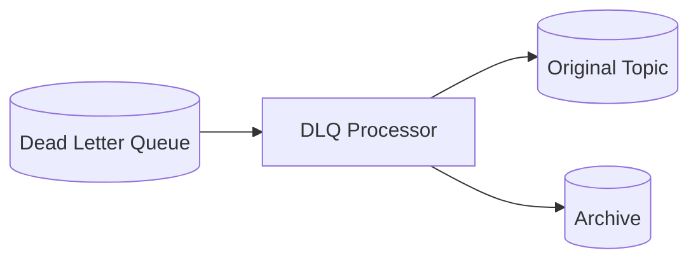

# DLQ Processor

The DLQ (Dead Letter Queue) processor drains and retries dead-lettered messages with exponential backoff. When a
message fails processing too many times, it ends up in the DLQ for manual inspection and retry.

For the full picture on how dead-lettering works, see [Dead Letter Queue](../dead-letter-queue.md).



## How it works

When a Kafka consumer fails to process a message after exhausting its retries, the message is sent to the dead letter
queue topic. The DLQ processor picks up these messages and applies a retry policy:

1. Check if the message has exceeded max retry attempts
2. If not, wait for the backoff delay
3. Republish to the original topic
4. If successful, remove from DLQ
5. If max attempts exceeded, archive the message

The processor uses exponential backoff — each retry waits longer than the previous one, up to a maximum delay. This
prevents overwhelming downstream services during outages.

## Configuration

| Variable                       | Default | Description                   |
|--------------------------------|---------|-------------------------------|
| `DLQ_RETRY_MAX_ATTEMPTS`       | 5       | Maximum retry attempts        |
| `DLQ_RETRY_BASE_DELAY_SECONDS` | 60      | Base retry delay              |
| `DLQ_RETRY_MAX_DELAY_SECONDS`  | 3,600   | Maximum retry delay (1 hour)  |
| `DLQ_RETENTION_DAYS`           | 7       | Message retention             |
| `DLQ_WARNING_THRESHOLD`        | 100     | Threshold for warning alerts  |
| `DLQ_CRITICAL_THRESHOLD`       | 1,000   | Threshold for critical alerts |

## Monitoring

The DLQ can be monitored via the admin API:

- `GET /api/v1/dlq/stats` — DLQ statistics by status, topic, event type
- `GET /api/v1/dlq/messages` — List DLQ messages with filtering
- `GET /api/v1/dlq/messages/{event_id}` — Retrieve a specific message by ID
- `GET /api/v1/dlq/topics` — List all topics with DLQ messages
- `POST /api/v1/dlq/retry` — Manually retry messages
- `POST /api/v1/dlq/retry-policy` — Configure retry policy for a topic
- `DELETE /api/v1/dlq/messages/{event_id}` — Discard a message

## Key files

| File                                                                                                      | Purpose              |
|-----------------------------------------------------------------------------------------------------------|----------------------|
| [`dlq_processor.py`](https://github.com/HardMax71/Integr8sCode/blob/main/backend/workers/dlq_processor.py) | Entry point          |
| [`manager.py`](https://github.com/HardMax71/Integr8sCode/blob/main/backend/app/dlq/manager.py)            | DLQ management logic |
| [`dlq.py`](https://github.com/HardMax71/Integr8sCode/blob/main/backend/app/api/routes/dlq.py)             | Admin API routes     |

## Deployment

```yaml
dlq-processor:
  build:
    dockerfile: workers/Dockerfile.dlq_processor
```

Usually runs as a single replica. The processor is designed to handle periodic retries, not real-time processing.
