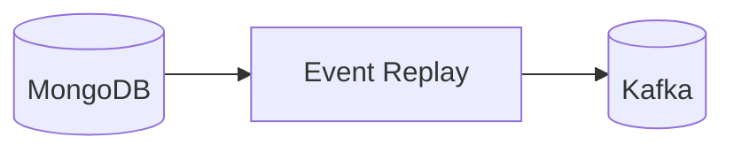

# Event Replay

The event replay worker re-emits stored events for debugging or rebuilding projections. It reads from the MongoDB
event store and republishes events to Kafka, optionally filtering by time range, event types, or aggregates.



## How it works

Event replay is typically triggered via the admin API. You specify a replay configuration with filters:

- Time range (start/end timestamps)
- Event types to include
- Specific aggregate IDs (like execution IDs)

The worker reads matching events from the event store in chronological order and republishes them to their original
topics. Each replayed event includes a provenance marker so consumers can distinguish replays from live events.

## Use cases

**Debugging** — Replay events for a specific execution to understand what happened step by step.

**Rebuilding projections** — If a read model gets corrupted or a new projection is added, replay historical events
to rebuild state.

**Testing** — Replay production events in a test environment to verify behavior.

## Dry-run mode

The worker supports dry-run mode where events are loaded and validated but not actually published. This helps verify
filter criteria before running a real replay.

## Key files

| File                                                                                                           | Purpose                   |
|----------------------------------------------------------------------------------------------------------------|---------------------------|
| [`run_event_replay.py`](https://github.com/HardMax71/Integr8sCode/blob/main/backend/workers/run_event_replay.py) | Entry point               |
| [`replay_service.py`](https://github.com/HardMax71/Integr8sCode/blob/main/backend/app/services/replay_service.py) | Replay session management |
| [`event_store.py`](https://github.com/HardMax71/Integr8sCode/blob/main/backend/app/events/event_store.py)      | Event store queries       |

## Deployment

```yaml
event-replay:
  image: ghcr.io/hardmax71/integr8scode/backend:${IMAGE_TAG:-latest}
  command: ["python", "workers/run_event_replay.py"]
```

Typically runs on-demand. Scale up when replay is needed, scale back down when complete.
