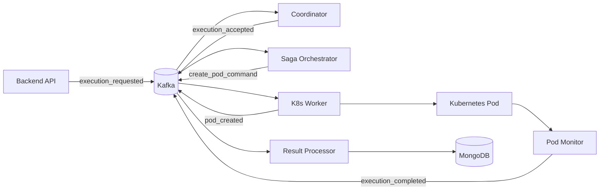

# Workers

The execution pipeline is split across seven background workers, each running as a separate container. This separation
keeps concerns isolated - the API doesn't block waiting for pods to finish, the saga orchestrator doesn't care how pods
are created, and the result processor doesn't know anything about Kubernetes.

Workers communicate through Kafka. Each publishes events when it completes work, and subscribes to events from upstream.
MongoDB and Redis provide shared state where needed.



## The workers

| Worker                                    | What it does                                              | Entry point                |
|-------------------------------------------|-----------------------------------------------------------|----------------------------|
| [Coordinator](coordinator.md)             | Admits executions, manages the queue, allocates resources | `run_coordinator.py`       |
| [Saga Orchestrator](saga_orchestrator.md) | Drives the execution state machine, issues pod commands   | `run_saga_orchestrator.py` |
| [K8s Worker](k8s_worker.md)               | Creates ConfigMaps and Pods with security hardening       | `run_k8s_worker.py`        |
| [Pod Monitor](pod_monitor.md)             | Watches pods, translates K8s events to domain events      | `run_pod_monitor.py`       |
| [Result Processor](result_processor.md)   | Persists execution results, cleans up resources           | `run_result_processor.py`  |
| [Event Replay](event_replay.md)           | Re-emits historical events for debugging                  | `run_event_replay.py`      |
| [DLQ Processor](dlq_processor.md)         | Retries failed messages from the dead letter queue        | `dlq_processor.py`         |

All entry points live in [`backend/workers/`](https://github.com/HardMax71/Integr8sCode/tree/main/backend/workers).

## Running locally

Docker Compose starts everything:

```bash
./deploy.sh dev
```

For debugging a specific worker, run it directly:

```bash
cd backend
python -m workers.run_coordinator
```

## Scaling

Most workers can run as single replicas. The stateful ones (Coordinator, Saga Orchestrator) use event sourcing to
recover after restarts. The stateless ones (K8s Worker, Pod Monitor, Result Processor) can scale horizontally if
throughput becomes an issue.
