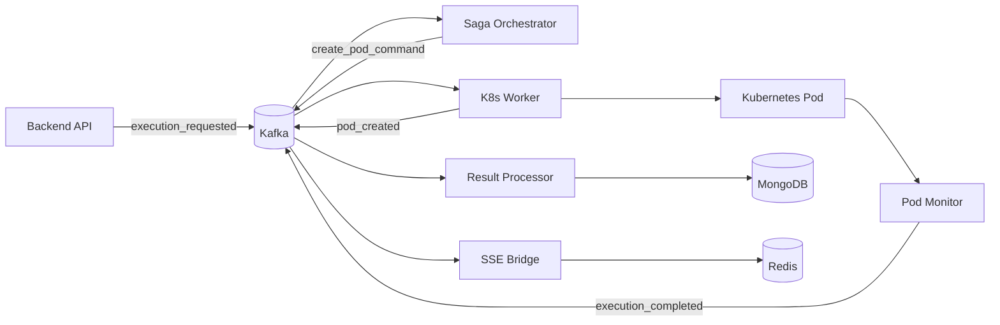

# Workers

The execution pipeline is split across seven background workers, each running as a separate container. This separation
keeps concerns isolated - the API doesn't block waiting for pods to finish, the saga orchestrator doesn't care how pods
are created, and the result processor doesn't know anything about Kubernetes.

Workers communicate through Kafka. Each publishes events when it completes work, and subscribes to events from upstream.
MongoDB and Redis provide shared state where needed.



## The workers

| Worker                                    | What it does                                              | Entry point                |
|-------------------------------------------|-----------------------------------------------------------|----------------------------|
| [Saga Orchestrator](saga_orchestrator.md) | Drives the execution state machine, issues pod commands   | `run_saga_orchestrator.py` |
| [K8s Worker](k8s_worker.md)               | Creates ConfigMaps and Pods with security hardening       | `run_k8s_worker.py`        |
| [Pod Monitor](pod_monitor.md)             | Watches pods, translates K8s events to domain events      | `run_pod_monitor.py`       |
| [Result Processor](result_processor.md)   | Persists execution results, cleans up resources           | `run_result_processor.py`  |
| SSE Bridge                                | Routes execution events from Kafka to Redis for SSE       | `run_sse_bridge.py`        |
| [Event Replay](event_replay.md)           | Re-emits historical events for debugging                  | `run_event_replay.py`      |
| [DLQ Processor](dlq_processor.md)         | Retries failed messages from the dead letter queue        | `dlq_processor.py`         |

All entry points live in [`backend/workers/`](https://github.com/HardMax71/Integr8sCode/tree/main/backend/workers).

## FastStream framework

All Kafka-consuming workers are built on [FastStream](https://faststream.ag2.ai/), an asynchronous Python framework for
building event-driven microservices. FastStream provides:

- **Declarative subscribers** — define handlers with `@broker.subscriber()` decorators
- **Automatic serialization** — Avro/JSON encoding handled transparently via custom decoders
- **Dependency injection** — integrated with [Dishka](https://dishka.readthedocs.io/) for clean DI
- **Lifespan management** — startup/shutdown hooks for resource initialization
- **Acknowledgement policies** — fine-grained control over message processing guarantees

### Message acknowledgement policies

FastStream's `AckPolicy` controls when Kafka offsets are committed, determining message delivery semantics. Each policy
offers different trade-offs between throughput, reliability, and complexity:

| Policy              | On Success                | On Error                    | Delivery Guarantee | Use Case                                    |
|---------------------|---------------------------|-----------------------------|--------------------|---------------------------------------------|
| `ACK_FIRST`         | Commit before processing  | Already committed           | At most once       | High throughput, idempotent operations      |
| `ACK`               | Commit after processing   | Commit anyway (no retry)    | At least once      | Reliable processing without retry needs     |
| `NACK_ON_ERROR`     | Commit after processing   | Seek back for redelivery    | At least once      | Auto-retry on transient failures            |
| `REJECT_ON_ERROR`   | Commit after processing   | Commit (discard message)    | At least once      | Permanent failures, no retry desired        |
| `MANUAL`            | User calls `msg.ack()`    | User calls `msg.nack()`     | User-controlled    | Complex conditional acknowledgement         |

!!! note "Kafka-specific behavior"
    Unlike RabbitMQ or NATS, Kafka lacks native message rejection. `REJECT_ON_ERROR` behaves identically to `ACK` —
    the offset is committed regardless, and the message won't be redelivered. Use a Dead Letter Queue for failed
    messages that need investigation.

### Worker acknowledgement configuration

Each worker uses the policy best suited to its reliability requirements:

| Worker              | Policy       | Rationale                                                                              |
|---------------------|--------------|----------------------------------------------------------------------------------------|
| Saga Orchestrator   | `ACK`        | Saga state is persisted to MongoDB; duplicate processing is idempotent                 |
| K8s Worker          | `ACK`        | Pod creation is idempotent (same execution ID); uses idempotency middleware            |
| Result Processor    | `ACK`        | Result persistence is idempotent; duplicate writes are safe                            |
| SSE Bridge          | `ACK_FIRST`  | Redis pubsub is fire-and-forget; missing an event causes a client retry, not data loss |
| DLQ Processor       | `ACK`        | DLQ messages are tracked in MongoDB; safe to acknowledge after processing              |

Example subscriber configuration:

```python
from faststream import AckPolicy

@broker.subscriber(
    *topics,
    group_id="saga-orchestrator",
    ack_policy=AckPolicy.ACK,
    decoder=decode_avro,
)
async def handle_event(event: DomainEvent) -> None:
    await saga_logic.process(event)
```

### Exception-based flow control

FastStream supports interrupting message processing at any call stack level:

```python
from faststream.exceptions import AckMessage, NackMessage

async def deep_processing_function():
    if should_skip:
        raise AckMessage()  # Acknowledge and stop processing
    if should_retry:
        raise NackMessage()  # Reject for redelivery (NATS/RabbitMQ only)
```

For Kafka, `NackMessage` has no effect since Kafka doesn't support message-level rejection. Use `NACK_ON_ERROR` policy
instead for automatic retry behavior.

## Running locally

Docker Compose starts everything:

```bash
./deploy.sh dev
```

For debugging a specific worker, run it directly:

```bash
cd backend
python -m workers.run_saga_orchestrator
```

## Scaling

Most workers can run as single replicas. The Saga Orchestrator uses event sourcing to recover after restarts.
The stateless ones (K8s Worker, Pod Monitor, Result Processor) can scale horizontally if throughput becomes an issue.
