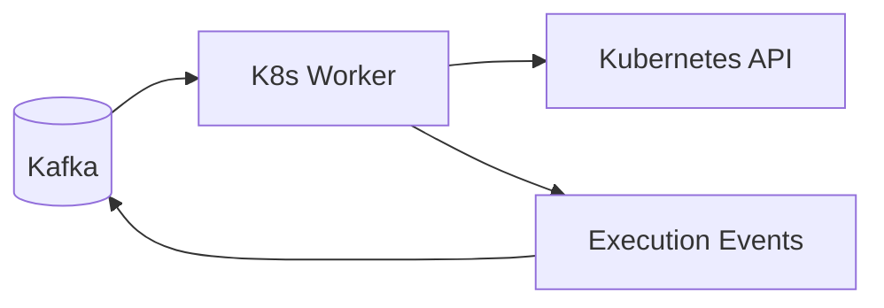

# K8s Worker

The K8s worker materializes saga commands into Kubernetes resources. When the [Saga Orchestrator](saga_orchestrator.md)
decides a pod should be created, the K8s worker handles the actual creation with proper security hardening.



## How it works

The worker consumes `CreatePodCommand` and `DeletePodCommand` events from the saga commands topic. For pod creation,
it builds a complete pod specification including:

- A ConfigMap containing the user's script and an entrypoint script
- A Pod manifest with hardened security context
- Proper labels for tracking and network policy matching

After creating resources, it publishes `PodCreated` and `ExecutionStarted` events so the rest of the system knows
the execution has begun.

## Pod security

Every pod is created with defense-in-depth security:

| Control            | Implementation                                |
|--------------------|-----------------------------------------------|
| Non-root execution | UID/GID 1000, no privilege escalation         |
| Filesystem         | Read-only root filesystem                     |
| Capabilities       | All Linux capabilities dropped                |
| Seccomp            | RuntimeDefault profile                        |
| Network            | Cilium deny-all egress policy (cluster-level) |
| DNS                | Disabled                                      |
| Service account    | No token mounted                              |

The worker refuses to run pods in the `default` namespace to ensure network policies are always applied.

## Topics

- **Consumes**: `saga_commands`
- **Produces**: `execution_events`, `pod_events`

## Key files

| File                                                                                                                | Purpose             |
|---------------------------------------------------------------------------------------------------------------------|---------------------|
| [`run_k8s_worker.py`](https://github.com/HardMax71/Integr8sCode/blob/main/backend/workers/run_k8s_worker.py)        | Entry point         |
| [`worker.py`](https://github.com/HardMax71/Integr8sCode/blob/main/backend/app/services/k8s_worker/worker.py)        | Worker service      |
| [`pod_builder.py`](https://github.com/HardMax71/Integr8sCode/blob/main/backend/app/services/k8s_worker/pod_builder.py) | Pod spec generation |

## Deployment

```yaml
k8s-worker:
  image: ghcr.io/hardmax71/integr8scode/backend:${IMAGE_TAG:-latest}
  command: ["python", "workers/run_k8s_worker.py"]
```

Scale based on pod creation throughput. Each instance needs access to the Kubernetes API via kubeconfig.
