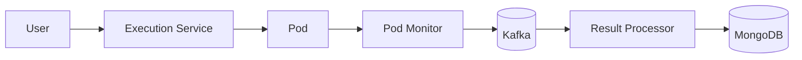

# Pod monitor

## Overview

The pod monitor is a bridge between Kubernetes and the event system. It watches for pods created with specific labels (execution pods) and translates what happens to them into events that the rest of the system understands.

Think of it as a translator sitting between Kubernetes speaking its native language of pod phases and conditions, and the application speaking in terms of execution events.

## How it works

When an execution starts, the system creates a Kubernetes pod to run the user's code. The pod monitor watches the Kubernetes API using the watch mechanism — like a WebSocket connection that streams pod changes as they happen.

As pods go through their lifecycle (getting scheduled, starting to run, completing or failing), the monitor captures these state changes and maps them to domain events. A pod becoming "Running" in Kubernetes becomes an `ExecutionRunningEvent`. A pod that completes becomes either `ExecutionCompletedEvent` or `ExecutionFailedEvent` depending on the exit code.

The clever part is log extraction. When a pod terminates, the monitor fetches container logs, parses them to extract stdout, stderr, and resource usage metrics printed in a special JSON format, then includes all this data in the completion event.

## System flow

Without the pod monitor, there would be no way to know when executions finish or what their output was. It's the eyes and ears of the system for everything happening in Kubernetes.

The service runs as a standalone container because it needs to maintain a persistent watch connection to the Kubernetes API. If it was part of the main backend, every restart would break the watch and potentially miss pod events.

## Reconciliation

Every five minutes, the monitor queries Kubernetes for all pods matching the labels and compares them to what it thinks it's tracking. This catches any events that might have been missed due to network issues or restarts — like doing a periodic inventory check to make sure nothing slipped through.
