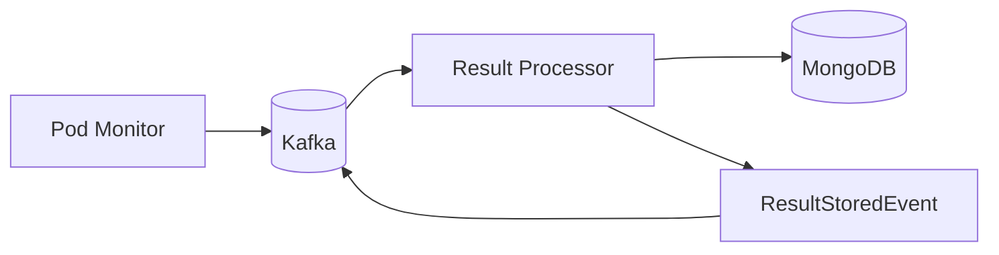

# Result processor

## Overview

The result processor consumes execution completion events from Kafka and persists results to MongoDB. It's the final step in the execution pipeline — once a pod finishes and the pod monitor publishes the outcome, the result processor stores everything and notifies downstream consumers.



## What it does

When an `ExecutionCompletedEvent`, `ExecutionFailedEvent`, or `ExecutionTimeoutEvent` arrives, the processor stores the execution output (stdout, stderr, exit codes) in the `execution_results` collection and updates the execution status in the `executions` collection. It also records metrics like duration and memory usage.

After persisting, the processor publishes a `ResultStoredEvent` so downstream consumers (like SSE streams) know the execution has finished and results are available.

## Deployment

The processor runs as a standalone container in the `result-processor-group` consumer group, subscribing to the `EXECUTION_RESULTS` topic. It depends on Kafka for event consumption, MongoDB for storage, and Schema Registry for event deserialization.

```yaml
result-processor:
  build:
    dockerfile: workers/Dockerfile.result_processor
```
