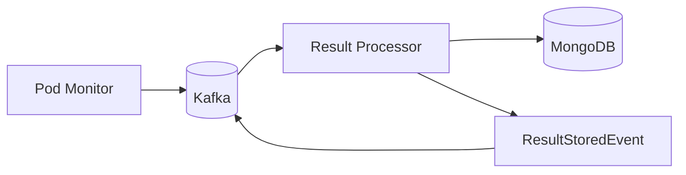

# Result Processor

The result processor consumes execution completion events from Kafka and persists results to MongoDB. It's the final
step in the execution pipeline — once a pod finishes and the [Pod Monitor](pod_monitor.md) publishes the outcome,
the result processor stores everything and notifies downstream consumers.



## What it does

When an `ExecutionCompletedEvent`, `ExecutionFailedEvent`, or `ExecutionTimeoutEvent` arrives, the processor stores
the execution output (stdout, stderr, exit codes) in the `execution_results` collection and updates the execution
status in the `executions` collection. It also records metrics like duration and memory usage.

After persisting, the processor publishes a `ResultStoredEvent` so downstream consumers (like SSE streams) know the
execution has finished and results are available.

## Resource cleanup

The processor also handles cleanup after executions complete. The [`resource_cleaner.py`](https://github.com/HardMax71/Integr8sCode/blob/main/backend/app/services/result_processor/resource_cleaner.py)
module deletes ConfigMaps and pods that are no longer needed, keeping the Kubernetes namespace tidy.

## Key files

| File                                                                                                                           | Purpose          |
|--------------------------------------------------------------------------------------------------------------------------------|------------------|
| [`run_result_processor.py`](https://github.com/HardMax71/Integr8sCode/blob/main/backend/workers/run_result_processor.py)       | Entry point      |
| [`processor.py`](https://github.com/HardMax71/Integr8sCode/blob/main/backend/app/services/result_processor/processor.py)       | Result handling  |
| [`resource_cleaner.py`](https://github.com/HardMax71/Integr8sCode/blob/main/backend/app/services/result_processor/resource_cleaner.py) | K8s cleanup      |

## Deployment

```yaml
result-processor:
  image: ghcr.io/hardmax71/integr8scode/backend:${IMAGE_TAG:-latest}
  command: ["python", "workers/run_result_processor.py"]
```

Runs in the `result-processor-group` consumer group. Can scale horizontally if result throughput becomes a bottleneck.
