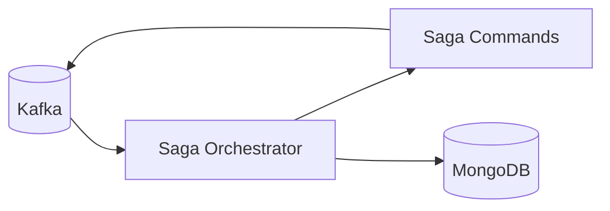
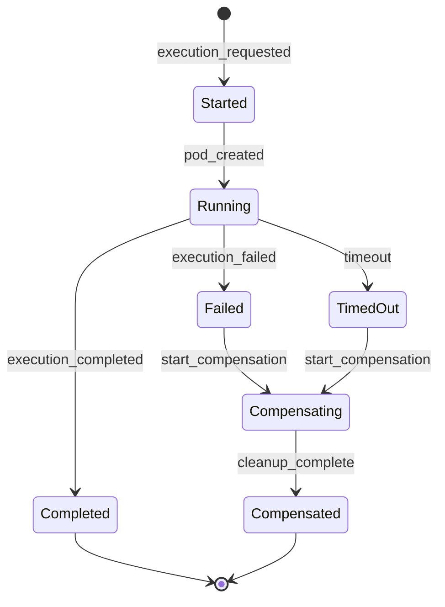

# Saga Orchestrator

The saga orchestrator is the stateful choreographer for the execution lifecycle. It coordinates multi-step workflows
by subscribing to execution events and publishing saga commands, ensuring that complex operations complete correctly
or get properly compensated on failure.



## How it works

When an execution request comes in, the saga orchestrator creates a new saga instance and drives it through its
lifecycle. Each saga tracks which steps have been completed and what compensation actions are needed if something
fails.

The orchestrator issues commands like `CreatePodCommand` and `DeletePodCommand` to the [K8s Worker](k8s_worker.md).
It watches for completion events (`EXECUTION_COMPLETED`, `EXECUTION_FAILED`, `EXECUTION_TIMEOUT`) and advances
the saga state accordingly. The execution saga specifically stays in `RUNNING` state after its steps complete,
waiting for these external completion events before transitioning to a terminal state. If a step fails or times
out, it triggers compensation — like deleting a partially created pod.

The clever part is idempotency. The orchestrator reconstructs saga state from events on restart, so it can resume
interrupted workflows without duplicate side effects. If a pod was already created, it won't try to create it again.

## Saga states



## Topics

- **Consumes**: `execution_events`, saga-related topics
- **Produces**: `saga_commands`

## Key files

| File                                                                                                                    | Purpose                       |
|-------------------------------------------------------------------------------------------------------------------------|-------------------------------|
| [`run_saga_orchestrator.py`](https://github.com/HardMax71/Integr8sCode/blob/main/backend/workers/run_saga_orchestrator.py) | Entry point                   |
| [`saga_orchestrator.py`](https://github.com/HardMax71/Integr8sCode/blob/main/backend/app/services/saga/saga_orchestrator.py) | Core orchestrator logic       |
| [`saga_service.py`](https://github.com/HardMax71/Integr8sCode/blob/main/backend/app/services/saga/saga_service.py)      | Saga state management         |
| [`execution_saga.py`](https://github.com/HardMax71/Integr8sCode/blob/main/backend/app/services/saga/execution_saga.py)  | Execution saga definition     |
| [`saga_repository.py`](https://github.com/HardMax71/Integr8sCode/blob/main/backend/app/db/repositories/saga_repository.py) | Saga persistence layer     |

## Deployment

```yaml
saga-orchestrator:
  build:
    dockerfile: workers/Dockerfile.saga_orchestrator
```

The orchestrator runs as a single replica since it's stateful. Event sourcing allows recovery after restarts.
