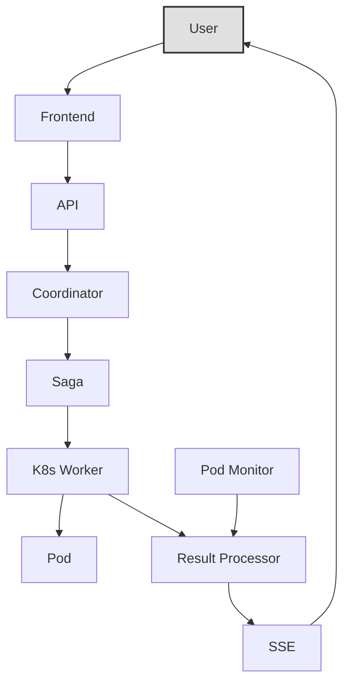

# Integr8sCode

[GitHub :material-github:](https://github.com/HardMax71/Integr8sCode){ .md-button }
[Live Demo :material-play:](https://app.integr8scode.cc/){ .md-button .md-button--primary }

## Quick start

### Deployment

```bash
# 1. Clone the repo
git clone https://github.com/HardMax71/Integr8sCode.git
cd Integr8sCode

# 2. Start containers
docker-compose up --build
```

Access points:

| Service | URL |
|---------|-----|
| Frontend | `https://127.0.0.1:5001/` |
| Backend API | `https://127.0.0.1:443/` |
| Grafana | `http://127.0.0.1:3000` (admin/admin123) |

### Verify installation

Check if the backend is running:

```bash
curl -k https://127.0.0.1/api/v1/k8s-limits
```

Example response:

```json
{
  "cpu_limit": "1000m",
  "memory_limit": "128Mi",
  "timeout_seconds": 5
}
```

### Enable Kubernetes metrics

If CPU and Memory metrics show as `null`, enable the metrics server:

```bash
kubectl create -f https://raw.githubusercontent.com/pythianarora/total-practice/master/sample-kubernetes-code/metrics-server.yaml
```

Verify with:

```bash
kubectl top node
```

Example output:

```
NAME             CPU(cores)   CPU%   MEMORY(bytes)   MEMORY%
docker-desktop   267m         3%     4732Mi          29%
```

## Core features

- Every script runs in its own Kubernetes pod, fully isolated from others
- Resource limits keep things in check: 1000m CPU, 128Mi memory, configurable timeouts
- Multiple Python versions supported (3.9, 3.10, 3.11, 3.12)
- Real-time updates via Server-Sent Events so you see what's happening as it happens
- Full audit trail through Kafka event streams
- Failed events get retried automatically via dead letter queue

## Architecture

The platform has three main parts:

- A Svelte frontend that users interact with
- FastAPI backend handling the heavy lifting, backed by MongoDB, Kafka, and Redis
- Kubernetes cluster where each script runs in its own pod with Cilium network policies



For detailed architecture diagrams, see the [Architecture](architecture/overview.md) section.

## Security

- Pods can't make external network calls (Cilium deny-all policy)
- Everything runs as non-root with dropped capabilities
- Read-only root filesystem on containers
- No service account access to Kubernetes API

## Documentation

<div class="grid cards" markdown>

-   :material-sitemap: **[Architecture](architecture/overview.md)**

    ---

    System design, service interactions, and event flows

-   :material-api: **[API Reference](reference/api-reference.md)**

    ---

    Complete REST and SSE endpoint documentation

-   :material-cog: **[Components](components/dead-letter-queue.md)**

    ---

    SSE, Workers, DLQ, and Schema management

-   :material-wrench: **[Operations](operations/tracing.md)**

    ---

    Tracing, metrics, monitoring, and troubleshooting

</div>

## Sample test

Verify your installation by running this Python 3.10+ code:

```python
from typing import TypeGuard

def is_string(value: object) -> TypeGuard[str]:
    return isinstance(value, str)

def example_function(data: object):
    match data:
        case int() if data > 10:
            print("An integer greater than 10")
        case str() if is_string(data):
            print(f"A string: {data}")
        case _:
            print("Something else")

example_function(15)
example_function("hello")
example_function([1, 2, 3])
```

Expected output:

```
An integer greater than 10
A string: hello
Something else
```
