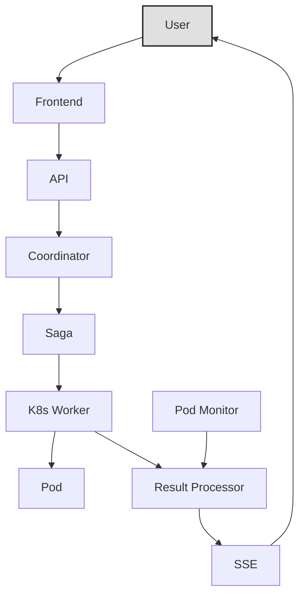

# Integr8sCode

[GitHub :material-github:](https://github.com/HardMax71/Integr8sCode){ .md-button }
[Live Demo :material-play:](https://app.integr8scode.cc/){ .md-button .md-button--primary }

Run Python scripts in isolated Kubernetes pods with real-time output streaming, resource limits, and full audit trails.

## Quick start

```bash
git clone https://github.com/HardMax71/Integr8sCode.git
cd Integr8sCode
./deploy.sh dev
```

| Service     | URL                         | Credentials       |
|-------------|-----------------------------|-------------------|
| Frontend    | `https://localhost:5001`    | user / user123    |
| Backend API | `https://localhost:443`     | —                 |
| Grafana     | `http://localhost:3000`     | admin / admin123  |

Verify the backend is running:

```bash
curl -k https://localhost/api/v1/health/live
```

!!! note "Kubernetes metrics"
    If CPU/memory metrics show as `null`, enable the metrics server:
    `kubectl apply -f https://github.com/kubernetes-sigs/metrics-server/releases/latest/download/components.yaml`

## Core features

Every script runs in its own Kubernetes pod with complete isolation. Resource limits are configurable per execution
(defaults: 1000m CPU, 128Mi memory, 300s timeout).

The platform supports multiple languages and versions:

| Language | Versions                       |
|----------|--------------------------------|
| Python   | 3.7, 3.8, 3.9, 3.10, 3.11, 3.12|
| Node.js  | 18, 20, 22                     |
| Ruby     | 3.1, 3.2, 3.3                  |
| Go       | 1.20, 1.21, 1.22               |
| Bash     | 5.1, 5.2, 5.3                  |

Execution output streams in real-time via Server-Sent Events. All events flow through Kafka for full audit trails, with
automatic retries via dead letter queue for failed processing.

## Architecture

Svelte frontend → FastAPI backend (MongoDB, Kafka, Redis) → Kubernetes pods with Cilium network policies.



For detailed architecture diagrams, see the [Architecture](architecture/overview.md) section.

## Security

| Control                  | Implementation                              |
|--------------------------|---------------------------------------------|
| Network isolation        | Cilium deny-all egress policy               |
| Non-root execution       | Dropped capabilities, no privilege escalation|
| Filesystem               | Read-only root filesystem                   |
| Kubernetes API           | No service account token mounted            |

## Documentation

<div class="grid cards" markdown>

-   :material-sitemap: **[Architecture](architecture/overview.md)**

    ---

    System design, service interactions, and event flows

-   :material-api: **[API Reference](reference/api-reference.md)**

    ---

    Complete REST and SSE endpoint documentation

-   :material-cog: **[Components](components/dead-letter-queue.md)**

    ---

    SSE, Workers, DLQ, and Schema management

-   :material-wrench: **[Operations](operations/tracing.md)**

    ---

    Tracing, metrics, monitoring, and troubleshooting

</div>

## Sample code

Try this Python 3.10+ example in the editor:

```python
from typing import TypeGuard

def is_string(value: object) -> TypeGuard[str]:
    return isinstance(value, str)

def example_function(data: object):
    match data:
        case int() if data > 10:
            print("An integer greater than 10")
        case str() if is_string(data):
            print(f"A string: {data}")
        case _:
            print("Something else")

example_function(15)
example_function("hello")
example_function([1, 2, 3])
```

Expected output:

```
An integer greater than 10
A string: hello
Something else
```
