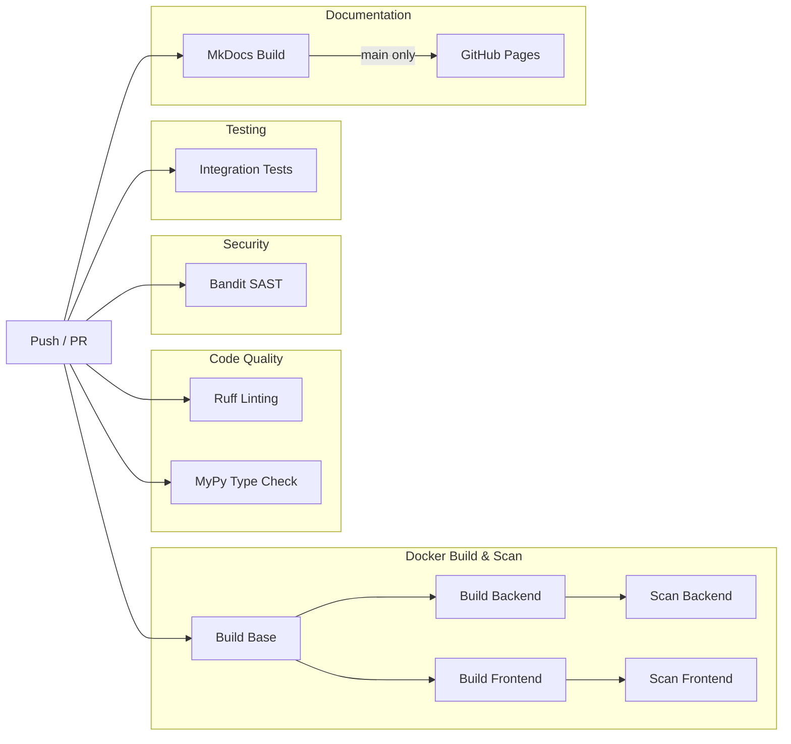
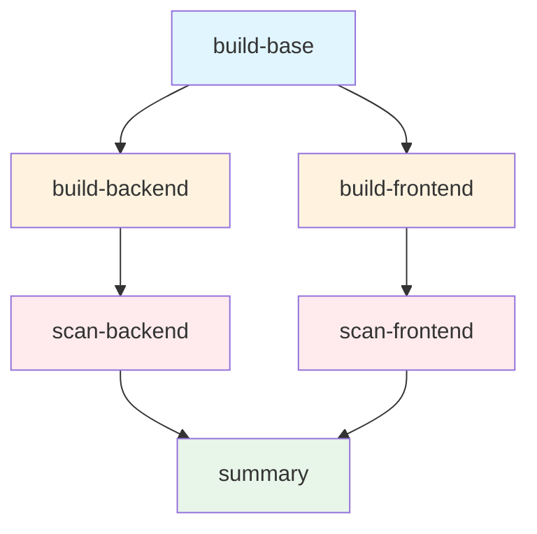
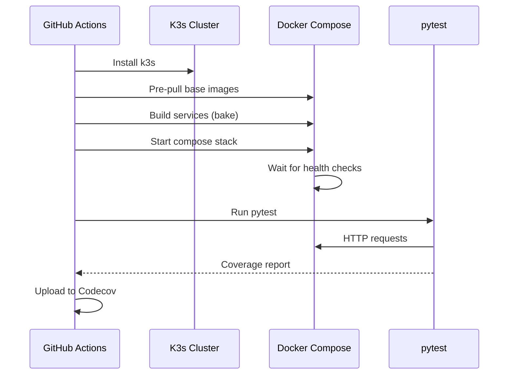

# CI/CD Pipeline

The project uses GitHub Actions to automate code quality checks, security scanning, testing, and documentation
deployment. Every push to `main` or `dev` and every pull request triggers the pipeline, with each workflow running in
parallel to provide fast feedback.

## Pipeline overview



All workflows trigger on pushes to `main` and `dev` branches, pull requests against those branches, and can be triggered
manually via `workflow_dispatch`. The documentation workflow additionally filters on path changes to avoid unnecessary
rebuilds.

## Linting and type checking

Two lightweight workflows run first since they catch obvious issues quickly.

The linting workflow installs dependencies with [uv](https://docs.astral.sh/uv/) and
runs [Ruff](https://docs.astral.sh/ruff/) against the backend codebase. Ruff checks for style violations, import
ordering, and common bugs in a single pass. The configuration lives in `pyproject.toml` under `[tool.ruff]`, selecting
rules from the E, F, B, I, and W categories.

The type checking workflow runs [mypy](https://mypy.readthedocs.io/) with strict settings. It catches type mismatches,
missing return types, and incorrect function signatures before they reach production. Both workflows use uv's dependency
caching to skip reinstallation when the lockfile hasn't changed.

## Security scanning

The security workflow uses [Bandit](https://bandit.readthedocs.io/) to perform static analysis on Python source files,
flagging issues like hardcoded credentials, SQL injection patterns, and unsafe deserialization. It excludes the test
directory and reports only medium-severity and above findings. Container-level vulnerability scanning with Trivy runs
as part of the Docker workflow (see below).

## Docker build and scan

The Docker workflow is structured as multiple jobs with dependencies, enabling parallel execution and early failure
detection. If any job fails, dependent jobs are skipped immediately.



| Job              | Depends On       | Purpose                                              |
|------------------|------------------|------------------------------------------------------|
| `build-base`     | -                | Build shared base image with Python and dependencies |
| `build-backend`  | `build-base`     | Build backend image using base as build context      |
| `build-frontend` | `build-base`     | Build frontend image (runs parallel with backend)    |
| `scan-backend`   | `build-backend`  | Trivy vulnerability scan on backend image            |
| `scan-frontend`  | `build-frontend` | Trivy vulnerability scan on frontend image           |
| `summary`        | All scans        | Generate summary (main branch only)                  |

### Base image

The base image (`Dockerfile.base`) contains Python, system dependencies, and all pip packages. It
uses [uv](https://docs.astral.sh/uv/) to install dependencies from the lockfile with `uv sync --locked --no-dev`,
ensuring reproducible builds without development tools. The base includes gcc, curl, and compression libraries needed
by some Python packages.

The image sets `PATH="/app/.venv/bin:$PATH"` so services can run Python directly without `uv run` at startup. This
avoids dependency resolution at container start, making services launch in seconds rather than minutes. Separating base
from application means dependency changes rebuild the base layer while code changes only rebuild the thin application
layer. See [Docker build strategy](deployment.md#docker-build-strategy) for details on the local development setup.

### Build contexts

Backend and frontend builds reference the base image via Docker's `build-contexts` feature. The workflow passes the
appropriate tag (`pr-<number>` for pull requests, `latest` for main branch) so each build uses the correct base.

### Security scanning

After each image builds, [Trivy](https://trivy.dev/) scans it for known vulnerabilities in OS packages and Python
dependencies. The scan fails if it finds any critical or high severity issues with available fixes. Results upload to
GitHub Security for tracking. The backend scan respects `.trivyignore` for acknowledged vulnerabilities.

## Integration tests

The integration test workflow is the most complex. It spins up the entire stack on a GitHub Actions runner to verify
that services work together correctly.



The workflow starts by installing [k3s](https://k3s.io/), a lightweight Kubernetes distribution, so the backend can
interact with a real cluster during tests. It pre-pulls container images in parallel to avoid cold-start delays during
the build step.

The CI workflow uses `deploy.sh` to start the infrastructure, ensuring consistency between local development and CI
environments. The `deploy.sh dev --ci` command starts the full stack without observability services (Jaeger, Grafana,
etc.) and waits for all services to be healthy before proceeding. For backend-only tests, `deploy.sh infra --wait`
starts just the infrastructure services (MongoDB, Redis, Kafka, Zookeeper, Schema Registry).

The [docker/bake-action](https://github.com/docker/bake-action) builds all services with GitHub Actions cache support.
It reads cache layers from previous runs and writes new layers back, so unchanged dependencies don't rebuild. The cache
scopes are branch-specific with a fallback to main, meaning feature branches benefit from the main branch cache even on
their first run.

Once images are built, `docker compose up -d` starts the stack. The workflow then uses curl's built-in retry mechanism
to wait for the backend health endpoint:

```bash
curl --retry 60 --retry-delay 5 --retry-all-errors -ksf https://127.0.0.1:443/api/v1/health/live
```

This approach is cleaner than shell loops and more reliable than Docker Compose's `--wait` flag (which has issues with
init containers that exit after completion). The backend's `depends_on` configuration ensures MongoDB, Redis, Kafka,
and Schema Registry are healthy before backend starts, so waiting for backend health implicitly waits for all
dependencies. Once the health check passes, the workflow runs pytest against the integration and unit test suites with
coverage reporting. Test isolation uses
per-worker database names and schema registry prefixes to avoid conflicts when pytest-xdist runs tests in parallel.

Coverage reports go to [Codecov](https://codecov.io/) for tracking over time. The workflow always collects container
logs and Kubernetes events as artifacts, which helps debug failures without reproducing them locally.

## Documentation

The docs workflow builds this documentation site using [MkDocs](https://www.mkdocs.org/) with
the [Material theme](https://squidfunk.github.io/mkdocs-material/). It triggers only when files under `docs/`,
`mkdocs.yml`, or the workflow itself change, avoiding rebuilds for unrelated commits.

Before building, the workflow fetches the current OpenAPI spec from the production API and injects it into the docs
directory. The [swagger-ui-tag](https://github.com/blueswen/mkdocs-swagger-ui-tag) plugin renders this spec as an
interactive API reference.

On pushes to main, the workflow deploys the built site to GitHub Pages. Pull requests only build without deploying, so
you can verify the build succeeds before merging. The deployment uses GitHub's native Pages action with artifact
uploads, which handles cache invalidation and atomic deployments automatically.

## Running locally

You can run most checks locally before pushing.

```bash
cd backend

# Linting
uv run ruff check .

# Type checking
uv run mypy .

# Security scan
uv tool run bandit -r . -x tests/ -ll

# Unit tests only (fast)
uv run pytest tests/unit -v

# Full integration tests (requires docker compose up)
uv run pytest tests/integration tests/unit -v
```

For the full integration test experience, start the stack with `docker compose up -d`, wait for the backend to be
healthy, then run pytest. Alternatively, use `./deploy.sh test` which handles startup, health checks, testing, and
cleanup automatically. The CI workflow's yq modifications aren't necessary locally since your environment
likely has the expected configuration already.

## Build optimizations

The CI pipeline employs several caching strategies to minimize build times. Without caching, a full frontend E2E build
takes 3+ minutes; with caching, subsequent runs complete in under 30 seconds.

### Docker layer caching

The frontend E2E workflow uses [docker/build-push-action](https://github.com/docker/build-push-action) with GitHub
Actions cache for each image:

```yaml
- name: Build frontend image
  uses: docker/build-push-action@v6
  with:
    context: ./frontend
    file: ./frontend/Dockerfile
    load: true
    tags: integr8scode-frontend:latest
    cache-from: type=gha,scope=frontend
    cache-to: type=gha,mode=max,scope=frontend
```

Each service has its own cache scope (`backend-base`, `backend`, `frontend`, `cert-generator`), preventing cache
pollution between unrelated builds. The `mode=max` setting caches all layers, not just the final image, so even
intermediate layers benefit from caching.

### Local registry for dependent builds

The `docker-container` buildx driver runs in isolation and cannot access images in the local Docker daemon. This
creates a problem when the backend image needs to reference the base image via `FROM base`. The workflow solves this
using a local registry:

```yaml
services:
  registry:
    image: registry:2
    ports:
      - 5000:5000

steps:
  - name: Setup Docker Buildx
    uses: docker/setup-buildx-action@v3
    with:
      driver-opts: network=host

  - name: Build and push base image
    uses: docker/build-push-action@v6
    with:
      push: true
      tags: localhost:5000/integr8scode-base:latest
      cache-from: type=gha,scope=backend-base
      cache-to: type=gha,mode=max,scope=backend-base

  - name: Build backend image
    uses: docker/build-push-action@v6
    with:
      build-contexts: |
        base=docker-image://localhost:5000/integr8scode-base:latest
      cache-from: type=gha,scope=backend
      cache-to: type=gha,mode=max,scope=backend
```

The `network=host` driver option allows buildx to reach `localhost:5000`. After pushing the base image to the local
registry, subsequent builds can reference it with `docker-image://localhost:5000/...`. This preserves full GHA layer
caching for all images while allowing dependent builds to work correctly.

### Infrastructure image caching

A reusable action at `.github/actions/docker-cache` handles infrastructure images (MongoDB, Redis, Kafka, Schema
Registry). It stores pulled images as zstd-compressed tarballs in the GitHub Actions cache:

```yaml
- name: Cache and load Docker images
  uses: ./.github/actions/docker-cache
  with:
    images: mongo:8.0 redis:7-alpine apache/kafka:3.9.0 confluentinc/cp-schema-registry:7.5.0
```

On cache hit, images load from local tarballs instead of pulling from registries. This saves ~30 seconds per run and
avoids Docker Hub rate limits.

### Frontend Dockerfile optimizations

The frontend Dockerfile uses several techniques to minimize build time and image size:

| Optimization    | Before                      | After                  | Impact                  |
|-----------------|-----------------------------|------------------------|-------------------------|
| Base image      | `node:22` (1GB)             | `node:22-slim` (200MB) | -80% image size         |
| Package install | `npm install`               | `npm ci`               | 3x faster, reproducible |
| Lockfile        | Excluded in `.dockerignore` | Included               | Enables `npm ci`        |

The `npm ci` command requires `package-lock.json` and installs dependencies exactly as specified, skipping dependency
resolution. This is faster than `npm install` and ensures reproducible builds.

### Cache invalidation

Docker layer caching works best when layers change infrequently. The Dockerfiles are structured to maximize cache hits:

1. **System dependencies** - Rarely change, cached long-term
2. **Package lockfiles** - Change only when dependencies update
3. **Application code** - Changes frequently, rebuilt on each commit

By copying lockfiles before application code, dependency installation layers remain cached even when code changes.

## Workflow files

| Workflow            | File                                | Purpose                       |
|---------------------|-------------------------------------|-------------------------------|
| Ruff Linting        | `.github/workflows/ruff.yml`        | Code style and import checks  |
| MyPy Type Checking  | `.github/workflows/mypy.yml`        | Static type analysis          |
| Security Scanning   | `.github/workflows/security.yml`    | Bandit SAST                   |
| Docker Build & Scan | `.github/workflows/docker.yml`      | Image build and Trivy scan    |
| Backend CI          | `.github/workflows/backend-ci.yml`  | Unit, integration, E2E tests  |
| Frontend CI         | `.github/workflows/frontend-ci.yml` | Unit tests and Playwright E2E |
| Documentation       | `.github/workflows/docs.yml`        | MkDocs build and deploy       |

All workflows use [uv](https://docs.astral.sh/uv/) for Python dependency management, with caching enabled via
`astral-sh/setup-uv`. The lockfile at `backend/uv.lock` ensures reproducible installs across CI runs.
