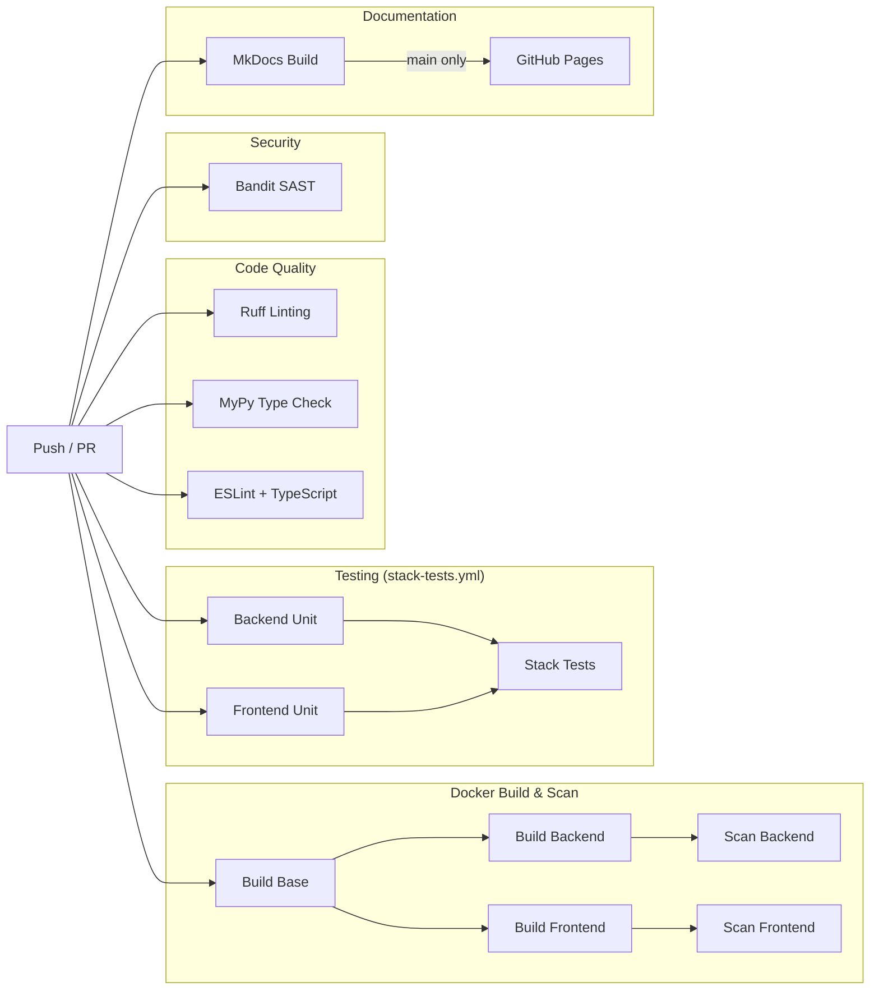
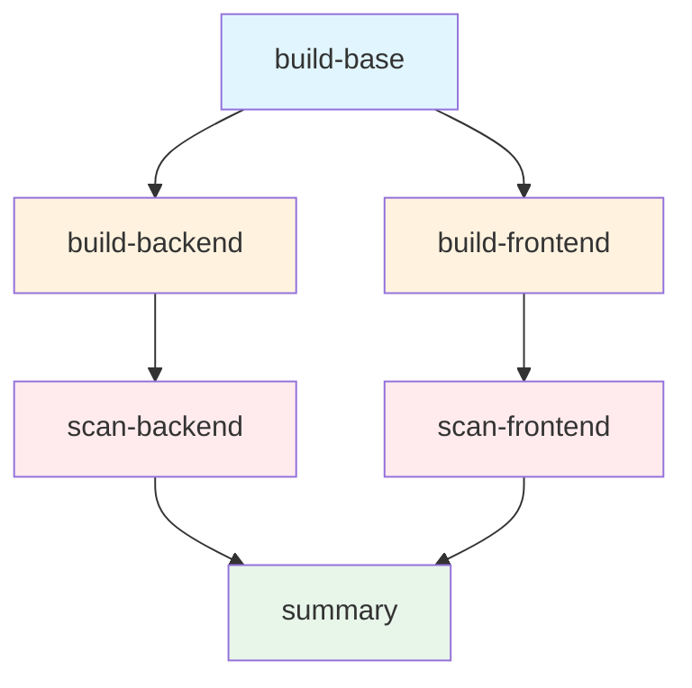
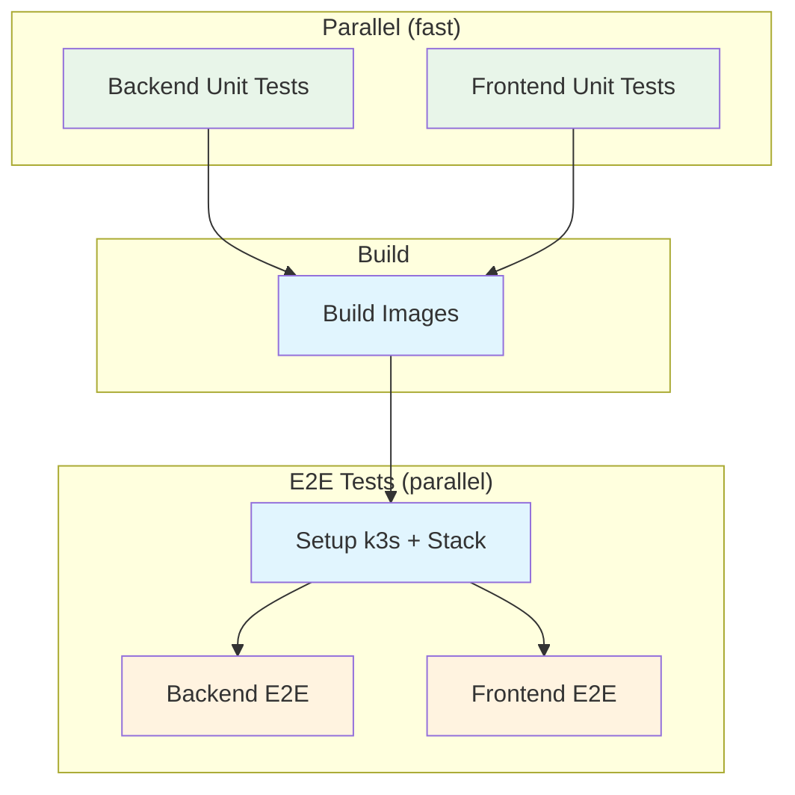

# CI/CD Pipeline

The project uses GitHub Actions to automate code quality checks, security scanning, testing, and documentation
deployment. Every push to `main` or `dev` and every pull request triggers the pipeline, with workflows running in
parallel to provide fast feedback.

## Pipeline overview



All workflows trigger on pushes to `main` and `dev` branches, pull requests against those branches, and can be triggered
manually via `workflow_dispatch`. Path filters ensure workflows only run when relevant files change.

## Linting and type checking

Three lightweight workflows run first since they catch obvious issues quickly.

**Backend (Python):**
- [Ruff](https://docs.astral.sh/ruff/) checks for style violations, import ordering, and common bugs
- [mypy](https://mypy.readthedocs.io/) with strict settings catches type mismatches and missing return types

**Frontend (TypeScript):**
- ESLint checks for code quality issues
- TypeScript compiler (`tsc --noEmit`) verifies type correctness

Both use dependency caching to skip reinstallation when lockfiles haven't changed.

## Security scanning

The security workflow uses [Bandit](https://bandit.readthedocs.io/) to perform static analysis on Python source files,
flagging issues like hardcoded credentials, SQL injection patterns, and unsafe deserialization. It excludes the test
directory and reports only medium-severity and above findings. Container-level vulnerability scanning with Trivy runs
as part of the Docker workflow.

## Docker build and scan

The Docker workflow is structured as multiple jobs with dependencies, enabling parallel execution and early failure
detection. If any job fails, dependent jobs are skipped immediately.



| Job              | Depends On       | Purpose                                              |
|------------------|------------------|------------------------------------------------------|
| `build-base`     | -                | Build shared base image with Python and dependencies |
| `build-backend`  | `build-base`     | Build backend image using base as build context      |
| `build-frontend` | `build-base`     | Build frontend image (runs parallel with backend)    |
| `scan-backend`   | `build-backend`  | Trivy vulnerability scan on backend image            |
| `scan-frontend`  | `build-frontend` | Trivy vulnerability scan on frontend image           |
| `summary`        | All scans        | Generate summary (main branch only)                  |

### Base image

The base image (`Dockerfile.base`) contains Python, system dependencies, and all pip packages. It
uses [uv](https://docs.astral.sh/uv/) to install dependencies from the lockfile with `uv sync --locked --no-dev`,
ensuring reproducible builds without development tools.

### Security scanning

After each image builds, [Trivy](https://trivy.dev/) scans it for known vulnerabilities in OS packages and Python
dependencies. The scan fails if it finds any critical or high severity issues with available fixes.

## Stack tests (unified testing)

The `stack-tests.yml` workflow consolidates all testing that requires infrastructure into a single job, avoiding
redundant stack setup across multiple jobs.



### Test execution order

1. **Unit tests (parallel)**: Backend and frontend unit tests run simultaneously. They require no infrastructure and
   complete quickly (~1-2 min each).

2. **Image build**: After unit tests pass, all Docker images are built with GHA layer caching.

3. **E2E tests (parallel)**: Backend and frontend E2E tests run in parallel, each setting up their own stack:
    - Backend E2E tests (pytest with k8s)
    - Frontend E2E tests (Playwright)

### Coverage reporting

Each test suite reports coverage to [Codecov](https://codecov.io/):
- `backend-unit` flag for unit tests
- `backend-e2e` flag for E2E tests
- `frontend-unit` flag for frontend unit tests

## Documentation

The docs workflow builds this documentation site using [MkDocs](https://www.mkdocs.org/) with
the [Material theme](https://squidfunk.github.io/mkdocs-material/). It triggers only when files under `docs/`,
`mkdocs.yml`, or the workflow itself change.

On pushes to main, the workflow deploys the built site to GitHub Pages.

## Running locally

You can run most checks locally before pushing.

```bash
cd backend

# Linting
uv run ruff check .

# Type checking
uv run mypy .

# Security scan
uv tool run bandit -r . -x tests/ -ll

# Unit tests only (fast, no infrastructure needed)
uv run pytest tests/unit -v
```

```bash
cd frontend

# Linting
npm run lint

# Type checking
npx tsc --noEmit

# Unit tests
npm run test
```

For E2E tests, use the same deployment as CI:

```bash
# Start full stack (requires k8s configured locally)
./deploy.sh dev

# Run tests inside the running backend container
docker compose exec -T backend uv run pytest tests/e2e -v

# Run frontend E2E tests
cd frontend && npx playwright test
```

Or use `./deploy.sh test` which handles everything automatically.

## Build optimizations

The CI pipeline employs several caching strategies to minimize build times.

### Docker layer caching

All image builds use [docker/build-push-action](https://github.com/docker/build-push-action) with GitHub Actions cache:

```yaml
- name: Build base image
  uses: docker/build-push-action@v6
  with:
    context: ./backend
    file: ./backend/Dockerfile.base
    load: true
    tags: integr8scode-base:latest
    cache-from: type=gha,scope=backend-base
    cache-to: type=gha,mode=max,scope=backend-base
```

Each service has its own cache scope (`backend-base`, `backend`, `frontend`, `cert-generator`), preventing cache
pollution between unrelated builds.

### Infrastructure image caching

A reusable action at `.github/actions/docker-cache` handles infrastructure images (MongoDB, Redis, Kafka, Schema
Registry). It stores pulled images as zstd-compressed tarballs in the GitHub Actions cache, saving ~30 seconds per run
and avoiding Docker Hub rate limits.

### k3s setup action

A reusable composite action at `.github/actions/k3s-setup` handles Kubernetes setup:
- Installs k3s with traefik disabled
- Creates the `integr8scode` namespace
- Generates a kubeconfig accessible from Docker containers (via `host.docker.internal`)

This eliminates copy-paste across workflows and ensures consistent k8s setup.

## Workflow files

| Workflow           | File                                 | Purpose                            |
|--------------------|--------------------------------------|------------------------------------|
| Ruff Linting       | `.github/workflows/ruff.yml`         | Python code style and import checks |
| MyPy Type Checking | `.github/workflows/mypy.yml`         | Python static type analysis        |
| Frontend CI        | `.github/workflows/frontend-ci.yml`  | TypeScript lint and type check     |
| Security Scanning  | `.github/workflows/security.yml`     | Bandit SAST                        |
| Docker Build & Scan| `.github/workflows/docker.yml`       | Image build and Trivy scan         |
| Stack Tests        | `.github/workflows/stack-tests.yml`  | All unit and E2E tests               |
| Documentation      | `.github/workflows/docs.yml`         | MkDocs build and deploy            |

All workflows use [uv](https://docs.astral.sh/uv/) for Python dependency management and npm for Node.js, with caching
enabled for both.
