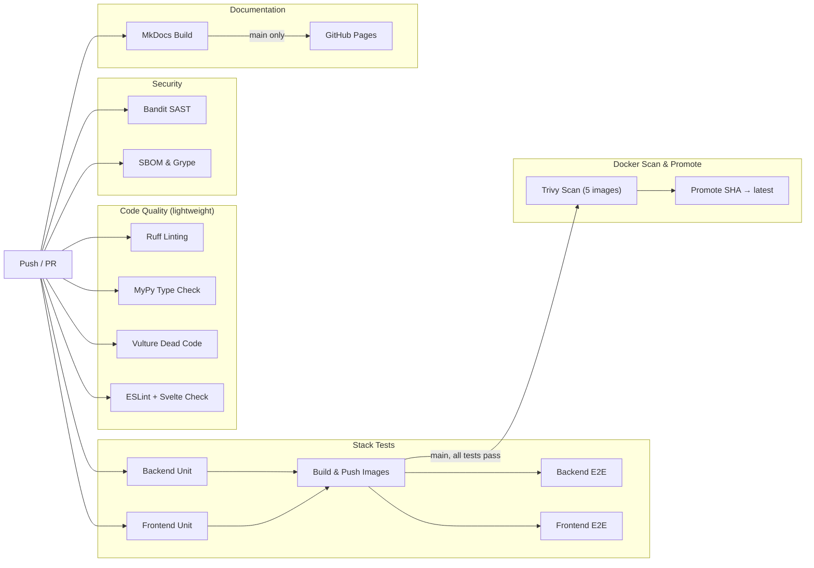
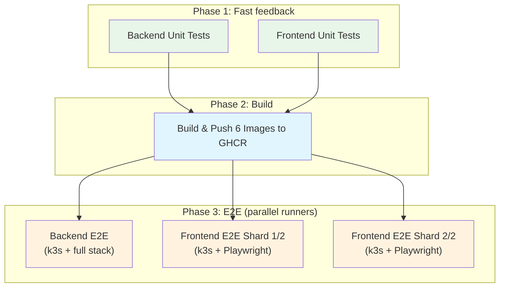
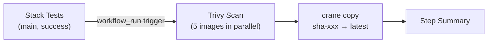

# CI/CD Pipeline

The project uses GitHub Actions to automate code quality checks, security scanning, testing, image publishing, and
documentation deployment. The pipeline is split across several workflow files that trigger independently based on path
filters, so only relevant checks run for each change.

## Pipeline overview



The two heavyweight workflows are **Stack Tests** (builds images, runs all tests) and **Docker Scan & Promote**
(scans images with Trivy and promotes to `latest`). They're connected: Docker Scan & Promote triggers automatically
after Stack Tests succeeds on `main`, forming a build-test-scan-promote pipeline where the `latest` tag only moves
forward when everything passes.

## Workflow files

| Workflow                | File                                         | Trigger                                       | Purpose                                    |
|-------------------------|----------------------------------------------|-----------------------------------------------|--------------------------------------------|
| Stack Tests             | `.github/workflows/stack-tests.yml`          | Push/PR to `main`, tags `v*`                   | Unit tests, image build, E2E tests         |
| Docker Scan & Promote   | `.github/workflows/docker.yml`               | After Stack Tests completes on `main`          | Trivy scan + promote SHA tag to `latest`   |
| SBOM & Supply Chain     | `.github/workflows/sbom-compliance.yml`      | Push/PR to `main`, weekly schedule             | SPDX SBOM generation + Grype vulnerability scan |
| Ruff Linting            | `.github/workflows/ruff.yml`                 | Push/PR to `main`                              | Python code style and import checks        |
| MyPy Type Checking      | `.github/workflows/mypy.yml`                 | Push/PR to `main`                              | Python static type analysis                |
| Frontend CI             | `.github/workflows/frontend-ci.yml`          | Push/PR to `main` (frontend changes)           | ESLint + Svelte type check                 |
| Security Scanning       | `.github/workflows/security.yml`             | Push/PR to `main`                              | Bandit SAST                                |
| Dead Code Detection     | `.github/workflows/vulture.yml`              | Push/PR to `main`                              | Vulture dead code analysis                 |
| Documentation           | `.github/workflows/docs.yml`                 | Push/PR (`docs/`, `mkdocs.yml`)                | MkDocs build and GitHub Pages deploy       |

## Composite actions

Shared steps are extracted into reusable composite actions under `.github/actions/`. This eliminates duplication between
the backend and frontend E2E jobs, which both need k3s and the full docker compose stack but set it up differently.

| Action                  | File                                         | Purpose                                    |
|-------------------------|----------------------------------------------|--------------------------------------------|
| E2E Boot                | `.github/actions/e2e-boot/action.yml`        | GHCR login, background image pull + infra pre-warm, k3s install |
| E2E Ready               | `.github/actions/e2e-ready/action.yml`       | Finalize k3s, start compose stack, health checks |

The split is intentional. Frontend E2E needs to install Node.js and Playwright browsers _between_ boot and ready,
overlapping that work with k3s installation to save wall-clock time. Backend E2E calls them back-to-back since it has
no setup to overlap.

## Stack Tests (the main workflow)

This is the core testing workflow. It builds all 6 container images, pushes them to GHCR with immutable SHA-based
tags, then runs E2E tests on separate runners that pull images from the registry.



### Phase 1: Unit tests

Backend and frontend unit tests run in parallel. They need no infrastructure and complete quickly. If either fails,
the image build is skipped entirely.

### Phase 2: Build and push

All 6 images are built on a single runner and pushed to GHCR with an immutable `sha-<7chars>` tag:

| Image                | Source                                      |
|----------------------|---------------------------------------------|
| `base`               | `backend/Dockerfile.base`                   |
| `backend`            | `backend/Dockerfile`                        |
| `cert-generator`     | `cert-generator/Dockerfile`                 |
| `zookeeper-certgen`  | `backend/zookeeper/Dockerfile.certgen`      |
| `frontend-dev`       | `frontend/Dockerfile`                       |
| `frontend`           | `frontend/Dockerfile.prod`                  |

Workers reuse the `backend` image with different `command:` overrides in docker-compose, so no separate worker images
are needed. Of these 6 images, 5 are scanned by Trivy and promoted to `latest` in the
[Docker Scan & Promote](#docker-scan--promote) workflow. The `frontend-dev` image is excluded — it's the Rollup dev
server build used only for E2E tests in CI and is never deployed to production.

The base image is cached separately as a zstd-compressed tarball since its dependencies rarely change. The backend
image depends on it via `--build-context base=docker-image://integr8scode-base:latest`. Utility and frontend images
use GHA layer caching.

All 6 images are pushed to GHCR in parallel, with each push tracked by PID so individual failures are reported:

```yaml
declare -A PIDS
for name in base backend cert-generator zookeeper-certgen ...; do
  docker push "$IMG/$name:$TAG" &
  PIDS[$name]=$!
done
FAILED=0
for name in "${!PIDS[@]}"; do
  if ! wait "${PIDS[$name]}"; then
    echo "::error::Failed to push $name"
    FAILED=1
  fi
done
[ "$FAILED" -eq 0 ] || exit 1
```

Fork PRs skip the GHCR push (no write access), so E2E tests only run for non-fork PRs.

### Phase 3: E2E tests

Backend and frontend E2E tests run on separate runners. Each runner provisions its own k3s cluster and docker compose
stack, pulling pre-built images from GHCR.

#### E2E Boot (`.github/actions/e2e-boot`)

This action kicks off three slow tasks that can overlap:

1. **GHCR login** using `docker/login-action@v3`
2. **Background image pull + infra pre-warm** — pulls all compose images then starts infrastructure services
   (mongo, redis, kafka, zookeeper) in a background `nohup` process. The exit status is persisted
   to `/tmp/infra-pull.exit` so the next action can check for failures.
3. **k3s install** — downloads and installs a pinned k3s version with SHA256 checksum verification (see
   [supply-chain hardening](#supply-chain-hardening) below)

#### E2E Ready (`.github/actions/e2e-ready`)

This action finalizes the environment after boot tasks complete:

1. **Finalize k3s** — copies kubeconfig, rewrites the API server address to `host.docker.internal` so containers
   inside docker compose can reach the k3s API server, creates the `integr8scode` namespace
2. **Start cert-generator** in the background
3. **Copy test config** — uses `config.test.toml` and `secrets.example.toml`
4. **Wait for image pull and infra** — blocks until the background pull completes and checks the exit code from
   `/tmp/infra-pull.exit`, failing fast if the background process had errors
5. **Start compose stack** with `docker compose up -d --no-build`
6. **Health checks** — waits for backend (`/api/v1/health/live`), and optionally frontend (`https://localhost:5001`)

#### Frontend E2E sharding

Frontend E2E tests use Playwright with 2 shards running in parallel on separate runners. Between `e2e-boot` and
`e2e-ready`, each shard installs Node.js dependencies and Playwright browsers (with caching), overlapping that work
with k3s booting in the background.

```
e2e-boot (GHCR login + pull + k3s install)
    |
    ├── npm ci + playwright install (overlapped with k3s)
    |
e2e-ready (finalize k3s + start stack + health check)
    |
    └── npx playwright test --shard=N/2
```

### Coverage reporting

Each test suite reports coverage to [Codecov](https://codecov.io/) with separate flags:

- `backend-unit` — backend unit tests
- `backend-e2e` — backend E2E tests
- `frontend-unit` — frontend unit tests (Vitest with `lcov` output)

### Log collection on failure

When E2E tests fail, logs are collected automatically and uploaded as artifacts:

- All docker compose service logs with timestamps
- Individual service logs for each worker
- Kubernetes events sorted by timestamp (backend E2E only)

## Docker Scan & Promote

This workflow implements the promotion model: the `latest` tag is never set during the build. Only this workflow
sets it, and only after all tests pass.



### Trigger

Runs automatically when `Stack Tests` completes successfully on `main`. Can also be triggered manually via
`workflow_dispatch` with an optional SHA input to promote a specific commit.

### Scan

Uses [Trivy](https://trivy.dev/) (pinned at `v0.68.2`) to scan all 5 deployed images in parallel via matrix strategy.
Scans for `CRITICAL` and `HIGH` severity vulnerabilities with unfixed issues ignored. Results are uploaded as SARIF
files to GitHub's Security tab.

### Promote

Uses [crane](https://github.com/google/go-containerregistry/blob/main/cmd/crane/README.md) to copy manifests at the
registry level (`crane copy sha-tag latest`), avoiding any rebuild or re-push. This is a fast, atomic operation that
simply re-tags existing image manifests.

## SBOM & Supply Chain Security

The `sbom-compliance.yml` workflow generates [SPDX](https://spdx.dev/) Software Bills of Materials for both backend
(Python) and frontend (JavaScript) components. It runs on every push/PR to `main` and weekly on a schedule.

For each component:

1. **Generate SBOM** using [anchore/sbom-action](https://github.com/anchore/sbom-action) — produces an SPDX JSON file
   listing all direct and transitive dependencies
2. **Scan SBOM** using [anchore/scan-action](https://github.com/anchore/scan-action) (Grype) — checks for known
   vulnerabilities with a `high` severity cutoff
3. **Upload** — SBOM artifacts are retained for 5 days; vulnerability results are uploaded as SARIF to GitHub's
   Security tab

## Supply-chain hardening

### k3s version pinning and checksum verification

The k3s installation in CI is hardened against supply-chain attacks:

1. **Pinned version** — `K3S_VERSION` is set as a workflow-level env var (`v1.32.11+k3s1`), not fetched dynamically
2. **Source pinning** — the install script is fetched from the k3s GitHub repository at the exact tagged version
   (e.g., `https://raw.githubusercontent.com/k3s-io/k3s/v1.32.11%2Bk3s1/install.sh`), not from the `get.k3s.io` CDN
3. **SHA256 verification** — the install script is verified against a known checksum before execution:

```bash
K3S_TAG=$(echo "$K3S_VERSION" | sed 's/+/%2B/g')
curl -sfL "https://raw.githubusercontent.com/k3s-io/k3s/${K3S_TAG}/install.sh" -o /tmp/k3s-install.sh
echo "$K3S_INSTALL_SHA256  /tmp/k3s-install.sh" | sha256sum -c -
chmod +x /tmp/k3s-install.sh
INSTALL_K3S_VERSION="$K3S_VERSION" ... /tmp/k3s-install.sh
```

This prevents the common `curl | sh` anti-pattern where a compromised CDN or MITM could inject malicious code.

### GHCR image tags

Images are tagged with `sha-<7chars>` (immutable, tied to a specific commit) during build. The `latest` tag is only
applied by the Docker Scan & Promote workflow after all tests and security scans pass. This means:

- Every E2E test runs against exactly the images built from that commit
- `latest` is never stale or untested
- Any commit's images can be pulled by their SHA tag for debugging

### Dependency pinning

All GitHub Actions are pinned to major versions (e.g., `actions/checkout@v6`, `docker/build-push-action@v6`). Trivy is
pinned to a specific version (`aquasecurity/trivy-action@0.33.1`) for scan reproducibility.

## Linting and type checking

Three lightweight workflows run independently since they catch obvious issues quickly.

**Backend (Python):**

- [Ruff](https://docs.astral.sh/ruff/) checks for style violations, import ordering, and common bugs
- [mypy](https://mypy.readthedocs.io/) with strict settings catches type mismatches and missing return types
- [Vulture](https://github.com/jendrikseipp/vulture) detects unused functions, classes, methods, imports, and variables. A whitelist file (`backend/vulture_whitelist.py`) excludes framework patterns (Dishka providers, FastAPI routes, Beanie documents, Pydantic models) that look unused but are called at runtime

**Frontend (TypeScript/Svelte):**

- ESLint checks for code quality issues
- `svelte-check` verifies TypeScript types and Svelte component correctness

Both use dependency caching ([uv](https://docs.astral.sh/uv/) for Python, npm for Node.js) to skip reinstallation
when lockfiles haven't changed.

## Security scanning

The `security.yml` workflow uses [Bandit](https://bandit.readthedocs.io/) to perform static analysis on Python source
files, flagging issues like hardcoded credentials, SQL injection patterns, and unsafe deserialization. It excludes the
test directory and reports only medium-severity and above findings. Container-level vulnerability scanning with Trivy
runs as part of the [Docker Scan & Promote](#docker-scan--promote) workflow.

## Documentation

The docs workflow builds this documentation site using [MkDocs](https://www.mkdocs.org/) with
the [Material theme](https://squidfunk.github.io/mkdocs-material/). It triggers only when files under `docs/`,
`mkdocs.yml`, or the workflow itself change.

On pushes to main, the workflow deploys the built site to GitHub Pages.

## Build optimizations

### Docker layer caching

All image builds use [docker/build-push-action](https://github.com/docker/build-push-action) with GitHub Actions
cache. Each service has its own cache scope, preventing pollution between unrelated builds:

```yaml
- name: Build cert-generator image
  uses: docker/build-push-action@v6
  with:
    context: ./cert-generator
    file: ./cert-generator/Dockerfile
    load: true
    tags: integr8scode-cert-generator:latest
    cache-from: type=gha,scope=cert-generator
    cache-to: type=gha,mode=max,scope=cert-generator
```

### Base image caching

The base image (Python + all pip dependencies) changes infrequently, so it's cached as a zstd-compressed tarball keyed
on `Dockerfile.base`, `pyproject.toml`, and `uv.lock`. On cache hit the image is loaded directly with `docker load`,
skipping the entire build.

### Background infra pre-warm

The `e2e-boot` action pulls all docker compose images and starts infrastructure services _in the background_ while k3s
installs. This overlaps network-bound (image pull) and CPU-bound (k3s compilation) work, saving several minutes per
E2E job.

### Frontend Playwright caching

Playwright browsers are cached by `package-lock.json` hash. On cache hit, only system dependencies are installed
(`playwright install-deps chromium`), skipping the browser download.

### Parallel image push

All 6 images are pushed to GHCR concurrently using background processes with PID tracking. Each push failure is
reported individually via `::error::` annotations.

## Running locally

You can run most checks locally before pushing.

```bash
cd backend

# Linting
uv run ruff check . --config pyproject.toml

# Type checking
uv run mypy --config-file pyproject.toml --strict .

# Dead code detection
uv run vulture app/ vulture_whitelist.py

# Security scan
uv tool run bandit -r . -x tests/ -ll

# Unit tests only (fast, no infrastructure needed)
uv run pytest tests/unit -v
```

```bash
cd frontend

# Linting
npm run lint

# Type checking
npm run check

# Unit tests
npm run test
```

For E2E tests, use the deployment script to bring up the full stack:

```bash
# Start full stack with k8s configured locally
./deploy.sh dev --wait

# Run backend E2E tests inside the running container
docker compose exec -T backend uv run pytest tests/e2e -v

# Run frontend E2E tests
cd frontend && npx playwright test
```

Or use `./deploy.sh test` which handles stack setup, testing, and teardown automatically.
