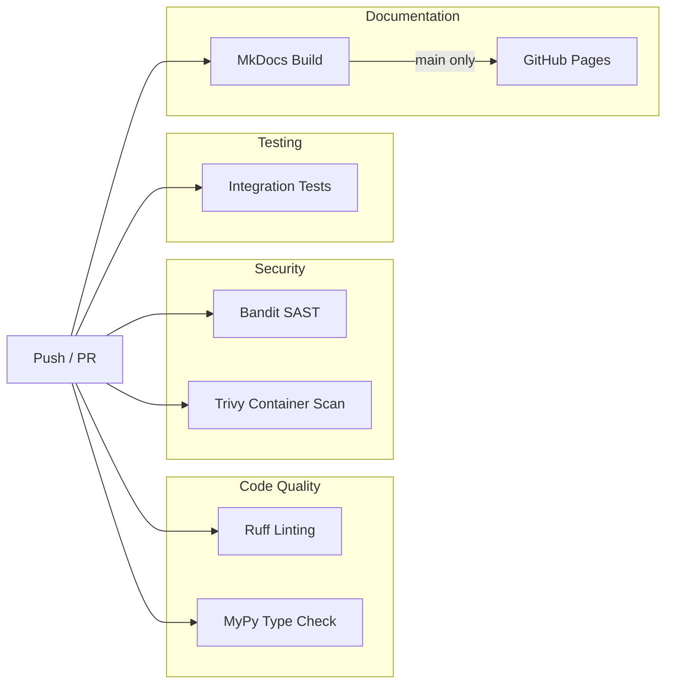

# CI/CD Pipeline

The project uses GitHub Actions to automate code quality checks, security scanning, testing, and documentation
deployment. Every push to `main` or `dev` and every pull request triggers the pipeline, with each workflow running in
parallel to provide fast feedback.

## Pipeline overview



All workflows trigger on pushes to `main` and `dev` branches, pull requests against those branches, and can be triggered
manually via `workflow_dispatch`. The documentation workflow additionally filters on path changes to avoid unnecessary
rebuilds.

## Linting and type checking

Two lightweight workflows run first since they catch obvious issues quickly.

The linting workflow installs dependencies with [uv](https://docs.astral.sh/uv/) and
runs [Ruff](https://docs.astral.sh/ruff/) against the backend codebase. Ruff checks for style violations, import
ordering, and common bugs in a single pass. The configuration lives in `pyproject.toml` under `[tool.ruff]`, selecting
rules from the E, F, B, I, and W categories.

The type checking workflow runs [mypy](https://mypy.readthedocs.io/) with strict settings. It catches type mismatches,
missing return types, and incorrect function signatures before they reach production. Both workflows use uv's dependency
caching to skip reinstallation when the lockfile hasn't changed.

## Security scanning

Security runs in two places. The security workflow uses [Bandit](https://bandit.readthedocs.io/) to perform static
analysis on Python source files, flagging issues like hardcoded credentials, SQL injection patterns, and unsafe
deserialization. It excludes the test directory and reports only medium-severity and above findings.

The Docker workflow builds the backend image and scans it with [Trivy](https://trivy.dev/). Trivy checks the image
layers for known vulnerabilities in OS packages and Python dependencies, failing the build if it finds any critical or
high severity issues that have available fixes. This catches supply chain problems that static analysis would miss.

## Docker build

The Docker workflow builds images using a two-stage approach to optimize layer caching. First it builds a shared base
image (`Dockerfile.base`) containing Python, system dependencies, and all pip packages. Then it builds the main backend
image on top of that base, copying only the application code. This separation means dependency changes rebuild the base
layer while code changes only rebuild the thin application layer.

The base image includes gcc, curl, and compression libraries needed by some Python packages. It
uses [uv](https://docs.astral.sh/uv/) to install dependencies from the lockfile, ensuring reproducible builds across
environments. The pinned uv version (currently 0.9.17) prevents unexpected behavior from upstream changes.

## Integration tests

The integration test workflow is the most complex. It spins up the entire stack on a GitHub Actions runner to verify
that services work together correctly.


The workflow starts by installing [k3s](https://k3s.io/), a lightweight Kubernetes distribution, so the backend can
interact with a real cluster during tests. It pre-pulls container images in parallel to avoid cold-start delays during
the build step.

Before building, the workflow modifies `docker-compose.yaml` using [yq](https://github.com/mikefarah/yq) to create a
CI-specific configuration. These modifications disable SASL authentication on Kafka and Zookeeper (unnecessary for
isolated CI), remove volume mounts that cause permission conflicts, inject test credentials for MongoDB, and disable
OpenTelemetry export to avoid connection errors. The result is a `docker-compose.ci.yaml` that works reliably in the
ephemeral CI environment.

The [docker/bake-action](https://github.com/docker/bake-action) builds all services with GitHub Actions cache support.
It reads cache layers from previous runs and writes new layers back, so unchanged dependencies don't rebuild. The cache
scopes are branch-specific with a fallback to main, meaning feature branches benefit from the main branch cache even on
their first run.

Once images are built, `docker compose up` starts the stack and waits for health checks. The backend needs MongoDB,
Redis, Kafka, Schema Registry, and the cert-generator to be ready before it can serve requests. After stabilization, the
workflow runs pytest against the integration and unit test suites with coverage reporting. Test isolation uses
per-worker database names and schema registry prefixes to avoid conflicts when pytest-xdist runs tests in parallel.

Coverage reports go to [Codecov](https://codecov.io/) for tracking over time. The workflow always collects container
logs and Kubernetes events as artifacts, which helps debug failures without reproducing them locally.

## Documentation

The docs workflow builds this documentation site using [MkDocs](https://www.mkdocs.org/) with
the [Material theme](https://squidfunk.github.io/mkdocs-material/). It triggers only when files under `docs/`,
`mkdocs.yml`, or the workflow itself change, avoiding rebuilds for unrelated commits.

Before building, the workflow fetches the current OpenAPI spec from the production API and injects it into the docs
directory. The [swagger-ui-tag](https://github.com/blueswen/mkdocs-swagger-ui-tag) plugin renders this spec as an
interactive API reference.

On pushes to main, the workflow deploys the built site to GitHub Pages. Pull requests only build without deploying, so
you can verify the build succeeds before merging. The deployment uses GitHub's native Pages action with artifact
uploads, which handles cache invalidation and atomic deployments automatically.

## Running locally

You can run most checks locally before pushing.

```bash
cd backend

# Linting
uv run ruff check .

# Type checking
uv run mypy .

# Security scan
uv tool run bandit -r . -x tests/ -ll

# Unit tests only (fast)
uv run pytest tests/unit -v

# Full integration tests (requires docker compose up)
uv run pytest tests/integration tests/unit -v
```

For the full integration test experience, start the stack with `docker compose up -d`, wait for services to stabilize,
then run pytest. The CI workflow's yq modifications aren't necessary locally since your environment likely has the
expected configuration already.

## Workflow files

| Workflow            | File                             | Purpose                      |
|---------------------|----------------------------------|------------------------------|
| Ruff Linting        | `.github/workflows/ruff.yml`     | Code style and import checks |
| MyPy Type Checking  | `.github/workflows/mypy.yml`     | Static type analysis         |
| Security Scanning   | `.github/workflows/security.yml` | Bandit SAST                  |
| Docker Build & Scan | `.github/workflows/docker.yml`   | Image build and Trivy scan   |
| Integration Tests   | `.github/workflows/tests.yml`    | Full stack testing           |
| Documentation       | `.github/workflows/docs.yml`     | MkDocs build and deploy      |

All workflows use [uv](https://docs.astral.sh/uv/) for Python dependency management, with caching enabled via
`astral-sh/setup-uv`. The lockfile at `backend/uv.lock` ensures reproducible installs across CI runs.
