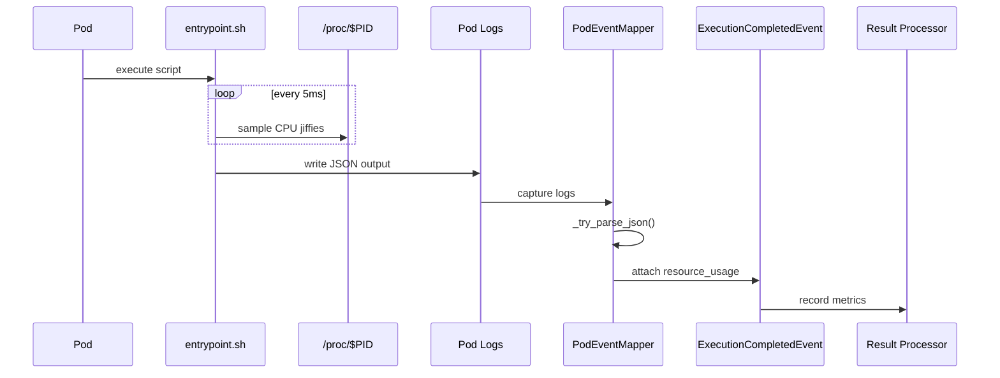

# CPU time measurement

The platform measures CPU time for executed scripts using Linux's jiffy-based accounting system. This document explains the limitations and characteristics of CPU time measurement, particularly for short-running processes.

## How it works

The [`entrypoint.sh`](https://github.com/HardMax71/Integr8sCode/blob/main/backend/app/scripts/entrypoint.sh) script wraps all pod executions and captures resource metrics. Wall clock time is measured using `date +%s.%N` with nanosecond precision. CPU time is sampled from `/proc/$PID/stat` fields 14 (user) and 15 (system) in jiffies. Memory usage comes from peak RSS in the `/proc/$PID/status` VmHWM field.

Main sampling loop looks like so:

```bash
while kill -0 "$PID" 2>/dev/null; do
    # Read CPU jiffies from /proc/$PID/stat
    CPU_JIFFIES=$(awk '{print $14+$15}' "/proc/$PID/stat" 2>/dev/null)
    # Sample every 5ms
    sleep 0.005
done
```

## The zero jiffies problem

Linux tracks CPU time in "jiffies" — discrete time units typically representing 10ms each (CLK_TCK=100Hz). Any script using less than 10ms of CPU time reports as 0 jiffies, 10-19ms reports as 1 jiffy, and so on. This granularity means many simple scripts show `cpu_time_jiffies: 0` despite measurable wall time:

| Script Type           | Wall Time | Actual CPU | Reported Jiffies |
|-----------------------|-----------|------------|------------------|
| `echo "Hello"`        | ~5ms      | <1ms       | 0                |
| `print("Hello")`      | ~20ms     | ~3ms       | 0                |
| `time.sleep(0.05)`    | ~50ms     | <1ms       | 0                |
| Simple math operation | ~10ms     | ~2ms       | 0                |

Wall time is total elapsed real-world time including waiting, I/O, and sleep. CPU time is actual processor cycles consumed by the process. A script can run for 100ms wall time but use only 1ms of CPU if it's waiting for I/O, sleeping, or blocked on system calls.

Beyond jiffy granularity, there are additional factors. For processes that complete in under 5ms, the sampling loop might never execute at all — the process exits before the first sample, leaving jiffies at the initial value of 0. When a process exits, the kernel performs final CPU accounting but `/proc/$PID/stat` is immediately removed, so any final CPU time accumulation is lost. Short scripts also spend proportionally more time in interpreter initialization (Python, Node.js), library loading, and process creation — overhead that often doesn't register as CPU time.

## Impact on metrics

When `cpu_time_jiffies` is 0, the CPU utilization calculation becomes `(0 / 100) / wall_time = 0%`. This appears as if the script used no CPU, which is technically accurate from the kernel's perspective but can be confusing. It's not a bug — the measurement is accurate within Linux's accounting granularity. Short, simple scripts legitimately use less than one jiffy of CPU time, and the system simply cannot measure CPU usage for processes consuming under 10ms.

## Technical details

Jiffy calculation: 

```bash
CLK_TCK=$(getconf CLK_TCK)  # Usually 100 Hz
cpu_seconds = cpu_time_jiffies / CLK_TCK
```

Resource usage structure (output of Shell script):
```json
{
  "resource_usage": {
    "execution_time_wall_seconds": 0.052341,
    "cpu_time_jiffies": 0,
    "clk_tck_hertz": 100,
    "peak_memory_kb": 2048
  }
}
```

### Event flow



The pod executes with the entrypoint.sh wrapper, which samples `/proc` during execution. When the script finishes, JSON output is captured from pod logs. The PodEventMapper parses this JSON via `_try_parse_json()` and attaches the resource usage to an ExecutionCompletedEvent. Finally, the result processor records the metrics.

## Security considerations

The `clk_tck_hertz` value is included in resource usage metrics because it's required to convert jiffies to seconds (`cpu_seconds = cpu_time_jiffies / clk_tck_hertz`) and allows proper CPU utilization calculation.

This is **low risk** — CLK_TCK is obtainable by any user via `getconf CLK_TCK`, requires no special permissions, and uses standard values (usually 100 Hz, occasionally 250/300/1000 Hz). Users executing code in the environment could obtain it themselves anyway.

There are minimal concerns around system fingerprinting (helps identify kernel configuration) and theoretical timing attack calibration, but since users already execute arbitrary code in the environment, this disclosure adds negligible risk.

## References

- [proc(5)](https://man7.org/linux/man-pages/man5/proc.5.html) — `/proc/[pid]/stat` documentation
- [time(7)](https://man7.org/linux/man-pages/man7/time.7.html) — time accounting overview
- [getrusage(2)](https://man7.org/linux/man-pages/man2/getrusage.2.html) — system call documentation
- [sysconf(3)](https://man7.org/linux/man-pages/man3/sysconf.3.html) — system configuration variables