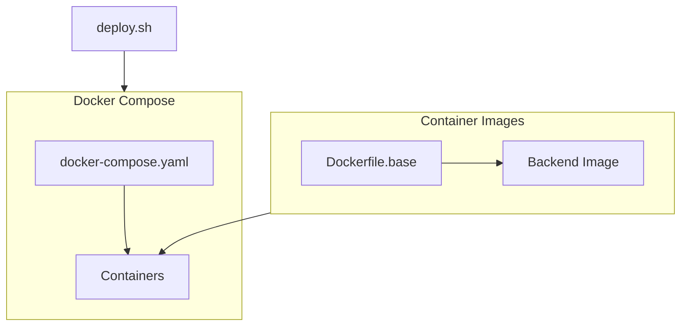
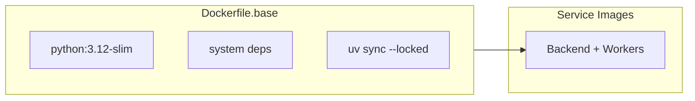

# Deployment

Integr8sCode uses Docker Compose for deployment. All services — backend, frontend, workers, and infrastructure —
run as containers orchestrated by a single `docker-compose.yaml`. Workers reuse the backend image with different
`command:` overrides, so there's only one application image to build. Kubernetes is used only for executor pods
(running user code); workers just need a kubeconfig to talk to the K8s API.

## Architecture



## Deployment script

The [`deploy.sh`](https://github.com/HardMax71/Integr8sCode/blob/main/deploy.sh) script wraps Docker Compose:

```bash
--8<-- "deploy.sh:usage"
```

The script wraps Docker Compose with convenience commands for building, starting, stopping, and running tests.

## Local development

Local development uses Docker Compose to spin up the entire stack on your machine. The compose file defines all services
with health checks and dependency ordering, so containers start in the correct sequence.

```bash
./deploy.sh dev
```

This brings up MongoDB, Redis, Kafka (KRaft mode), all seven workers, the backend API, and the
frontend. One initialization container runs automatically: `user-seed` populates the database with default user accounts.
Kafka topics are created on-demand via `auto.create.topics.enable` when producers first publish or consumers subscribe.

Once the stack is running, you can access the services at their default ports.

| Service            | URL                    |
|--------------------|------------------------|
| Frontend           | https://localhost:5001 |
| Backend API        | https://localhost:443  |
| Kafdrop (Kafka UI) | http://localhost:9000  |
| Jaeger (Tracing)   | http://localhost:16686 |
| Grafana            | http://localhost:3000  |

The default credentials created by the seed job are `user` / `user123` for a regular account and `admin` / `admin123`
for an administrator. You can override these via environment variables if needed.

```bash
DEFAULT_USER_PASSWORD=mypass ADMIN_USER_PASSWORD=myadmin ./deploy.sh dev
```

Hot reloading works for the backend since the source directory is mounted into the container. Changes to Python files
trigger Uvicorn to restart automatically. The frontend runs its own dev server with similar behavior.

### Docker build strategy

The backend uses a multi-stage build with a shared base image to keep startup fast:



The base image installs all production dependencies:

```dockerfile
--8<-- "backend/Dockerfile.base"
```

Each service image extends the base and copies only application code. Since dependencies rarely change, Docker's layer
caching means most builds only rebuild the thin application layer.

For local development, the compose file mounts source directories:

```yaml
--8<-- "docker-compose.yaml:dev_volumes"
```

This preserves the container's `.venv` while allowing live code changes. Gunicorn watches for file changes and reloads
automatically. The design means `git clone` followed by `docker compose up` just works—no local Python environment
needed.

To stop everything and clean up volumes:

```bash
./deploy.sh down
docker compose down -v  # Also removes persistent volumes
```

### Running tests locally

The `test` command runs the full unit and E2E test suite:

```bash
./deploy.sh test
```

This builds images, starts services, waits for the backend health endpoint using curl's built-in retry mechanism, runs
pytest with coverage reporting, then tears down the stack. The curl retry approach is cleaner than shell loops and
avoids issues with Docker Compose's `--wait` flag (which fails on init containers that exit after completion). Key
services define healthchecks in `docker-compose.yaml`:

| Service         | Healthcheck                                   |
|-----------------|-----------------------------------------------|
| MongoDB         | `mongosh ping`                                |
| Redis           | `redis-cli ping`                              |
| Backend         | `curl /api/v1/health/live`                    |
| Kafka           | `kafka-broker-api-versions`                   |

Services without explicit healthchecks (workers, Grafana, Kafdrop) are considered "started" when their container is
running. The test suite doesn't require worker containers since tests instantiate worker classes directly.

## Container resource limits

Every long-running service has a `mem_limit` in `docker-compose.yaml` to prevent any single container from starving the host. The budget targets a 7.7 GB server with the observability profile enabled, leaving ~2 GB for the OS and page cache.

| Service | `mem_limit` | Internal cap | Notes |
|---------|-------------|--------------|-------|
| MongoDB | 1024 m | wiredTiger 0.4 GB | `--wiredTigerCacheSizeGB 0.4` prevents default 50 %-of-RAM behavior |
| Redis | 300 m | 256 MB maxmemory | LRU eviction, persistence disabled |
| Kafka | 1280 m | JVM `-Xms256m -Xmx1g` | Single-broker KRaft mode, low throughput workload |
| Backend API | 768 m | 2 gunicorn workers | Controlled by `WEB_CONCURRENCY` env var |
| Frontend | 128 m | nginx serving static assets | |
| Each worker (×7) | 160 m | Single-process Python | coordinator, k8s-worker, pod-monitor, result-processor, saga-orchestrator, event-replay, dlq-processor |
| Grafana | 192 m | | Observability profile |
| Jaeger | 256 m | All-in-one, in-memory storage | Observability profile |
| Victoria Metrics | 256 m | 30-day retention | Observability profile |
| OTel Collector | 192 m | `limit_mib: 150` in memory_limiter processor; includes `kafkametrics` receiver | Observability profile |

All long-running services — core infrastructure (MongoDB, Redis, Kafka, backend, frontend), all seven workers (coordinator, k8s-worker, pod-monitor, result-processor, saga-orchestrator, event-replay, dlq-processor), and observability components (Grafana, victoria-metrics, otel-collector) — have `restart: unless-stopped` so they recover automatically after an OOM kill or crash.

## Monitoring

Check service status using the deploy script or Docker Compose directly.

```bash
./deploy.sh status
docker compose ps
docker compose logs backend
```

## Troubleshooting

| Issue                 | Cause                             | Solution                                          |
|-----------------------|-----------------------------------|---------------------------------------------------|
| Unknown topic errors  | Kafka not ready or wrong prefix   | Check `docker compose logs kafka`                 |
| MongoDB auth errors   | Password mismatch                 | Verify `secrets.toml` matches compose env vars    |
| Worker crash loop     | Config file missing               | Ensure `config.<worker>.toml` exists              |

### Kafka topic debugging

```bash
docker compose logs kafka
docker compose exec kafka kafka-topics --list --bootstrap-server localhost:29092
```

Topics are auto-created on first use. Each topic name = event type value with prefix (e.g., `dev_execution_requested`).

### k3s crash loop after VPN or IP change

**Symptoms:**

- `systemctl status k3s` shows `Active: activating (auto-restart) (Result: exit-code)`
- k3s repeatedly crashes with `status=1/FAILURE`
- `kubectl` commands fail with `connection refused` or `ServiceUnavailable`
- API intermittently responds then stops

**Root cause:**

When the host IP changes (VPN on/off, network switch, DHCP renewal), k3s stores stale IP references in two locations:

1. **SQLite database** (`/var/lib/rancher/k3s/server/db/`) — contains cluster state with old IP
2. **TLS certificates** (`/var/lib/rancher/k3s/server/tls/`) — generated with old IP in SAN field

k3s detects the mismatch between config (`node-ip` in `/etc/rancher/k3s/config.yaml`) and stored data, causing the crash loop.

**Solution:**

> **WARNING: DATA LOSS** — The steps below will permanently delete all cluster state, including:
> - All deployed workloads (pods, deployments, services)
> - All cluster configuration (namespaces, RBAC, ConfigMaps, Secrets)
> - All PersistentVolume data stored in the default local-path provisioner
>
> **Before proceeding, back up:**
> - etcd snapshots: `sudo k3s etcd-snapshot save`
> - kubeconfig files
> - Application manifests
> - Any critical PersistentVolume data
>
> Confirm backups are complete before continuing.

```bash
# 1. Stop k3s
sudo systemctl stop k3s

# 2. Delete corrupted database (k3s will rebuild it)
sudo rm -rf /var/lib/rancher/k3s/server/db/

# 3. Delete old TLS certificates (k3s will regenerate them)
sudo rm -rf /var/lib/rancher/k3s/server/tls/

# 4. Start k3s with clean state
sudo systemctl start k3s
```

After k3s restarts, regenerate the application kubeconfig:

```bash
# Regenerate kubeconfig with fresh ServiceAccount token
docker compose restart cert-generator

# Restart workers to pick up new kubeconfig
docker compose restart k8s-worker pod-monitor
```

**Verification:**

```bash
# Check k3s is running
systemctl status k3s  # Should show "active (running)"

# Test API access
KUBECONFIG=/path/to/backend/kubeconfig.yaml kubectl get namespaces

# Check workers connected
docker logs k8s-worker 2>&1 | tail -5
docker logs pod-monitor 2>&1 | tail -5
```

**VPN-specific notes:**

When using VPN (e.g., NordVPN with WireGuard/NordLynx):

- **LAN Discovery must be enabled**: `nordvpn set lan-discovery enabled`
- VPN can interfere with Docker's `host` network mode and k3s flannel networking
- Consider using bridge networking for containers that need to reach k3s

**References:**

- [k3s IP change issue #277](https://github.com/k3s-io/k3s/issues/277)
- [k3s crash loop troubleshooting](https://dev.to/shankar_t/my-k3s-pi-cluster-died-after-a-reboot-a-troubleshooting-war-story-m93)
- [k3s certificate documentation](https://docs.k3s.io/cli/certificate)

## Pre-built images

The CI pipeline automatically builds and pushes images to GitHub Container Registry on every merge to main. To use
pre-built images instead of building locally, set `IMAGE_TAG`:

```bash
IMAGE_TAG=sha-abc1234 docker compose up -d --no-build
```

### Available tags

| Tag           | Description                        |
|---------------|------------------------------------|
| `latest`      | Most recent build from main branch |
| `sha-abc1234` | Specific commit SHA                |
| `2026.2.0`    | CalVer release version             |

## Production deployment

Merges to `main` trigger automatic deployment to the production server via the
[Release & Deploy](cicd.md#release--deploy) workflow. The full pipeline chain is:

1. **Stack Tests** — unit tests, image build, E2E tests
2. **Docker Scan & Promote** — Trivy vulnerability scan, promote `sha-xxx` to `latest`
3. **Release & Deploy** — create CalVer tag + GitHub Release, SSH deploy to production

The deploy step pulls the latest images on the server and recreates containers with zero-downtime health checks. No
manual intervention is required for normal merges.

### Rollback

To roll back to a previous release, use a specific CalVer or SHA tag:

```bash
# On the production server
IMAGE_TAG=2026.2.0 docker compose pull
IMAGE_TAG=2026.2.0 docker compose up -d --remove-orphans
```

Or trigger the Release & Deploy workflow manually with `skip_deploy` enabled to create a release without deploying,
then deploy a specific version via SSH.

### First-time setup

To configure the production server and GitHub Secrets, follow the [Required secrets](cicd.md#required-secrets) section
in the CI/CD docs. You will need to generate an SSH key pair, create a GitHub PAT with `read:packages` scope, and add
all four secrets (`DEPLOY_HOST`, `DEPLOY_USER`, `DEPLOY_SSH_KEY`, `DEPLOY_GHCR_TOKEN`) to the repository settings.

## Key files

| File                                                                                                                           | Purpose                     |
|--------------------------------------------------------------------------------------------------------------------------------|-----------------------------|
| [`deploy.sh`](https://github.com/HardMax71/Integr8sCode/blob/main/deploy.sh)                                                   | Deployment script           |
| [`docker-compose.yaml`](https://github.com/HardMax71/Integr8sCode/blob/main/docker-compose.yaml)                               | Full stack definition       |
| [`backend/Dockerfile.base`](https://github.com/HardMax71/Integr8sCode/blob/main/backend/Dockerfile.base)                       | Shared base image with deps |
| [`.github/workflows/docker.yml`](https://github.com/HardMax71/Integr8sCode/blob/main/.github/workflows/docker.yml)             | CI/CD image build pipeline  |
| [`.github/workflows/release-deploy.yml`](https://github.com/HardMax71/Integr8sCode/blob/main/.github/workflows/release-deploy.yml) | Release + deploy pipeline   |
