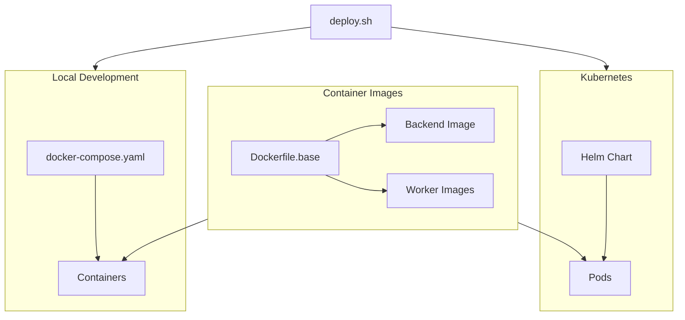
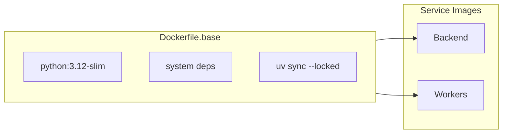

# Deployment

Integr8sCode supports two deployment modes: local development using Docker Compose and production deployment to
Kubernetes using Helm. Both modes share the same container images and configuration patterns, so what works locally
translates directly to production.

## Architecture



## Deployment script

The unified [`deploy.sh`](https://github.com/HardMax71/Integr8sCode/blob/main/deploy.sh) script handles both modes:

```bash
--8<-- "deploy.sh:6:18"
```

The script abstracts away the differences between environments. For local development it orchestrates Docker Compose,
while for production it builds images, imports them to the container runtime, and runs Helm with appropriate values.

## Local development

Local development uses Docker Compose to spin up the entire stack on your machine. The compose file defines all services
with health checks and dependency ordering, so containers start in the correct sequence.

```bash
./deploy.sh dev
```

This brings up MongoDB, Redis, Kafka with Zookeeper and Schema Registry, all seven workers, the backend API, and the
frontend. Two initialization containers run automatically: `kafka-init` creates required Kafka topics, and `user-seed`
populates the database with default user accounts.

Once the stack is running, you can access the services at their default ports.

| Service            | URL                    |
|--------------------|------------------------|
| Frontend           | https://localhost:5001 |
| Backend API        | https://localhost:443  |
| Kafdrop (Kafka UI) | http://localhost:9000  |
| Jaeger (Tracing)   | http://localhost:16686 |
| Grafana            | http://localhost:3000  |

The default credentials created by the seed job are `user` / `user123` for a regular account and `admin` / `admin123`
for an administrator. You can override these via environment variables if needed.

```bash
DEFAULT_USER_PASSWORD=mypass ADMIN_USER_PASSWORD=myadmin ./deploy.sh dev
```

Hot reloading works for the backend since the source directory is mounted into the container. Changes to Python files
trigger Uvicorn to restart automatically. The frontend runs its own dev server with similar behavior.

### Docker build strategy

The backend uses a multi-stage build with a shared base image to keep startup fast:



The base image installs all production dependencies:

```dockerfile
--8<-- "backend/Dockerfile.base"
```

Each service image extends the base and copies only application code. Since dependencies rarely change, Docker's layer
caching means most builds only rebuild the thin application layer.

For local development, the compose file mounts source directories:

```yaml
--8<-- "docker-compose.yaml:95:99"
```

This preserves the container's `.venv` while allowing live code changes. Gunicorn watches for file changes and reloads
automatically. The design means `git clone` followed by `docker compose up` just works—no local Python environment
needed.

To stop everything and clean up volumes:

```bash
./deploy.sh down
docker compose down -v  # Also removes persistent volumes
```

### Running tests locally

The `test` command runs the full integration and unit test suite:

```bash
./deploy.sh test
```

This builds images, starts services, waits for the backend health endpoint using curl's built-in retry mechanism, runs
pytest with coverage reporting, then tears down the stack. The curl retry approach is cleaner than shell loops and
avoids issues with Docker Compose's `--wait` flag (which fails on init containers that exit after completion). Key
services define healthchecks in `docker-compose.yaml`:

| Service         | Healthcheck                                   |
|-----------------|-----------------------------------------------|
| MongoDB         | `mongosh ping`                                |
| Redis           | `redis-cli ping`                              |
| Backend         | `curl /api/v1/health/live`                    |
| Kafka           | `kafka-broker-api-versions`                   |
| Schema Registry | `curl /config`                                |
| Zookeeper       | `echo ruok \| nc localhost 2181 \| grep imok` |

Services without explicit healthchecks (workers, Grafana, Kafdrop) are considered "started" when their container is
running. The test suite doesn't require worker containers since tests instantiate worker classes directly.

## Kubernetes deployment

Production deployment targets Kubernetes using a Helm chart that packages all manifests and configuration. The chart
lives in `helm/integr8scode/` and includes templates for every component of the stack.

### Prerequisites

Before deploying, ensure you have Helm 3.x installed and kubectl configured to talk to your cluster. If you're using
K3s, the deploy script handles image import automatically. For other distributions, you'll need to push images to a
registry and update the image references in your values file.

### Chart structure

The Helm chart organizes templates by function:

| Directory                   | Contents                                  |
|-----------------------------|-------------------------------------------|
| `templates/rbac/`           | ServiceAccount, Role, RoleBinding         |
| `templates/secrets/`        | Kubeconfig and Kafka JAAS                 |
| `templates/configmaps/`     | Environment variables                     |
| `templates/infrastructure/` | Zookeeper, Kafka, Schema Registry, Jaeger |
| `templates/app/`            | Backend and Frontend deployments          |
| `templates/workers/`        | All seven worker deployments              |
| `templates/jobs/`           | Kafka topic init and user seed            |
| `charts/`                   | Bitnami sub-charts (Redis, MongoDB)       |

The chart uses Bitnami sub-charts for Redis and MongoDB. Kafka uses custom templates because Confluent images require
unsetting Kubernetes auto-generated environment variables like `KAFKA_PORT=tcp://...` that conflict with expected
numeric values.

### Running a deployment

The simplest deployment uses default values, which work for development and testing clusters.

```bash
./deploy.sh prod
```

This builds the Docker images, imports them to K3s (if available), updates Helm dependencies to download the Redis and
MongoDB sub-charts, creates the namespace, and runs `helm upgrade --install`. The `--wait` flag ensures the command
blocks until all pods are ready.

For production environments, pass additional flags to set secure passwords.

```bash
./deploy.sh prod --prod \
    --set userSeed.defaultUserPassword=secure-user-pass \
    --set userSeed.adminUserPassword=secure-admin-pass \
    --set mongodb.auth.rootPassword=mongo-root-pass
```

The `--prod` flag tells the script to use `values-prod.yaml`, which increases replica counts, resource limits, and
enables MongoDB authentication. Without the password flags, the user seed job will fail since the production values
intentionally leave passwords empty to force explicit configuration.

To validate templates without applying anything:

```bash
./deploy.sh prod --dry-run
```

This renders the templates and prints what would be applied, useful for catching configuration errors before they hit
the cluster.

### Configuration

The `values.yaml` file contains all configurable options. Key sections:

```yaml
--8<-- "helm/integr8scode/values.yaml:10:19"
```

Environment variables shared across services live in the `env` section and get rendered into a ConfigMap.
Service-specific overrides go in their respective sections. For example, to increase backend replicas and memory:

```yaml
backend:
  replicas: 3
  resources:
    limits:
      memory: "2Gi"
```

Worker configuration follows a similar pattern. Each worker has its own section under `workers` where you can enable or
disable it, set replicas, and override the default command.

```yaml
workers:
  k8sWorker:
    enabled: true
    replicas: 2
  dlqProcessor:
    enabled: false  # Disable if not needed
```

The infrastructure section controls Confluent platform components. You can adjust heap sizes, resource limits, and
enable or disable optional services like Jaeger.

```yaml
infrastructure:
  kafka:
    heapOpts: "-Xms1G -Xmx1G"
    resources:
      limits:
        memory: "2Gi"
  jaeger:
    enabled: false  # Disable tracing in resource-constrained environments
```

### Post-install jobs

Two Helm hooks run after the main deployment completes. The kafka-init job waits for Kafka and Schema Registry to become
healthy, then creates all required topics using the `scripts/create_topics.py` module. Topics are created with the
prefix defined in settings (default `pref`) to avoid conflicts with Kubernetes-generated environment variables.

The user-seed job waits for MongoDB, then runs `scripts/seed_users.py` to create the default and admin users. If users
already exist, the script updates their roles without creating duplicates, making it safe to run on upgrades.

Both jobs have a hook-weight that controls ordering. Kafka init runs first (weight 5), followed by user seed (weight
10). The `before-hook-creation` delete policy ensures old jobs are cleaned up before new ones run, preventing conflicts
from previous releases.

### Accessing deployed services

After deployment, services are only accessible within the cluster by default. Use kubectl port-forward to access them
locally.

```bash
kubectl port-forward -n integr8scode svc/integr8scode-backend 8443:443
kubectl port-forward -n integr8scode svc/integr8scode-frontend 5001:5001
```

For production exposure, enable the ingress section in your values file and configure it for your ingress controller.
The chart supports standard Kubernetes ingress annotations for TLS termination and path routing.

### Monitoring the deployment

Check pod status and logs using standard kubectl commands.

```bash
kubectl get pods -n integr8scode
kubectl logs -n integr8scode -l app.kubernetes.io/component=backend
kubectl logs -n integr8scode -l app.kubernetes.io/component=coordinator
```

The deploy script's `status` command shows both Docker Compose and Kubernetes status in one view.

```bash
./deploy.sh status
```

### Rollback and uninstall

Helm maintains release history, so you can roll back to a previous version if something goes wrong.

```bash
helm rollback integr8scode 1 -n integr8scode
```

To completely remove the deployment:

```bash
helm uninstall integr8scode -n integr8scode
kubectl delete namespace integr8scode
```

This removes all resources created by the chart. Persistent volume claims for MongoDB and Redis may remain depending on
your storage class's reclaim policy.

## Troubleshooting

| Issue                 | Cause                             | Solution                                          |
|-----------------------|-----------------------------------|---------------------------------------------------|
| Unknown topic errors  | kafka-init failed or wrong prefix | Check `kubectl logs job/integr8scode-kafka-init`  |
| Confluent port errors | K8s auto-generated `KAFKA_PORT`   | Ensure `unset KAFKA_PORT` in container startup    |
| ImagePullBackOff      | Images not in cluster             | Use ghcr.io images or import with K3s             |
| MongoDB auth errors   | Password mismatch                 | Verify secret matches `values-prod.yaml`          |
| OOMKilled workers     | Resource limits too low           | Increase `workers.common.resources.limits.memory` |

### Kafka topic debugging

```bash
kubectl logs -n integr8scode job/integr8scode-kafka-init
kubectl exec -n integr8scode integr8scode-kafka-0 -- kafka-topics --list --bootstrap-server localhost:29092
```

Topics should be prefixed (e.g., `prefexecution_events` not `execution_events`).

### MongoDB password verification

```bash
kubectl get secret -n integr8scode integr8scode-mongodb -o jsonpath='{.data.mongodb-root-password}' | base64 -d
```

## Pre-built images

For production deployments, you can skip the local build step entirely by using pre-built images from GitHub Container
Registry. The CI pipeline automatically builds and pushes images on every merge to main.

### Using registry images

The `--prod` flag configures the deployment to pull images from `ghcr.io/hardmax71/integr8scode/`:

```bash
./deploy.sh prod --prod \
    --set userSeed.defaultUserPassword=secure-pass \
    --set userSeed.adminUserPassword=secure-admin
```

This skips the local Docker build and tells Kubernetes to pull images from the registry. The `values-prod.yaml` file
sets `imagePullPolicy: IfNotPresent`, so images are cached locally after the first pull.

### Available tags

Each push to main produces multiple tags:

| Tag           | Description                        |
|---------------|------------------------------------|
| `latest`      | Most recent build from main branch |
| `sha-abc1234` | Specific commit SHA                |
| `v1.0.0`      | Release version (from git tags)    |

For production, pin to a specific SHA or version rather than `latest`:

```yaml
images:
  backend:
    repository: ghcr.io/hardmax71/integr8scode/backend
    tag: sha-abc1234
```

### Hybrid approach

If you need production resource limits but want to build locally (for testing changes before pushing):

```bash
./deploy.sh prod --prod --local
```

The `--local` flag forces a local build even when using `values-prod.yaml`.

### CI/CD integration

The GitHub Actions workflow in `.github/workflows/docker.yml` handles image building and publishing. On every push to
main, it builds the base, backend, and frontend images, scans them with Trivy for vulnerabilities, and pushes to
ghcr.io. Pull requests build and scan but don't push, ensuring only tested code reaches the registry.

## Key files

| File                                                                                                                           | Purpose                     |
|--------------------------------------------------------------------------------------------------------------------------------|-----------------------------|
| [`deploy.sh`](https://github.com/HardMax71/Integr8sCode/blob/main/deploy.sh)                                                   | Unified deployment script   |
| [`docker-compose.yaml`](https://github.com/HardMax71/Integr8sCode/blob/main/docker-compose.yaml)                               | Local development stack     |
| [`backend/Dockerfile.base`](https://github.com/HardMax71/Integr8sCode/blob/main/backend/Dockerfile.base)                       | Shared base image with deps |
| [`helm/integr8scode/values.yaml`](https://github.com/HardMax71/Integr8sCode/blob/main/helm/integr8scode/values.yaml)           | Default Helm configuration  |
| [`helm/integr8scode/values-prod.yaml`](https://github.com/HardMax71/Integr8sCode/blob/main/helm/integr8scode/values-prod.yaml) | Production overrides        |
| [`.github/workflows/docker.yml`](https://github.com/HardMax71/Integr8sCode/blob/main/.github/workflows/docker.yml)             | CI/CD image build pipeline  |
