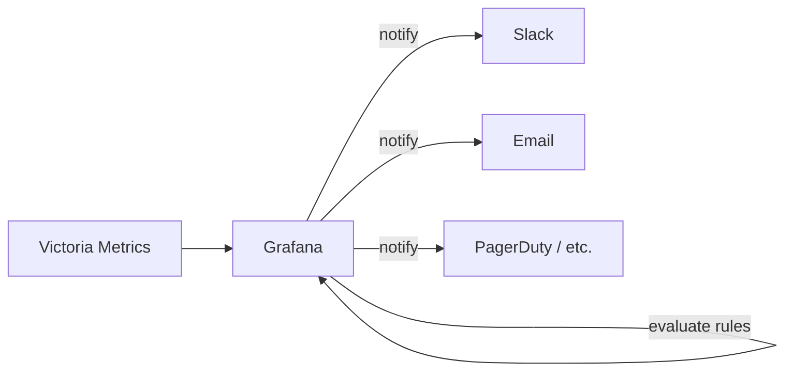

# Grafana Integration

Grafana connects to Victoria Metrics to visualize platform metrics and to Jaeger for trace exploration. Alerting uses
Grafana's built-in unified alerting engine with provisioned contact points and alert rules — no custom backend endpoints
involved.

## Dashboards

Grafana is available at `http://localhost:3000` when the stack is running (anonymous viewer access enabled by default).
Victoria Metrics serves as the Prometheus-compatible data source. See [Metrics Reference](metrics-reference.md) for the
full metric catalog and example PromQL queries.

## Alerting Architecture



Grafana's unified alerting engine evaluates rules on a schedule, queries Victoria Metrics, and sends notifications
directly to configured contact points (Slack, email, PagerDuty, OpsGenie, webhooks, etc.). This is the standard
Grafana approach — no intermediate backend service is needed.

## Provisioning

Alert configuration is managed via YAML files in `backend/grafana/provisioning/alerting/`. Grafana loads these on
startup, so alert rules, contact points, and notification policies are version-controlled and reproducible.

The provisioning file ships with commented-out examples for common setups:

### Contact Points

Contact points define where notifications go. Uncomment and configure in `alerting.yml`:

```yaml
contactPoints:
  - orgId: 1
    name: slack-notifications
    receivers:
      - uid: slack-receiver
        type: slack
        settings:
          url: https://hooks.slack.com/services/YOUR/WEBHOOK/URL
          recipient: "#alerts"
```

Grafana supports 20+ contact point types out of the box: Slack, email, PagerDuty, OpsGenie, Microsoft Teams, generic
webhooks, and more. See the
[Grafana contact points documentation](https://grafana.com/docs/grafana/latest/alerting/configure-notifications/manage-contact-points/)
for the full list.

### Notification Policies

Policies route alerts to the right contact point based on labels:

```yaml
policies:
  - orgId: 1
    receiver: slack-notifications
    group_by: ["alertname", "namespace"]
    group_wait: 30s
    group_interval: 5m
    repeat_interval: 4h
```

### Alert Rules

Rules query Victoria Metrics and fire when thresholds are breached. Example for HTTP 5xx error rate:

```yaml
groups:
  - orgId: 1
    name: backend-alerts
    folder: Integr8sCode
    interval: 1m
    rules:
      - uid: high-error-rate
        title: High HTTP 5xx Error Rate
        condition: C
        data:
          - refId: A
            relativeTimeRange:
              from: 300
              to: 0
            datasourceUid: victoria-metrics
            model:
              expr: >
                sum(rate(http_requests_total{status=~"5.."}[5m]))
                / sum(rate(http_requests_total[5m])) * 100
        for: 5m
        labels:
          severity: warning
        annotations:
          summary: "HTTP 5xx error rate is above 5%"
```

## Configuration

Unified alerting is enabled in `backend/grafana/grafana.ini`:

```ini
[unified_alerting]
enabled = true

[alerting]
enabled = false
```

The `[alerting]` section controls the legacy alerting engine (Grafana < 9) and stays disabled. `[unified_alerting]`
is the modern engine used for all provisioned rules.

## Key Files

| File                                                                                                                                                           | Purpose                           |
|----------------------------------------------------------------------------------------------------------------------------------------------------------------|-----------------------------------|
| [`grafana/grafana.ini`](https://github.com/HardMax71/Integr8sCode/blob/main/backend/grafana/grafana.ini)                                                       | Grafana server configuration      |
| [`grafana/provisioning/alerting/alerting.yml`](https://github.com/HardMax71/Integr8sCode/blob/main/backend/grafana/provisioning/alerting/alerting.yml)           | Alert rules and contact points    |
| [`grafana/provisioning/datasources/`](https://github.com/HardMax71/Integr8sCode/tree/main/backend/grafana/provisioning/datasources)                             | Victoria Metrics data source      |
